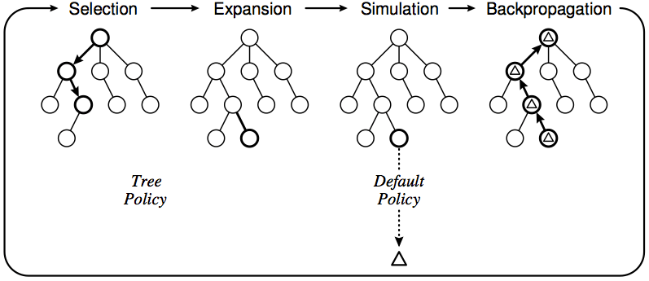

# 对抗搜索

## 极小-极大模型

由于轮次玩家切换，因此在搜索树中引入极小和极大。

Minimax 搜索可以得到对阵一个理性玩家所能获得的最好成果。

假设 minimax 搜索得到策略 $\pi_{\max}, \pi_{\min}$，对于任意的策略 $\pi_{\text{agent}}, \pi_{\text{opp}}$ 获得收益 $V(\pi_{\text{agent}}, \pi_{\text{opp}})$，则 minimax 有如下性质：

1. $$
   \forall \pi_{\text{opp}}, V(\pi_{\max}, \pi_{\min}) \le V(\pi_{\max}, \pi_{\text{opp}})
   $$

2. $$
   \forall \pi_{\text{agent}}, V(\pi_{\max}, \pi_{\min}) \ge V(\pi_{\text{agent}, \pi_{\text{opp}}})
   $$

问题：状态空间大，无法在合理的时间内搜索完成。


## $\alpha-\beta$ 剪枝

令 max 节点的取值下界为 $\alpha$，min 节点的取值上界为 $\beta$。

容易得到 minimax 搜索中两类剪枝的情况：

- $\alpha$ 剪枝：当后辈节点的 $\beta$ 值**小于等于**祖先节点的 $\alpha$ 值时进行剪枝（$\text{agent}$ 有更优策略一定不会走当前局面）。
- $\beta$ 剪枝：当后辈节点的 $\alpha$ 值**大于等于**祖先节点的 $\beta$ 值时进行剪枝（$\text{opp}$ 有更优的策略一定不会走当前局面）。

注：**一次剪枝仅完成一次走步**，每次到新局面应当重新进行搜索。


## 蒙特卡洛树搜索

蒙特卡洛树搜索融合了两种重要的搜索：蒙特卡洛方法模拟进行评估、选择性的搜索。


### MCTS

MCTS 的框架包含四个阶段：

1. 选择：从根节点出发，在搜索树上自上而下迭代式执行一个子节点选择策略，直至找到当前最为紧迫的可扩展节点为止。一个节点是可扩展的，当且仅当其所对应的状态是非停止状态，且拥有未被访问过的子状态。
2. 扩展：根据当前可执行的行动，向选定的节点上添加一个（或多个）子节点以扩展搜索树。
3. 模拟：根据默认策略在扩展出来的一个（或多个）子节点上执行蒙特卡洛棋局模拟，并确定节点的估计值。
4. 回溯：根据模拟结果向上依次更新祖先节点的估计值，并更新其状态。




### UCT

在选择应当扩展哪个节点时，有两个重要的因素需要平衡：

- Exploitation：希望聚焦于找到的最优节点。
- Exploration：希望探索未拓展的节点，避免陷入局部最优。

此时，来源于多臂老虎机模型的信心上界树被用于解决这一问题。


#### 多臂老虎机模型

问题：多臂老虎机拥有 $k$ 个手臂，拉动每个手臂所能产生的回报互不相关，我们希望找到一个合理的策略，可以使得拉动手臂的人获得最大的收益。


#### UCB

信心上界算法。

```pseudocode
function UCB
	for each j:
		访问拉杆 j 并记录收益
	end for
	while 未达到访问次数上限 do:
		计算每个拉杆的信心上界 Ij
		访问信心上界最大的手臂
	end while
```

信心上界：

$$
I_j = \overline{X_j} + \sqrt{\frac{2 \ln (n)}{T_j(n)}}
$$

其中 $\overline{X_j}$ 为回报均值，$n$ 为当前手臂访问总次数，$T_j(n)$ 为所有手臂访问总次数。


#### UCT

在 MCTS 的 `treePolicy` 中根据信心上界进行选择：

$$
I_j = \overline{X_j} + c\sqrt{\frac{2 \ln (n)}{T_j(n)}}
$$

其中 $c$ 为可调整的参数。


## 强化学习

### 基于策略梯度的强化学习

训练得到在每个位置行动获胜的概率。


### 基于价值评估的强化学习

训练得到在每个位置行动的价值评估。


### 基于 actor-critic 的强化学习

同时训练策略网络（actor）和价值网络（critic），利用价值网络对于行动的收益增量进行评估。