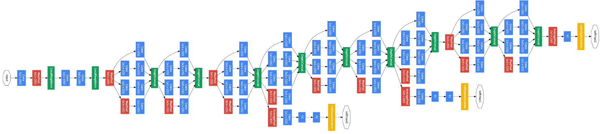

# 深度学习

> Deep learning is algorithms that model high-level abstractions in data using architectures consisting of multiple nonlinear transformations.

传统的人工设计模式在大规模数据面前并不可取（“有多少智能，就有多少人工”），同时有很多的特征模式是一种隐含的表达，并不能清晰列举。


## 多层感知机

### 感知器

#### 感知器结构

$$
\hat y = g(\theta_0 + \sum \limits_{i = 1}^d x_i \theta_i)
$$

$g$ 为非线性激活函数，括号中为输入的线性组合加偏置。


#### 异或问题

感知器可以代表常规的与或非布尔函数。

但对于异或函数却无法表示。


### 多层感知机

为解决异或问题的缺陷引入多层感知机作为感知器的组合。

此时，多层感知机可以表示任意一种布尔函数。

> 注：多层感知机的连接可能是稀疏的，这与人脑中的结构有类似之处。


### 激活函数

通过激活函数的方式添加非线性性。

#### sigmoid 函数

$$
g(z) = \frac 1 {1 + e^{-z}}
$$


#### 双曲正切函数

$$
g(z) = \frac{e^z - e^{-z}}{e^z + e^{-z}}
$$


#### ReLU 函数

$$
g(z) = \max(0, z)
$$


#### 三种激活函数比较


#### softmax 函数

$$
g(\boldsymbol z)_i = \frac{e^{z_i}}{\sum \limits_{j = 1}^k e^{z_j}}
$$

将一层的输出映射到 $[0, 1]$ 之间，并且归一：$\sum \limits_{j = 1}^k \hat y_j = 1$。

> 注：“赢者通吃”。

> 注：为保障数值稳定性避免上溢，在实际计算时常常转换为
> 
> $$
> g(\boldsymbol z)_i = \frac{e^{z_i - z_m}}{\sum \limits_{j = 1}^k e^{z_j - z_m}}, m = \arg \max(z_j)
> $$


### 损失函数

#### MSE

$$
J(\boldsymbol y, \boldsymbol {\hat y}) = \frac 1 {2k} \sum \limits_{j = 1}^k (y_i - \hat y_i)^2
$$

在输出是具体数值的问题时常使用。


#### 交叉熵

$$
J(\boldsymbol y, \boldsymbol{\hat y}) = - \sum \limits_{j = 1}^k y_j \log \hat y_j
$$

在输出是分类问题（标签是独热编码）时常使用。

交叉熵的推导可以从两种视角得到。

> 信息论视角
>
> 信息量：
> 
> $$
> I(q_j) = -\log p(q_j)
> $$
> 
>
> 信息熵：
> 
> $$
> H(q) = -\sum \limits_{j = 1}^k q_j \log q_j
> $$
> 
> 对随机变量的信息量求期望，描述用于编码 $q$ 的信息（不确定性）所需要的比特数。
>
> 
>
> 相对熵（KL 散度）
> 
> $$
> \begin{align}
> \text{KL}(q \lvert \rvert p) &= - \sum \limits_{j = 1}^k q_j \log(\frac{p_j}{q_j}) \\
> &= - \sum \limits_{j = 1}^k q_j \log p_j - H(q)
> \end{align}
> $$
> 
> 描述已知分布 $q$，描述分布 $p$ 所需要的比特数。
>
> 
>
> 交叉熵
>
> 注意到 KL 散度中 $H(q)$ 与 $p$ 无关，去除该部分得到交叉熵：
> 
> $$
> H(q, p) = - \sum \limits_{j = 1}^k q_j \log p_j
> $$

> 统计学视角
>
> 考虑最大似然估计。
>
> 在逻辑回归中，有条件概率：
> 
> $$
> P(y = 1 | \boldsymbol x, \boldsymbol w) = \sigma(\boldsymbol w^T \boldsymbol x) = \frac{1}{1 + \exp(-\boldsymbol w^T \boldsymbol x)}
> $$
> 
> 极大化似然函数：
> 
> $$
> \max \limits_{\boldsymbol w} \prod \limits_{i = 1}^k \prod \limits_{c = 0}^1 P(y = c | \boldsymbol x_i, \boldsymbol w)^{1[y_i = c]}
> $$
> 
> 取对数，则问题等价于：
> 
> $$
> \min \limits_{\boldsymbol w} - \frac 1 n \sum \limits_{i = 1}^n \sum \limits_{c = 0}^1 \{1[y_i = c] \cdot \log [P(y = c | \boldsymbol x_i)] \}
> $$
> 
> 拆开可得到交叉熵的形式。


### 基于梯度的训练

优化目标（Structural Risk Minimization）：

$$
\mathop{\arg \min} \limits_{\theta} \  O(\mathcal D, \theta) = \sum \limits_{i = 1}^m L(y_i, f(x_i); \theta) + \Omega(\theta)
$$

```pseudocode
for t <- 1 to T:
	FowardPropagation();
	BackwardPropagation();
	UpdateParam();
```

梯度下降：

$$
\theta_{ij}^{(l)} = \theta_{ij}^{(l)} - \eta \frac{\partial}{\partial \theta_{ij}^{(l)}}J(\theta, b)
$$


### 反向传播

利用链式法则计算每层中参数 $\theta$ 的梯度：

$$
\nabla_{\boldsymbol x} z = (\frac{\partial \boldsymbol y}{\partial \boldsymbol x})^T \nabla_{\boldsymbol y} z
$$

使用类似动态规划填表的方式可以进行计算。


### 梯度下降

#### 批量梯度下降算法

每次处理全部样本。


#### 随机梯度下降算法

每次处理一个样本。


#### 小批量梯度下降算法

每次处理小批量的样本。


## 卷积神经网络

### 卷积神经网络

全连接网络的不足：连接权重过多，既影响训练速度也影响使用速度。

回到人类认知图像的方式：通过感受野来激活特定的神经元进行认知。

依次为基础，卷积神经网络还吸纳了几个重要的思想：

- Idea 1：局部连接（或稀疏连接、稀疏交互）

  Locality Assumption：局部的信息足够用于识别。

  

  这种做法有利于减少需要存储的参数，减少模型的存储需求，提高其统计效率。

- Idea 2：参数共享

  在多个函数中，可以使用相同的参数。

卷积神经网络的层级结构：


#### 卷积


卷积核可以人为设定步长、填充。

对于一个 $w \times h \times c$ 的输入图像，使用 $k \times k \times c \times d$，填充为 $\text{pad}$，步长为 $\text{stride}$ 的卷积核可以得到

$$
(\lceil \frac{w - k + 2 \times \text{pad}}{\text{stride}} \rceil + 1) \times (\lceil \frac{h - k + 2 \times \text{pad}}{\text{stride}} \rceil + 1) \times d
$$

的输出。

卷积神经网络是由卷积层的堆积，中间夹杂着激活函数。


#### 池化

最大池化与平均池化。

- 池化可用于 **减少卷积层对于位置的多余敏感性**。

  > 注：局部平移不变性。
  >
  > 当我们只关心一个特征是否出现，而不是特别关心其位置时，局部平移不变性成为一个很有用的特征。
  >
  > 此时，引入池化相当于加入了无限强的先验，使得模型具有局部平移不变性。

- 池化可用于减少图像的大小。


#### 典型网络结构


### LeNet

用于手写数字识别问题。


### VGG-16


以小的卷积核堆积替代大卷积核。


## 梯度消失问题

当神经网络层数增多之后，反向传播回来到浅层时，由于累乘的性质梯度有可能会很小，造成训练困难和准确率下降，构成梯度消失问题。

一种解决方式是使用 ReLU 激活函数（避免 sigmoid 函数中导数 $\frac{\partial \sigma}{\partial x} = \sigma(1 - \sigma)$ 较小）。

更为有效的办法是使用其它的网络结构。


### GoogLeNet



#### 辅助分类器

类比于“高楼供水系统”，引入多个辅助分类器避免深层传播的梯度消失。


#### inception 模块

改变原先一层中只有单个大小的感受野的模式，在一层中引入多个尺寸的卷积核并拼接结果。为了避免参数数量大规模增多，需要引入一定技巧降维。


### ResNet

一般的深层网络在训练集和测试集上效果均不佳，但这在直觉上并不合理。如果浅层神经网络可以取得较好的效果，且后续的网络层全部是恒等映射，在理应取得相同的效果。

因此，问题在于深层网络不易优化。

由于拟合残差相比于拟合恒等映射更为容易，因此考虑引入残差训练。


## 过拟合问题

### 正则项

#### L1 正则项

加入正则项：

$$
\lambda \lVert \boldsymbol w \rVert_1
$$

在正则项系数较大时可以获得稀疏解，可以起到特征选择的作用。


#### L2 正则项

加入正则项：

$$
\lambda \lVert \boldsymbol w \rVert_2
$$

不能得到稀疏解，但可以得到近似系数解。


### Dropout

在训练过程中随机临时丢弃部分神经元。

> 注：Dropout 可以被视作集成了大量深层神经网络的使用 Bagging 方法，同时还有参数共享的优点。
>
> 


### 数据增强

对于图像相关问题，可以考虑翻转、裁剪、缩放等方法。

对于语音相关问题，可以考虑注入噪声等方法。

> 例：《四库全书》数字化，对于汉字进行非线性变换进行数据增强。


## 词向量

### 词向量

对于一个词，最简单的向量表示是独热编码（只有一个元素是1，其余均为0）。

这种编码方式尽管较为简单，但编码太长、且无法度量出词之间的相似性。

因此，我们希望通过嵌入的方式将高维向量映射都低位空间中的特征中。


### 神经网络语言模型

考虑一个 $n$ 元语言模型，第 $i$ 个词是 $w_i$ 的概率为：

$$
p_i = p(w_i | w_{i - (n - 1)} w_{i - (n - 2)} \dots w_{i - 2}w_{i - 1})
$$

其神经网络模型即为：


词向量可以在训练网络的同时得到。

问题：

- 输入层有 $m(n - 1)$ 个输入，全连接接入是参数较多。
- 输出层神经元个数等于词表长度 $K$。


### word2vec

#### CBOW

针对 NNLM 的两个缺点，CBOW 模型进行了如下的改进。


- 利用加和避免了冗长的拼接带来的巨大参数量。
- 利用霍夫曼树压缩编码长度，避免输出层与词表长度相等。

输出的第 $i$ 为在第 $i$ 个节点选择左右的概率，具体的：

$$
\begin{cases}
p(R) = \sigma(\boldsymbol x_w \cdot \boldsymbol \theta_i) = \frac{1}{1 + e^{-\boldsymbol x_w \cdot \boldsymbol \theta_i}} \\
p(L) = 1 - p(R) = 1 -  \frac{1}{1 + e^{-\boldsymbol x_w \cdot \boldsymbol \theta_i}}
\end{cases}
$$


### Text-CNN

将文本词向量排列得到一个二维矩阵。利用多个卷积核在矩阵上进行卷积、最大池化并拼接后得到一个特征向量。利用全连接层连接到分类输出中。


## 循环神经网络

### RNN

Motivation：对于序列建模。

在 RNN 中，模型使用了两个重要的思想：

- Idea 1：局部依赖

  过去时刻的时序信息可以被一个编码的隐藏信息代表。

- Idea 2：参数共享

  在 $t - 1$ 时刻有用的参数在 $t$ 时刻也有用。


其中：

$$
\boldsymbol y_t = V \boldsymbol h_t \\
\boldsymbol h_t = \tanh (W \boldsymbol h_{t - 1} + U \boldsymbol x_t)
$$


### 典型结构


### 双向 RNN

普通的 RNN 结构隐藏了一个“因果”关系，即“因为过去，所以现在”。但事实上，在许多应用中，需要输出的预测 $\boldsymbol y_t$ 可能依赖于整个序列。


### 编码-解码序列到序列结构


## 长短期记忆网络

### 长期依赖问题

类似于深度神经网络中的梯度爆炸与消失问题，同样的原理出现在 RNN 中。

在一个简化的 case 中，我们假定一个简单的循环为：

$$
\boldsymbol h_t = W \boldsymbol h_{t - 1}
$$

对 $W$ 进行正交分解，得到：

$$
W = Q^T \Lambda Q
$$

而随着时间的推移，可以得到

$$
\boldsymbol h_t = Q^T \Lambda^t Q \boldsymbol h_0
$$

模数小于1的特征值会衰减到0，而大于1的会激增。

在 RNN 的特定问题中，长期的依赖可能会消失。


### LSTM


遗忘门、输入门、输入处理单元、输出门。