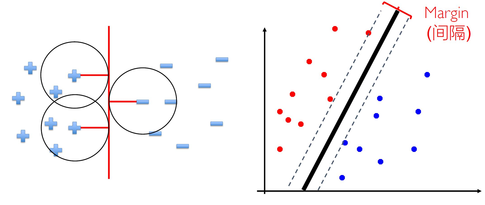
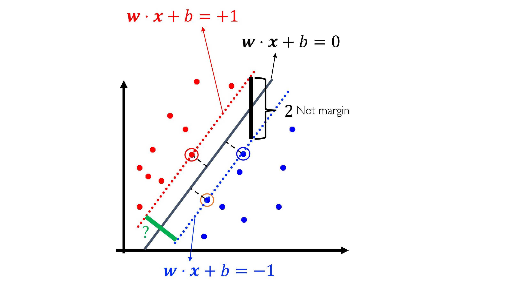
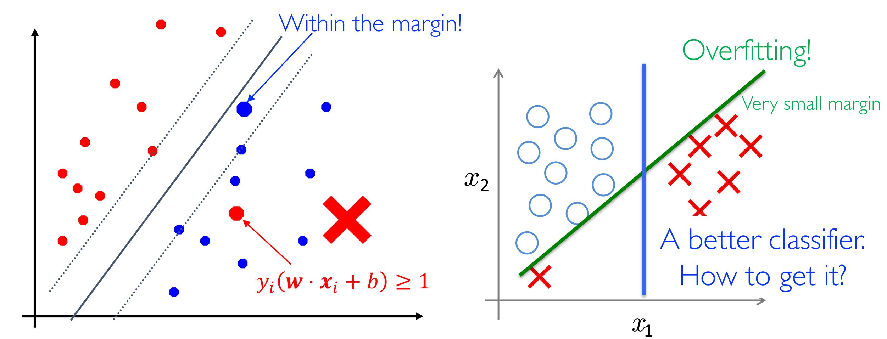
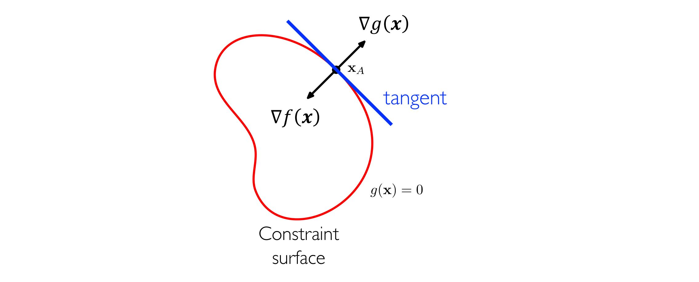
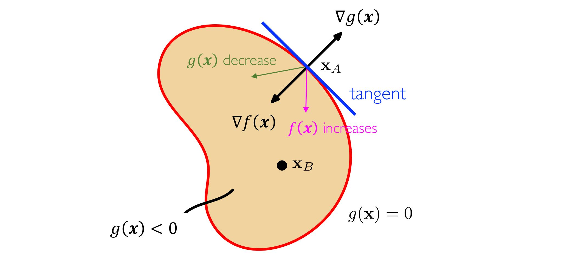
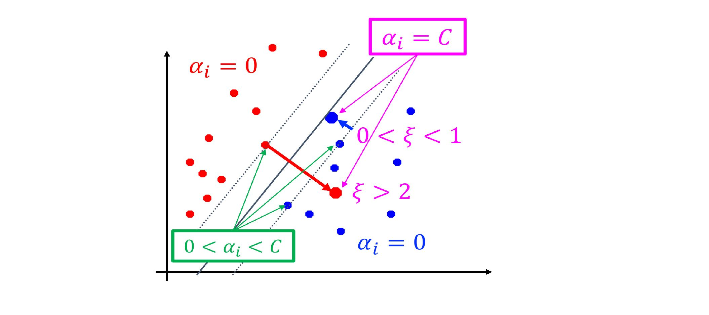
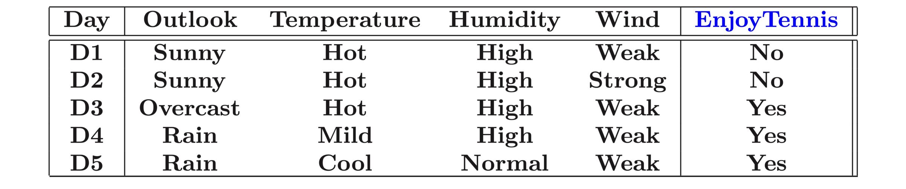
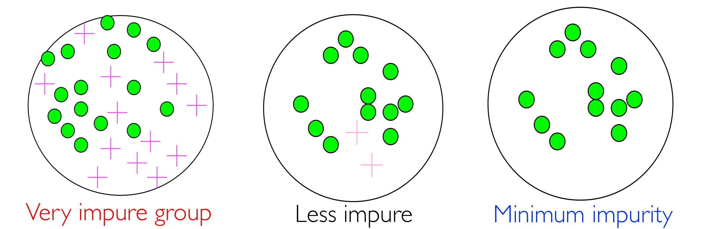
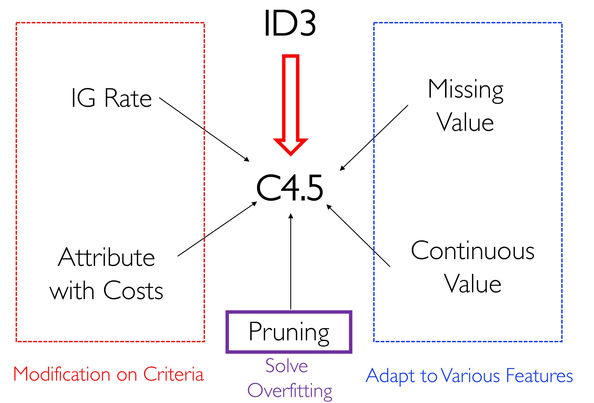

# 统计学习

## 统计学习

### 监督学习

给定可能的输入集合 $X$，输出集合 $Y$，一个未知的映射 $f: X \rightarrow Y$，以及可能的函数空间 $H = \{h | h: X \rightarrow Y\}$。

输入训练集合 $\{(x^{(i)}, y^{(i)}) \}$，希望输出一个函数 $f$ 的估计 $h \in H$ 使得 $h \approx f$。


## SVM

### SVM

#### 硬间隔 SVM

考虑几何视角。

当样本中的噪声逐渐增大时，只有一个线性分类器剩余，该线性分类器需要能够满足：

- 正确分类样本。
- 对于样本有最大的间距。



此时，支持向量机的想法就出现了。求解支持向量机等价于优化问题：

$$
\max \limits_{\vec w, b} \text{margin}(\boldsymbol w, b) \\
\text{s.t. } y_i(\boldsymbol w \cdot \boldsymbol x_i + b) \ge 1, 1 \le i \le n
$$



点 $\boldsymbol x_0$ 到超平面 $\boldsymbol w \cdot \boldsymbol x + b = 0$ 的距离为：

$$
\frac{\lvert \boldsymbol w \cdot \boldsymbol x_0 + b \rvert}{\lVert\boldsymbol w  \rVert}
$$

由于最近的点处在超平面 $\boldsymbol w \cdot \boldsymbol x_0 + b = \pm 1$ 上，则：

$$
\text{margin}(\boldsymbol w, b) = \frac{2}{\lVert w \rVert_2}
$$

由于表达式非凸，因此将其转化为更易优化的凸函数形式，硬间隔 SVM 于是等价于凸优化问题：

$$
\min \limits_{\boldsymbol  w, b} \frac 1 2 {\lVert \boldsymbol w\rVert_2^2} \\
\text{s.t. } y_i(\boldsymbol w \cdot \boldsymbol x_i + b) \ge 1, 1 \le i \le n
$$


#### 软间隔 SVM

硬间隔 SVM 仅适用于线性可分的问题，在实际中应用极少。即使可以使用，也容易出现过拟合问题。



容许部分点分类错误，引入松弛变量 $\xi_i$。

$$
\min \limits_{\boldsymbol  w, b, \boldsymbol \xi} \frac 1 2 {\lVert \boldsymbol w\rVert_2^2} \\
\text{s.t. } y_i(\boldsymbol w \cdot \boldsymbol x_i + b) \ge 1 - \xi_i, 1 \le i \le n \\
\xi_i \ge 0, \sum \limits_{i = 1}^n \xi_i \le n', 1 \le i \le n
$$

约束过多，利用 Lagrange 乘子法整理出等价的方程。

$$
\min \limits_{\boldsymbol  w, b, \boldsymbol \xi} \frac 1 2 {\lVert \boldsymbol w\rVert_2^2} + C \sum \limits_{i = 1}^n \xi_i \\
\text{s.t. } y_i(\boldsymbol w \cdot \boldsymbol x_i + b) \ge 1 - \xi_i, 1 \le i \le n \\
\xi_i \ge 0,  1 \le i \le n
$$


#### 多类别 SVM

对于多类别的分类问题，SVM 可以通过一下几种方式解决：

- 一对多：某类为正例，其余为负例。分类时将未知样本分给具有最大分类函数值的一类。
- 一对一：任意两类构造一个 SVM，分类时采取投票的方式决定类别。
- 层次法：所有类先分成两类，再依次类推。


### 优化

#### 凸优化问题

对于通用优化问题：

$$
\min \limits_x f(x) \\
\text{s.t.} x \in \mathcal X
$$

该问题称为凸优化问题如果 $\mathcal X$ 是一个凸集且 $f(x)$ 是凸函数。


#### KKT 条件

在凸优化问题中，分别考虑等式约束和不等式约束。


对于等式约束：

$$
\min \limits_{x \in \mathbb R^d} f(\boldsymbol x) \\
\text{s.t.} g(\boldsymbol x) = 0
$$

1. 对于任意满足 $g(\boldsymbol x) = 0$ 的 $\boldsymbol x$，$\nabla_{\boldsymbol x} g(\boldsymbol x)$ 一定垂直于表面切线。

   > 否则沿梯度在切线方向的投影一定能走到不同的值。

2. 对于约束表面上最优的 $\boldsymbol x^*$，$\nabla_{\boldsymbol x} f(\boldsymbol x)$ 一定垂直于表面切线。

   > 否则沿梯度在切线方向的投影一定能走到不同的值。



因此有：

$$
\nabla f + \lambda \nabla g = 0, \lambda \neq 0
$$

对于此问题的 Lagrange 方程：

$$
L(\boldsymbol x, \lambda) = f(\boldsymbol x) + \lambda g(\boldsymbol x)
$$

且有：

$$
\begin{cases}
\nabla_{\boldsymbol x} L = 0 \iff \nabla f + \lambda g = 0 \\
\frac{\partial}{\partial \lambda} L = 0 \iff g(\boldsymbol x) = 0
\end{cases}
$$

得到 $d + 1$ 组方程可以用于确定 $\boldsymbol x \in \mathbb R^d$ 和 $\lambda$，解为 $L(\boldsymbol x, \lambda)$ 的驻点。


对于不等式约束：

$$
\min \limits_{\boldsymbol x \in \mathbb R^d} f(\boldsymbol x) \\
\text{s.t.} g(\boldsymbol x) \le 0
$$

- 如果最优解在区域内（$g(\boldsymbol x) < 0$），则可直接求解 $\nabla_{\boldsymbol x} f = 0$，此时 $(\boldsymbol x^*, \lambda = 0)$ 是 $L(\boldsymbol x, \lambda)$ 的驻点。

- 如果最优解在边界上（$g(\boldsymbol x) = 0$），$f(\boldsymbol x)$ 最小当且仅当该点的梯度指向区域内，此时有

  $$
  \nabla f + \lambda \nabla g = 0, \lambda > 0
  $$




综合以上推导，可以得到 KKT 条件。

单个约束的 KKT 条件：

对于有约束的凸优化问题可以转化为对于 Lagrange 方程的求解：

$$
L(\boldsymbol x, \lambda) = f(\boldsymbol x) + \lambda g(\boldsymbol x)
$$

其中 $\boldsymbol x, \lambda$ 需要满足以下的 KKT 条件。

$$
\begin{align}
& g(\boldsymbol x) \le 0 \\
& \lambda \ge 0 \\
& \lambda g(\boldsymbol x) = 0
\end{align}
$$


多个约束的 KKT 条件：

当有多个约束时：

$$
\min \limits_{\boldsymbol x \in \mathbb R^d} f(\boldsymbol x) \\
\text{s.t.} g_j(\boldsymbol x) \le 0, \forall j = 1, \dots, J \\
h_k(\boldsymbol x) = 0, \forall k = 1, \dots, K
$$

得到 Lagrange 方程

$$
L(\boldsymbol x, \boldsymbol \lambda, \boldsymbol \mu) = f(\boldsymbol x) + 
\sum \limits_{j = 1}^J \lambda_j g_j(\boldsymbol x) + 
\sum \limits_{k = 1}^K \mu_k h_k(\boldsymbol x) \\
\text{s.t.} \lambda_j \ge 0, \forall j = 1, \dots, J
$$

此时的 KKT 条件为

$$
\forall 1 \le j \le J,
\begin{cases}
g_j(\boldsymbol x) \le 0 \\
\lambda_j \ge 0 \\
\lambda_j g_j(\boldsymbol x) = 0
\end{cases}
$$

此时，存在最优的 $\boldsymbol x^*$ 当且仅当存在 $\boldsymbol \lambda, \boldsymbol \mu$ 满足 KKT 条件。


#### 对偶问题 Lagrange 方法

原问题：

$$
\min \limits_{\boldsymbol x \in \mathbb R^d} f(\boldsymbol x) \\
\text{s.t.} g_j(\boldsymbol x) \le 0, \forall j = 1, \dots, J \\
h_k(\boldsymbol x) = 0, \forall k = 1, \dots, K
$$

其 Lagrange 对偶问题为：

$$
\max \limits_{\boldsymbol \lambda \in \mathbb R^J, \boldsymbol \mu \in \mathbb R^k} \Gamma(\boldsymbol \lambda, \boldsymbol \mu) = \inf \limits_{\boldsymbol x} L(\boldsymbol x, \boldsymbol \lambda, \boldsymbol \mu) \\
\text{s.t.} \lambda_j \ge 0, \forall j = 1, \dots, J
$$

> $\Gamma(\boldsymbol \lambda, \boldsymbol \mu)$ 为 $f(\boldsymbol x^*)$ 的下界，且是一个凹函数。
>
> 对于任意的点 $\boldsymbol x'$，有
> 
> $$
> \inf \limits_{\boldsymbol x} L(\boldsymbol x, \boldsymbol \lambda, \boldsymbol \mu)
> \le f(\boldsymbol x') + \sum \limits_{j = 1}^J \lambda_j g_j(\boldsymbol x') +
> \sum \limits_{k = 1}^K \mu_k h_k(\boldsymbol x')
> \le f(\boldsymbol x')
> $$
> 
> 在凸优化问题中，有
> 
> $$
> \max \limits_{\boldsymbol \lambda, \boldsymbol \mu} \Gamma(\lambda, \mu) = f(\boldsymbol x^*)
> $$

> 注：将原问题转化为对偶问题不一定是更容易。
>
> 事实上，如果从隐函数 $\nabla_{\boldsymbol x} = 0$ 计算得到的 $\boldsymbol x = \psi(\boldsymbol \lambda, \boldsymbol \mu)$ 没有解析形式，对偶问题是更为困难的。

> 注：
>
> 1. 对偶问题中求解 max-min 要比求解 min-max 问题更加容易（后者容易出现正无穷的情况）。
> 2. 对偶问题的约束是对于常量的约束，比原问题中对于函数的约束更为简单。


#### 对偶问题求解 SVM

将 SVM 对应的凸优化问题转换为对偶问题进行求解。

原问题为：

$$
\min \limits_{\boldsymbol w, b, \boldsymbol \xi} \frac 1 2 \lVert \boldsymbol w \rVert_2^2 + C \sum \limits_{i = 1}^n \xi_i \\
\text{s.t.} 1 - \xi_i - y_i(\boldsymbol w \cdot \boldsymbol x_i + b) \le 0 \\
- \xi_i \le 0, 1 \le i \le n
$$

写成 Lagrange 方程的形式（共 $2n$ 个约束）：

$$
L(\boldsymbol w, b, \boldsymbol \alpha, \boldsymbol \xi, \boldsymbol \mu)
= \frac 1 2 \lVert \boldsymbol w \rVert_2^2 + C \sum \limits_{i = 1}^n \xi_i
+ \sum \limits_{i = 1}^n \alpha_i(1 - \xi_i - y_i(\boldsymbol w \cdot \boldsymbol x_i + b)) - \sum \limits_{i = 1}^n \mu_i \xi_i \\
\alpha_i \ge 0, \mu_i \ge 0, i = 1, \dots, n
$$

**对 $L$ 求偏导，将参数写成 Lagrange 算子的形式**：

$$
\begin{cases}
\frac{\partial L}{\partial \boldsymbol w} = 0 \rightarrow \sum \limits_{i = 1}^n \alpha_i y_i \boldsymbol x_i = 0 \\
\frac{\partial L}{\partial b} = 0 \rightarrow \sum \limits_{i = 1}^n \alpha_i y_i = 0 \\
\frac{\partial L}{\partial \xi_i} = 0 \rightarrow C = \alpha_i + \mu_i, i = 1, \dots, n
\end{cases}
$$

整理可以得到对偶问题（$2n + 1$ 个约束）：

$$
\max \limits_{\boldsymbol \alpha} \sum \limits_{i = 1}^n \alpha_i - \frac 1 2 \sum \limits_{i = 1}^n \sum \limits_{j = 1}^n \alpha_i \alpha_j y_i y_j(\boldsymbol x_i \cdot \boldsymbol x_j) \\
\text{s.t.} \sum \limits_{i = 1}^n \alpha_i y_i = 0 \\
0 \le \alpha_i \le C, 1 \le i \le n
$$

此处可以通过二次线性规划求解（较慢），也可以使用特殊方法 SMO（Sequential Minimal Optimization）求解。

在解出 $\boldsymbol \alpha$ 后，可以求解 $\boldsymbol w = \sum \limits_{i = 1}^n \alpha_i y_i \boldsymbol x_i$。

在解出 $\boldsymbol w$ 后，选取 $\alpha_j > 0$ 的对应 $j$，计算得到 $b = y_j - \sum \limits_{i = 1}^n \alpha_i y_i (\boldsymbol x_i \cdot \boldsymbol x_j)$。

> 支持向量
>
> $\alpha_i > 0$ 的点 $\boldsymbol x_i$，对于 $\boldsymbol w$ 有贡献。（困难的样本、稀疏解）
>
> 
>
> 对于 $\alpha_i > 0$，可分类讨论得到：
>
> - 若 $\alpha_i < C$，则 $\xi_i = 0$，$x_i$ 在间隔边界上。
> - 若 $\alpha_i = C$：
>   - $0 < \xi_i < 1$，则分类正确，$x_i$ 在间隔边界和超平面之间。
>   - $\xi_i = 1$，则 $x_i$ 在超平面上。
>   - $\xi_i > 1$，则 $x_i$ 在误分的一侧。


### 核函数

对于非线性可分的支持向量机，可以通过引入基函数的方式将输入空间映射到特征空间，并在特征空间中进行线性划分：

$$
\boldsymbol x = (x_1, \dots, x_d) \in \mathcal X \overset{\Phi}{\rightarrow} \boldsymbol z = (z_1, \dots, z_{\tilde d}) \in \mathcal Z 
$$

为了避免特征空间维度过高导致的计算困难（事实上，有的特征空间可以是无穷维的），引入核函数。

$$
k(\boldsymbol x_1, \boldsymbol x_2) = \Phi(\boldsymbol x_1) \cdot \boldsymbol \Phi(\boldsymbol x_2)
$$

此时，用 SVM 解出的超平面为：

$$
\sum \limits_{i = 1}^n \alpha_i y_i (\boldsymbol x_i, \boldsymbol x) + b
$$

定理（Mercer）：映射 $k(\cdot, \cdot)$ 是一个 $\mathcal X \times \mathcal X$ 上的对称函数，$k(\cdot, \cdot)$ 是核函数的充要条件为，对于任意的输入 $(\boldsymbol x_1, \dots, \boldsymbol x_m)$，都有

$$
K = \begin{pmatrix}
k(\boldsymbol x_1, \boldsymbol x_1) & \cdots & k(\boldsymbol x_1, \boldsymbol x_m) \\
\vdots & \ddots & \vdots \\
k(\boldsymbol x_1, \boldsymbol x_m) & \cdots & k(\boldsymbol x_m, \boldsymbol x_m)
\end{pmatrix}
$$

是半正定矩阵。

常见核函数有：

| 核函数      | 表达式                                                       |
| ----------- | ------------------------------------------------------------ |
| 多项式      | $k(\boldsymbol x_1, \boldsymbol x_2) = (\boldsymbol x_1 \cdot \boldsymbol x_2 + 1)^d$ |
| 高斯（RBF） | $k(\boldsymbol x_1, \boldsymbol x_2) = \exp(-\frac{\lVert \boldsymbol x_1 - \boldsymbol x_2 \rVert^2}{2 \sigma^2})$ |


### 文本分类问题

#### 文本的向量空间模型

将文本表达为一个向量

$$
(w_{1j}, \dots, w_{nj})^T
$$

其中 $w_{ij}$ 表示词项 $i$ 在文档 $j$ 中的权重。


#### TF-IDF

词项频率 $\text{tf}_{ij}$ 为第 $i$ 个词项在第 $j$ 个文档中的词频。

文档频率 $\text{df}_{ij}$ 为出现词项 $i$ 的文档比例。

逆文档频率 $\text{idf}_{ij} = \log \frac 1 {\text{df}_{ij}}$。

令 $w_{ij} = \text{tf}_{ij} \times \text{idf}_{ij}$，可以得到文档的向量空间模型。利用 SVM 可对其进行分类。


## 决策树

在分类问题中，某些问题存在“异质数据”不适合被普通的线性模型所描述。



同时，我们也希望通过适当的处理为这类问题的模型增加可解释性。

决策树可用来处理这类异质数据，并且与特征工程相结合。


### ID3

Intuition：我们希望划分出来的每个节点都尽量“纯净”，因此我们希望通过描述节点的“纯度”来对划分进行衡量。




#### 信息熵

使用信息熵来对一个节点“纯度“进行衡量，有：

$$
H(\mathcal D) = - \sum \limits_{k = 1}^K \frac{\lvert \mathcal C_k \rvert}{\lvert \mathcal D \rvert} \log \frac{\lvert \mathcal C_k \rvert}{\lvert \mathcal D \rvert}
$$


#### 信息增益

对于一次划分，我们使用信息增益来进行衡量。

$$
\text{IG} = H(\mathcal D) - \sum \limits_{i = 1}^n \frac{\lvert \mathcal D_i \rvert}{\lvert \mathcal D \rvert} H(\mathcal D_i)
$$

> 注：更大的熵，更少的信息量。因此这一熵增的过程被称为信息增益。


#### ID3

```pseudocode
创建根节点

// 终止条件
- 如果数据集合全都为正，则标记为正，退出
- 如果数据集合全都为负，则标记为负，退出
- 如果特征集合为空，标记为最多的标记，退出

// 主循环
A <- 利用 IG 计算出的最优划分特征
for vi <- A 的取值:
	添加新的子节点对应 A = vi 的情况
	令 Ei 为对应的数据集合
	- 如果 Ei 为空，则标记为父节点中最多的标记，退出
	- 否则添加一个新的节点，递归运行算法
```


### C4.5

ID3 中的信息增益倾向于选择分支比较多的属性。

> 在最极端的情景中，每个分支只有一个数据点会获得较好的信息增益。




#### 信息增益比

为了对多分支情况加入惩罚项，引入信息增益比：

$$
\text{GR} = \frac{\text{IR}}{\text{multivalued rate}}
$$

C4.5 中，多分支的比例通过本征值 $\text{IV}$ 进行衡量：

$$
\text{IV}(f) = - \sum \limits_{i = 1}^{\lvert V \rvert} \frac{\lvert \mathcal D_i \rvert}{\lvert \mathcal D \rvert} \log \frac{\lvert \mathcal D_i \rvert}{\lvert \mathcal D \rvert}
$$

当集合 $\mathcal D$ 被特征 $f$ 划分后的 $\text{IV}$ 如上。


#### 带权重的特征

在实际应用中，不同的特征可能拥有不同的现实特征。因此可以将权重引入决策过程中：

$$
\frac{(\text{GR})^2}{\text{Cost}}
$$

> $\text{Cost}$ 的确定需要与特征工程相结合。


#### 缺失值

对于数据中可能的缺失值，决策树提供了一种天然的解决方案。由于每层决策都是依次考虑每个特征，因此如果单个特征缺失的数据在合理的范围内，可以有效地解决数据缺失的问题。

1. 在计算 $\text{IG}$ 的过程中：
   - 计算缺失数据的比例 $\rho = \frac{\lvert \overline {\mathcal D} \rvert}{\lvert \mathcal D \rvert}$。
   - 在 $\mathcal D \backslash \overline {\mathcal D}$ 上计算信息增益 $\text{IG}$。
   - 实际的 $\text{IG} = (1 - \rho) \text{IG}$。
2. 在划分的过程中：依据权重将缺失数据的集合划分到每一类中。


#### 连续值

如果数据集中存在连续值，则可以将所有数值排序后枚举分割点。

如果 $x_{1j}, \dots, x_{nj}$ 是第 $j$ 个特征中 $n$ 个数据点，一般地，我们采用的分割点为：

$$
s_j \in \{\frac 1 2 (x_{rj} + x_{(r + 1)j}) | r = 1, \dots, n - 1 \}
$$


#### 信息增益比与信息增益结合

信息增益比倾向于选择分割不均匀的特征。

因此一种可行的解决方案为，先选择 $n$ 个信息增益较大的特征，再从这 $n$ 个中挑选信息增益比最大的特征。


### 过拟合问题

决策树中容易出现过拟合的情况，因此可以采取剪枝的方式进行修正。


#### 预剪枝

在训练过程中，每次在验证集上计算划分能否提升准确率，如果不能则进行剪枝。


#### 后剪枝

在训练完成后进行剪枝，从叶子节点开始向上，如果划分不能提高准确率则剪枝。


#### 正则化

对于决策树定义损失函数并加上基于树复杂度的正则项：

$$
\begin{align}
C_\alpha(T) &= \hat {\mathcal E}(T) + \alpha \lvert T \rvert \\
&= \sum \limits_{t = 1}^{\lvert T \rvert} N_t H_t(T) + \alpha \lvert T \rvert \\
&= - \sum \limits_{t = 1}^{\lvert T \rvert} \sum \limits_{k = 1}^K N_{tk} \log \frac{N_{tk}}{N_t} + \alpha \lvert T \rvert
\end{align}
$$

其中 $T$ 为所有叶子节点的集合，$N_{tk}$ 是第 $k$ 类进入叶子节点 $t$ 的样本个数。

决策树的损失函数即为所有叶子节点的经验熵之和；正则项为树复杂度（叶子节点的数量）。

可以利用此损失函数进行剪枝：递归地考虑每个叶子结点，如果 $C_{\alpha}(T_B) \le C_{\alpha} (T_A)$，则剪去叶子节点 $A$ 而将父亲节点 $B$ 作为新的叶子。
