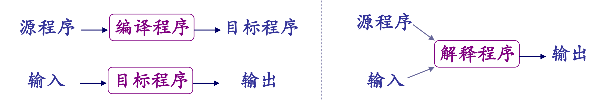
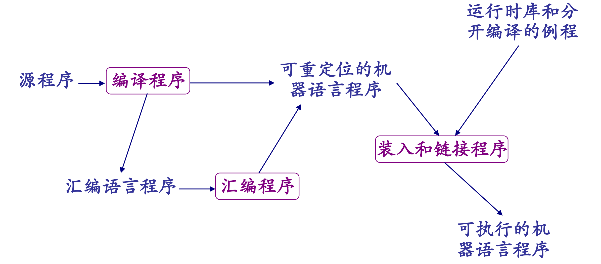
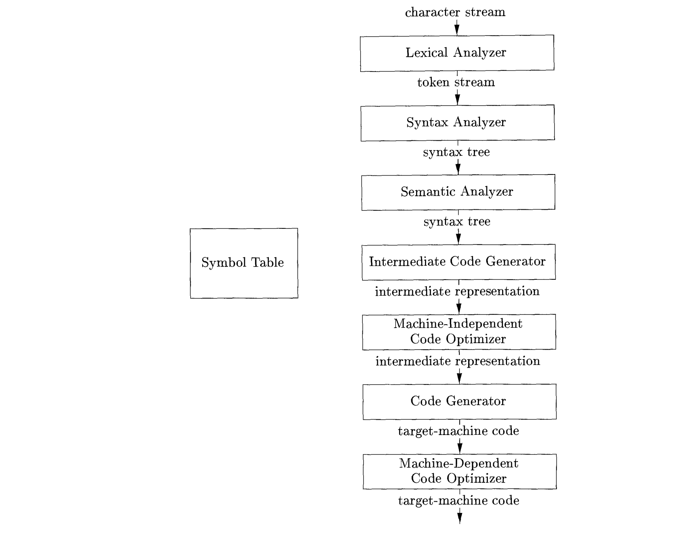

# 绪论

## 语言处理器

编译器是能将源语言翻译为目标语言的一段程序。在翻译过程中需要能够报告程序中的错误。

与编译器相关的还有一些伙伴程序，包括：

- 解释程序（interpreter）
- 预处理程序（preprocessor）
- 汇编程序（assembler）
- 装入和链接程序（load and link-editor）

它们之间的一些关系如下：

## 编译器的结构

一个典型的编译器分为 **分析（analysis）** 和 **综合（synthesis）** 两个阶段。

在分析阶段，编译器将源程序分解并组织成某种语法结构，并且通常将部分信息生成为符号表。

在综合阶段，编译器利用生成的中间代码最终生成目标语言的程序。

