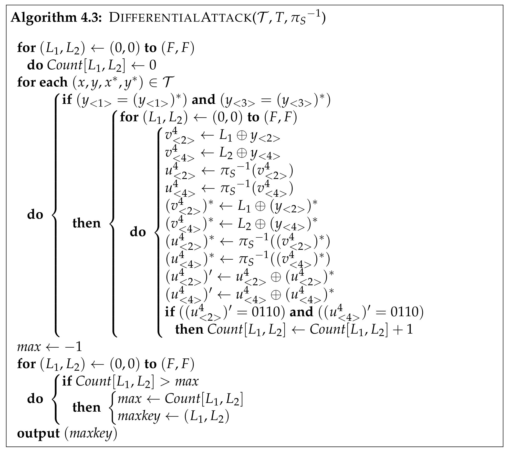
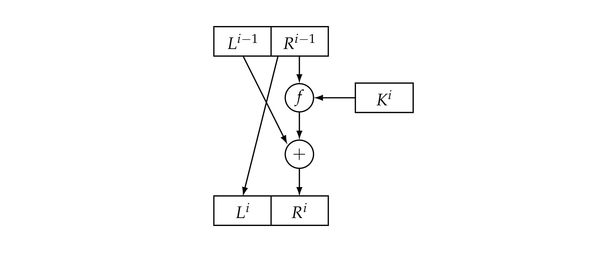
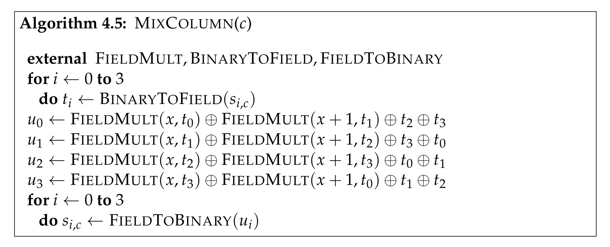
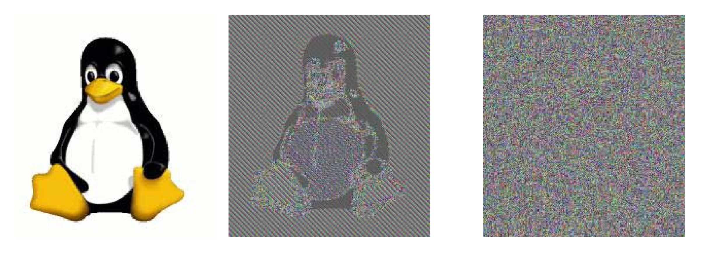
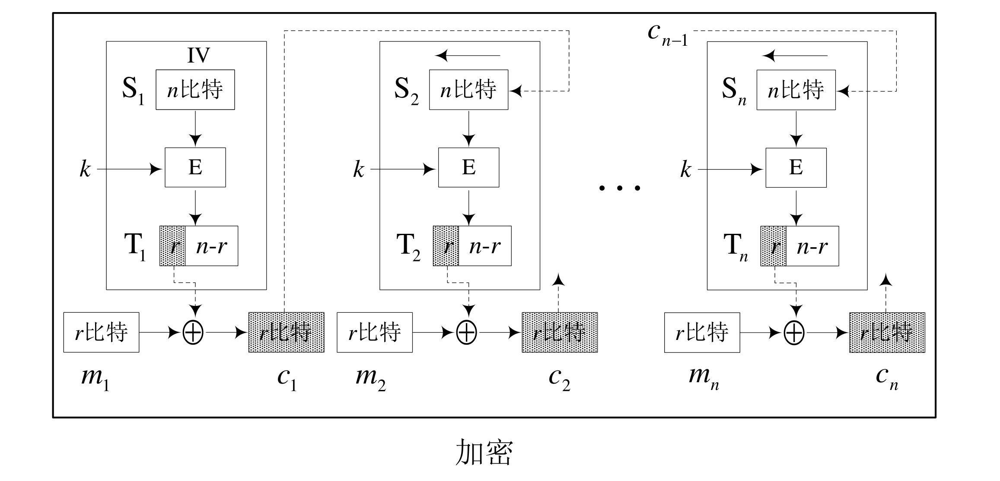
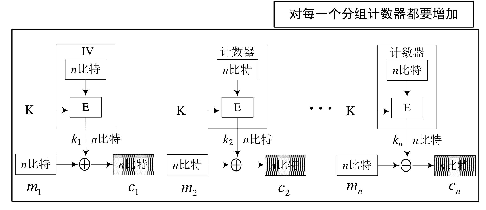
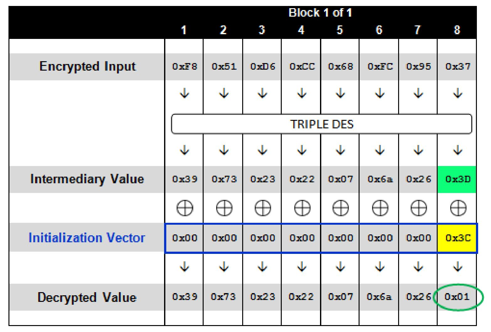

# 分组密码

## 概述

### 迭代密码

定义一个轮函数和一个密钥编排方案，一个明文的加密将经过 $N_r$ 轮类似的过程。

设 $K$ 是一个确定长度的随机二元密钥，用 $K$ 来生成 $N_r$ 个轮密钥得到密钥编排方案 $(K^1, \dots, K^{N_r})$ 就是密钥编排方案。

轮函数 $g$ 以轮密钥 $(K^r)$ 和当前状态 $w^{r - 1}$ 作为它的两个输入，下一轮状态定义为 $w^r = g(w^{r - 1}, K^r)$，整个加密过程为

$$
\begin{align}
w^0 & \leftarrow x \\
w^1 & \leftarrow g(w^0, K^1) \\
& \vdots \\
w^{N_r - 1} & \leftarrow g(w^{N_r - 2}, K^{N_r - 1}) \\
w^{N_r} & \leftarrow g(w^{N_r - 1}, K^{N_r}) \\
y & \leftarrow w^{N_r}
\end{align}
$$


### 轮函数

基本原则：

- 扩散：扩散就是让明文中的每一位影响密文中的许多位，或者说让密文中的每一位受明文中的许多位的影响。这样可以隐蔽明文的统计特性。

  > 线性变换、置换、移位等等。

- 混淆：是指让密文和密钥之间的统计关系变得复杂，使得敌手不能通过密文的统计关系，推测出密钥的统计关系 （非线性替换）。

  > 代换表、乘法与异或、加法与异或等等。


## 代换-置换网络

密码体制：设 $l, m, N_r$ 都为正整数，$\pi_s: \{0, 1\}^l \rightarrow \{0, 1\}^l$ 与 $\pi_p: \{1, \dots, lm\} \rightarrow \{1, \dots, lm\}$ 均为置换。设 $\mathcal P, \mathcal C = \{0, 1\}^{lm}, \mathcal K \subseteq (\{0, 1\}^{lm})^{N_r + 1}$ 是由初始密钥 $K$ 用密钥编排算法生成的所有可能密钥编排方案的集合。对一个密钥编排方案 $(K^1, \dots, K^{N_r + 1})$，使用如下算法加密明文 $x$。

```pseudocode
w^0 <- x
for r <- 1 to Nr - 1
do
	u^r <- w^{r - 1} oplus K^r
	for i <- 1 to m
		do v^r_i <- pi_s(u^r_i)
	w^r <- (v^r_{pi(1)}, ..., v^r_{pi(p)})
u^{Nr} <- w^{Nr - 1} oplus K^{Nr}
for i <- 1 to m
	do v^{Nr}_i <- pi_s(u^{Nr}_{i})
y <- v^{Nr} oplus K^{Nr + 1}
output(y)
```


- S盒属性：改变输入的1比特，输出比特中有一半的比特改变，输出的每一个比特依赖输入的所有比特。
- P盒属性：好的P置换是使得S盒的输出比特分布到下一轮的尽可能多的S盒。

此过程对应于扩散与混淆，使得明文的统计特性变得复杂。

第一轮和最后一轮是密码“白化”的过程，使得攻击者在不知道密钥的情况下不能直接进行加密或解密。


## 线性密码分析

### 偏差

令 $P(\boldsymbol X_i = 0) = p_i$，则 $P(\boldsymbol X_i = 1) = 1 - p_i$，定义 $\boldsymbol X_i$ 的偏差 $\varepsilon = p_i - \frac 1 2$。


### 堆积引理

引理：设 $\boldsymbol X_{i_1}, \dots, \boldsymbol X_{i_k}$ 是**独立**随机变量，$\varepsilon_{i_1, \dots, i_k}$ 表示随机变量 $\boldsymbol X_{i_1} \oplus \dots \oplus \boldsymbol X_{i_k}$ 的偏差，则

$$
\varepsilon_{i_1, \dots, i_k}  = 2^{k - 1} \prod \limits_{j = 1}^k \varepsilon_{i_j}
$$

推论：设 $\boldsymbol X_{i_1}, \dots, \boldsymbol X_{i_k}$ 是独立随机变量，$\varepsilon_{i_1, \dots, i_k}$ 表示随机变量 $\boldsymbol X_{i_1} \oplus \dots \oplus \boldsymbol X_{i_k}$ 的偏差，若对于某 $j$，有 $\varepsilon_{i_j} = 0$，则 $\mathcal E_{i_1, \dots, i_k} = 0$。


### 线性逼近

根据结果计算偏差较大的比特组合，寻找出S盒中的几组线性关系。


### 线性攻击

针对上一节中得到的若干线性逼近方程组。遍历所有的相关密钥比特，计算对于已知明密文对异或和为0的次数，寻找偏差最接近线性逼近偏差的密钥。


## 差分密码分析

差分密码分析主要通过差分对的方式对两个输入的异或和两输出的异或进行分析，以去除嵌入密码对于加密过程的影响，找到“不变”的因素。

### 差分链

定义：设 $\pi_s: \{0, 1\}^m \rightarrow \{0, 1\}^n$ 为一个S盒。考虑长为 $m$ 的有序比特串对 $(x, x^*)$，称S盒的输入异或为 $x \oplus x^*$，S盒的输出异或为 $\pi_s(x) \oplus \pi_s(x^*)$。

定义：对任何 $x' \in \{0, 1\}^m$，定义集合 $\Delta(x')$ 为包含所有具有输入异或值 $x'$ 的有序对 $(x, x')$。

> 注：集合 $\Delta(x')$ 共有 $2^m$ 个元素。

定义：

$$
N_D(x', y') = |\{(x, x') \in \Delta(x'): \pi_s(x) \oplus \pi_s(x^*) = y' \}|
$$

定义：异或扩散率

$$
R_p(a', b') = \frac{N_D(a', b')}{2^m}
$$

将异或在不同轮中形成差分链，并且假设差分链中不同扩散率彼此独立，我们可以得到差分链的扩散率。


### 差分攻击




## DES

### Feistel 结构

在 Feistel 型轮函数中，$g$ 有以下形式：

$$
g(L^{i - 1}, R^{i - 1}, K^i) = (L^i, R^i)
$$

其中

$$
\begin{cases}
L^i = R^{i - 1} \\
R^i = L^{i - 1} \oplus f(R^{i - 1}, K^i)
\end{cases}
$$

这一结构下，$f$ 不需要是可逆的，因为给定轮密钥，Feistel 轮函数一定是可逆的

$$
\begin{cases}
L^{i - 1} = R^i \oplus f(L^i, K^i) \\
R^{i - 1} = L^i
\end{cases}
$$

总的加密流程为：

$$
\begin{align}
& (L_0, R_0) = P \\ \\
& L_1 = R_0 \\
& R_1 = L_0 \oplus F(K_1, R_0) \\
& \dots \\
& L_r = R_{r - 1} \\
& R_r = L_{r - 1} \oplus F(K_r, R_{r - 1}) \\ \\
& C = (R_r, L_r)
\end{align}
$$

加解密使用同一套逻辑，除了密钥使用顺序不同。

安全性：如果轮函数是安全的伪随机函数，将轮密钥 $S_i$ 作为种子，则由 Feistel 结构构造的分组密码3轮就是一个伪随机置换，4轮是一个强的伪随机置换（即使允许敌手访问逆置换）。


### DES

DES 是一个16轮的 Feistel 型密码，分组长度64，密钥长度56。


#### 初始置换

在进行16轮加密之前，先对明文进行一个固定的初始置换 $\text{IP}(x) = L^0R^0$。

在16轮加密后，对比特串 $R^{16}L^{16}$ 做逆置换 $\text{IP}^{-1}$ 给出密文 $y$，即 $y = \text{IP}^{-1}(R^{16}L^{16})$。


#### 加密轮




#### f 函数

函数 $f: \{0, 1\}^{32} \times \{0, 1\}^{48} \rightarrow \{0, 1\}^{32}$。


计算 $f(A, J)$ 的过程为

1. 首先固定扩展函数 $E$，将 $A$ 扩展为一个48比特串。

2. 计算 $E(A) \oplus J$，并且将结果写作8个6比特串的并联 $B = B_1\dots B_8$。

3. 使用8个S盒，每一个S盒
   
   $$
   S_i: \{0, 1\}^6 \rightarrow (0, 1)^4
   $$
   
   一般用一个 $4 \times 16$ 的矩阵描述，用 $b_1b_6$ 表示行的二进制表示 $r$；用 $b_2b_3b_4b_5$ 表示列的二进制表示 $c$，则 $S_j(B_j) = S_j(r, c)$。

4. 根据置换 $P$ 对 $C$ 进行置换。


扩展函数 $E$：

|      |        |        |        |        |      |
| ---- | ------ | ------ | ------ | ------ | ---- |
| 32   | **1**  | **2**  | **3**  | **4**  | 5    |
| 4    | **5**  | **6**  | **7**  | **8**  | 9    |
| 8    | **9**  | **10** | **11** | **12** | 13   |
| 12   | **13** | **14** | **15** | **16** | 17   |
| 16   | **17** | **18** | **19** | **20** | 21   |
| 20   | **21** | **22** | **23** | **24** | 25   |
| 24   | **25** | **26** | **27** | **28** | 29   |
| 28   | **29** | **30** | **31** | **32** | 1    |


#### 密钥生成


从64位中首先取出56位，剩余8位弃用或用作奇偶性检验。

将56位分为两个28位，每轮进行一定的移位并取出其中的24位。

- 当 $i = 1, 2, 9, 16$ 时，移位数为1；
- 其他时候移位数为2。


### Double-DES

DES 56位的密钥空间太小，因此改进方法可以引进多轮 DES 加密。

最直观的方法是使用两轮 DES 加密：

$$
C = E_{k_2}(E_{k_1}(P))
$$


#### MITM

中间相遇攻击。

可以有效攻击多个密码体制组合进行加密的情况。

构造两个集合 $I = \{E_{k_1} (P) \}, J = \{D_{k_2}(C) \}$，即可利用生日攻击寻找碰撞。

加解密运算时间 $2^{57}$，存储空间 $2^{56}$。


### Triple-DES

为避免 MITM 的攻击提出 Triple-DES。

加密：

$$
C = E_{k_3}(D_{k_2}(E_{k_1}(P)))
$$

解密：

$$
P = D_{k_1}(E_{k_2}(D_{k_3}(C)))
$$


## AES

### AES

1. 给定明文 $x$，将 State 初始化为 $x$，并执行 AddRoundKey 操作，将 RoundKey 与 State 异或。
2. 对前 $N_r - 1$ 轮中的每一轮，用S盒进行一次代换操作 SubBytes，对 State 做置换 ShiftRows、MixColumns；然后进行 AddRoundKey。
3. 依次进行 SubBytes、ShiftRows、AddRoundKey。
4. 将 State 定义为密文 $y$。


#### State


#### SubBytes

AES 的S盒可以用代数的方法进行定义，置换 $\pi_s$ 涉及有限域

$$
\mathbb F_{2^8} = \mathbb Z_2[x] / (x^8 + x^4 + x^3 + x + 1)
$$

对于8个输入比特 $a_7a_6 \dots a_1a_0$，求其对应的多项式在有限域 $\mathbb F_{2^8}$ 中的乘法逆元（如果为0则不变）得到新的 $a_7 a_6 \dots a_1a_0$，令 $c_7 \dots c_0 = 01100011$。

令 $b_i = (a_i + a_{i + 4} + a_{i + 5} + a_{i + 6} + a_{i + 7} + c_i) \mod 2$。

最终得到 $b_7 b_6 \dots b_1 b_0$。


#### ShiftRows


#### MixColumns



其中乘域元素 $x$ 和 $x + 1$ 分别对应00000010和00000011。

或者，该过程可以写成矩阵形式，对于每一列中的元素 $\begin{bmatrix} s_{0, j} \\ s_{1, j} \\ s_{2, j} \\ s_{3, j} \end{bmatrix}$（$0 \le j \le 3$），可以计算得到新的列为：

$$
\begin{bmatrix} s_{0, j}' \\ s_{1, j}' \\ s_{2, j}' \\ s_{3, j}' \end{bmatrix} =
\begin{bmatrix} 2 & 3 & 1 & 1 \\ 1 & 2 & 3 & 1 \\ 1 & 1 & 2 & 3 \\ 3 & 1 & 1 & 2 \end{bmatrix}
\begin{bmatrix} s_{0, j} \\ s_{1, j} \\ s_{2, j} \\ s_{3, j} \end{bmatrix}
$$


## 工作模式

### ECB 模式

电子密码本模式。

模式：将明文的 $N$ 个分组独立地使用同一密钥 $K$ 加密和解密。

优点：

- 实现简单；
- 不同明文分组的加密可并行实施，尤其是硬件实现时速度很快。

缺点：

- 不同明文分组之间的加密独立进行，故保留了单表代换的缺点，造成相同明文分组对应相同密文分组，因而不能隐藏明文分组的统计规律和结构规律。



应用场合：

- 用于随机数的加密保护；
- 用于单分组明文的加密。


### CBC 模式

密码分组链接模式。

模式：每个明文分组在加密之前都要与以前的密文分组进行异或。第一个分组之前没有密文，故要用到一个伪分组 $IV$。


加密：

$$
C_0 = IV \\
C_i = E_k(P_i \oplus C_{i - 1})
$$

解密：

$$
C_0 = IV \\
P_i = D_k(C_i) \oplus C_{i - 1}
$$

优点：

- 明文块的统计特性得到了隐蔽。
- 具有有限的（两步）错误传播特性：一个密文块的错误将导致两个密文块不能正确解密。
- 具有自同步功能：密文出现丢块和错块不影响后续密文块的解密。若从第 $t$ 块起密文块正确，则第 $t+1$ 个明文块就能正确求出。

缺点：

- 加密不能并行处理（解密可以）。
- 消息是分组长度的整数倍（需要padding）。


### CFB 模式

密码反馈模式。

模式：




> 注：$S_i$ 为移位寄存器。 

> 注：CFB 实际上是将加密算法作为一个密钥流产生器。

优点：

- 适用于每次处理 $r$ 比特明文块的特定需求的加密情形，能灵活适应数据各格式的需要。
- 具有有限步的错误传播（$\frac n r$ 步），可用于认证。
- 具有自同步功能。

缺点：

- 加密效率低。
- 加密不能并行（解密可以并行）。
- 错误传播：
  - 明文或IV的一个比特的变化影响密文所有比特，但解密时除原有误的一组以外其它明文都能正确恢复。
  - 密文里的一个错误会引起明文的一个单独错误，此处错误会进入移位寄存器直到被移除。


应用：

- 不能改变明文长度：如数据库加密等特殊情况要求加密时不能改变明文的字节长度，这时就要以明文字节为单位进行加密。


### OFB 模式

输出反馈模式。

在结构上与 CFB 模式类似，但反馈内容是分组密码输出的密钥流而不是密文。

> 注：相当于利用分组密码的结构实现了序列密码。


优点：

- 密文每一个分组都独立于先前的分组，不具有错误传播特性。

缺点：

- 不能实现报文的完整性认证。
- 不具有自同步能力。
- 密钥序列的周期可能有短周期现象。

应用：

- 明文的冗余度特别大，信道不好但不易丢信号，明文信号出些错误也不影响效果的情形。如图像加密、语音加密等。


### CTR 模式

计数器模式。

模式：



特点：

- 与 OFB 模式一样，创建了独立于以前密文分组的密钥流，但是不运用反馈。

> 注：CTR 模式不需要填充，原因是最后一个即使不完整，也可以通过只截断密钥的前 $t$ 位完成加密。

优点：

- 处理效率高：能够对多块报文的加密和解密进行并行处理。
- 随机访问：密文分组的处理与其它密文无关实现简单。

缺点：可能导致明文攻击。


### 操作模式对比

| 操作模式 | 加密                                                         | 结果类型 | 数据单位大小 |
| -------- | ------------------------------------------------------------ | -------- | ------------ |
| ECB      | 每一个 $n$ 比特的分组都要用相同的密码密钥独立进行加密        | 分组密码 | $n$          |
| CBC      | 与 EBC 相同，不过每一个分组都要用前面的密文进行异或          | 分组密码 | $n$          |
| CFB      | 每一个 $r$ 比特的分组都要用一个 $r$ 比特的密钥进行异或，这个密钥是前面密文的一部分 | 序列密码 | $r \le n$    |
| OFB      | 与 CFB 相同，不过移位寄存器要用前面的 $r$ 比特密钥更新       | 序列密码 | $r \le n$    |
| CTR      | 与 OFB 相同，不过用的是计数器而不是移位寄存器                | 序列密码 | $n$          |


## 填充

Motivation：如何加密一个部分分组？

### 填充方法

#### 比特填充

在消息后面先填充一比特的1，然后填充若干比特的0，使其成为一个完整的消息分组。

为了使得填充没有二义性，即使明文是一个完整的分组，也要填充。


#### 字节填充

- PKCS7：填充“需要填充部分“的字节数。
- ANSI X.923：填充0字节，最后一个字节填充padding的长度。


### Padding Oracle 攻击

利用padding格式和CBC加密的特性，攻击者可以借助服务器解密任何一个block的密文。

1. 枚举合法块IV的最后一字节（256种情况），找到padding oracle返回的合法状态，此时两者异或和为 `0x01`，可由IV的值反推解密后的中间值。
2. 此后可以反着枚举倒数第二、三……字节，分别找到 `0x02`、`0x03`……，由此可以反推解密后的中间值的每一位置。




### Ciphertext Stealing

对于分组密码工作模式，可以通过 Ciphertext Stealing 保证密文和明文长度相同。


#### ECB-CTS


#### CBC-CTS


#### XTS-AES

Ciphertext Stealing 应用于磁盘加密。

满足磁盘加密的要求：

- 加密后密文长度与明文长度相同。
- 不同位置的相同的数据被加密成不同的密文。


## 通用密码分析

### 时间存储折中攻击

由穷尽密钥搜索攻击和查表攻击两种方法混合而成。

预处理过程：计算 $m$ 个链，每个链长度为 $t$，存储每条链的两端端点 $(SP_0, EP_0), \dots, (SP_{m - 1}, EP_{m - 1})$。

攻击过程：计算 $X_0 = C, X_1 = E(P, X_0), \dots$。把 $X_i$ 与存储的末节点 $EP_0, \dots, EP_{m - 1}$ 相比较，找的相符的可以从链起始端开始推得到明文。


## AES 密码分析

### 积分攻击

核心：寻找与随机不同的特征。

固定其余比特遍历某一特定比特的输出，可以统计其与纯随机情况的区别。


### 不可能差分攻击

寻找概率为0的差分路线。