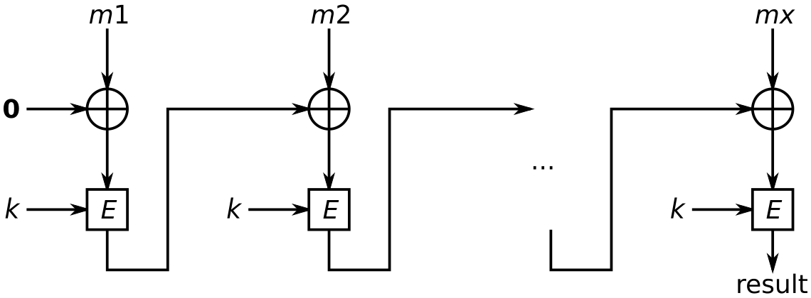

# Hash 函数

## Hash 函数

定义：一个 Hash 族函数是满足下列条件的四元组 $(\mathcal X, \mathcal Y, \mathcal K, \mathcal H)$：

1. $\mathcal X$ 是所有可能的消息的集合；
2. $\mathcal Y$ 是所有可能的消息摘要或认证标签构成的有限集；
3. $\mathcal K$ 是密钥空间，是所有可能的密钥构成的有限集；
4. 对每个 $K \in \mathcal K$，存在一个 Hash 函数 $h_K \in \mathcal H$，$h_K: \mathcal X \rightarrow \mathcal Y$。

## Hash 函数的安全性

如果一个 Hash 函数被认为是安全的，那么应该对下列三个问题应该出现难解的情况。

1. **抗原像攻击** ：对于 Hash 函数 $h: \mathcal X \rightarrow \mathcal Y$ 和 $y \in \mathcal Y$，找出 $x \in \mathcal X$ 使得 $h(x) = y$。

2. **抗第二原像攻击** ：对于 Hash 函数 $h: \mathcal X \rightarrow \mathcal Y$ 和 $x \in \mathcal X$，找出 $x' \in \mathcal X$ 使得 $x' \neq x$，并且 $h(x') \neq h(x)$。

3. **无碰撞性** ：对于 Hash 函数 $h: \mathcal X \rightarrow \mathcal Y$，找出 $x, x' \in \mathcal X$ 使得 $x' \neq x$，并且 $h(x') \neq h(x)$。

### 随机谕示模型

理想状态的 Hash 函数可用随机谕示模型进行描述。在这个理想模型中，我们只允许谕示器访问函数 $h$ 而不给出一个公式或算法计算 $h$。

在随机谕示模型下可以对上述三个问题进行讨论。

**抗原像攻击**
   
$$
P = 1 - (1 - \frac 1 M)^Q
$$

**抗第二原像攻击**
   
$$
P = 1 - (1 - \frac 1 M)^{Q - 1}
$$

**无碰撞性**
   
$$
\begin{align}
P &= 1 - (\frac{M - 1}M)(\frac{M - 2}M) \dots (\frac{M - Q + 1}M) \\
&\approx 1 - \prod \limits_{i = 1}^{Q - 1} e^{-\frac i M} \\
&= 1 - e^{\frac{-Q(Q - 1)}{2M}}
\end{align}
$$
   
令 $\varepsilon = P$，将 $Q$ 写成 $M, \varepsilon$ 的函数，得到：
   
$$
Q^2 - Q \approx 2M \ln(\frac 1 {1 - \varepsilon})
$$
   
忽略 $-Q$，可以估计出：
   
$$
Q \approx \sqrt{2M \ln(\frac 1 {1 - \varepsilon})}
$$
   
可以得到 $Q$ 大约在 $\sqrt M$ 量级。

## 迭代 Hash 函数

将一个压缩函数 $\text{compress}$ 延拓到无限域上的 Hash 函数。

迭代函数 $h$ 的求值主要由下列三步组成：

- 预处理。
- 处理。
- 输出变换。

### Merkle-Damgard 结构

定理：假设 $f: \{0, 1\}^{n + r} \rightarrow \{0, 1\}^n$ 是一个无碰撞压缩函数，则由 MD 迭代结构构造的 Hash 函数 $h$ 是无碰撞的。

## 碰撞攻击

穷举搜索：时间 $2^n$，空间 $1$。

生日攻击：时间 $2^{\frac n 2}$，空间 $2^{\frac n 2}$。

随机路径算法：迭代 Hash 值直到找到路径上一个圈的起点，时间 $2^{\frac n 2}$。

Floyd's two finger：

1. 使用两个指针，一个以正常速度运行，另一个以两倍速度运行，直到二者相遇。
2. 将其中一个指针移到起始点，以相同速度移动直到相遇。

## Hash 函数算法

### MD5

输入任意长度的消息，对输入按照512位的分组为单位进行处理，输出128位的消息摘要。

### SHA1

输入长度小于 $2^{64}$ 位的消息，输出是160位的消息摘要，输入消息以512位的分组为单位进行处理。

### SHA3

sponge 结构。

## 消息认证码

在传输信息过程中，需要对消息完整性和消息源进行认证。

认证可以用来：

- 验证消息 **完整性** 。
- 验证消息 **来源** 。
- 验证消息的 **顺序性** 和 **时间性** 。
- 验证消息的 **不可否认性** 。

消息认证码（MAC）是在密钥的控制下将任意长的消息映射为一个固定长度的短数据分组。

### MAC 安全性

#### 安全性界

- $k \le n$：猜测 $2^k$ 个密钥。
- $k > n$：直接选择一个消息，猜测其对应的标签，成功概率 $\frac 1 {2^n}$。

#### 假冒攻击

攻击目标：在一个未知但是固定的密钥 $K$ 下，产生一对有效的 $(x, y)$。（消息-标签对 $(m, \text{tag})$）。

攻击者向谕示器提出并获得一系列有效对 $(x_1, y_1), \dots, (x_Q, y_Q)$，如果攻击者据此输出一个假冒的概率至少为 $\varepsilon$，则称其为一个 $(\varepsilon, Q)$ 假冒。

#### 对于通用 MD 迭代结构 MAC的通用伪造攻击

定义：

- 内部碰撞：$g$ 函数前的碰撞；
- 外部碰撞：输出 tag 的碰撞，$g$ 函数之后的碰撞。

命题：一个内部碰撞能够用来伪造 MAC，仅需要一个选择消息和一次 MAC 询问。

> 设 $x, x'$ 是一对内部碰撞，则 $x \lvert \rvert y$ 和 $x' \lvert \rvert y$ 也是一对碰撞。

命题：设 $h$ 是一个基于 MD 迭代结构的 MAC 算法。需要 $u$ 个已知消息的消息询问和 $v$ 个选择消息的询问能够找到 $h$ 的一对内部碰撞。$u$ 和 $v$ 的期望值如下：

$$
u = \sqrt 2 2^{\frac n 2}
$$

- 当 $g$ 是置换函数（$n = m$），外部碰撞就是内部碰撞，$v = 0$；
- 当 $g$ 是压缩函数 （$n > m$），$v$ 近似于 $2 \cdot 2^{n - m} + 2 \cdot \lceil \frac n m \rceil$。

> 考虑生日攻击，通过 $u$ 个已知消息 - tag 对可以产生1个内部碰撞和 $2^{n - m}$ 个外部碰撞。
>
> 使用如下区分器进行区分：询问消息 $(x_i \lvert \rvert y, x_i' \lvert \rvert y)$ 的 MAC 值，看其是否还是碰撞。
>
> 1. 内部碰撞通过的概率为1。
> 2. 外部碰撞通过的概率为 $2^{-m}$。

### 消息认证构造

#### 密钥前缀方案

密钥前缀：$\text{MAC}_k(M) = H(K \lvert \rvert M)$。

缺点：长度扩展攻击。攻击者可以在消息的尾部增加一个新的消息分组，伪造一个新的 MAC：$(M\lvert \rvert S, \text{newtag})$。

#### 密钥后缀方案

密钥后缀：$\text{MAC}_k(M) = H(M \lvert \rvert K)$。

攻击：生日攻击。使用 Hash 函数的碰撞，可以伪造密钥后缀的 MAC。通过生日攻击找到碰撞 $(M, M')$，复杂度 $2^{\frac n 2}$。询问 $M$ 的 MAC 值 tag，伪造新的消息-MAC 对 $(M', \text{tag})$。

### NMAC 与 HMAC

#### NMAC

嵌套 MAC。

通过合成两个带密钥的 Hash 族建立嵌套 MAC 算法。假定 $(\mathcal X, \mathcal Y, \mathcal K, \mathcal G)$ 和 $(\mathcal Y, \mathcal Z, \mathcal L, \mathcal H)$ 是 Hash 族，利用其复合得到 Hash 组 $(\mathcal X, \mathcal Z, \mathcal M, \mathcal G \circ \mathcal H)$，其中 $\mathcal M = \mathcal K \times \mathcal L$。

#### HMAC

$$
H_K(M) = H(\overline K \oplus \text{opad} \lvert \rvert H(\overline K \oplus \text{ipad} \lvert \rvert M))
$$

其中，$\overline K = K \lvert \rvert 0 \dots 0$ 为一个完整的消息分组，$\text{opad}$ 和 $\text{ipad}$ 为常数。

### CBC-MAC

#### CBC-MAC

基于分组密码的消息验证码。

与 CBC 模式使用随机的初始化向量 IV 不同，CBC-MAC 使用固定的全零初始值，否则有变动的 IV 可能导致被攻击和伪造。

#### CBC-MAC 安全性

对于 CBC-MAC 的攻击分为两种情况考虑。设最后一轮加密后得到的结果 $x$ 再经过 $f(x)$ 得到最后结果。

若 $f(x) = x$：

- 若已知 $c = \text{CBC}_K(m)$，则有 $c = \text{CBC}_K(m \lvert \rvert c \oplus m)$。
- 若已知 $c = \text{CBC}_K(m), c' = \text{CBC}_K(m')$，则有 $\text{CBC}(m' \lvert \rvert c' \oplus c \oplus n) = \text{CBC}_K(m \lvert \rvert n)$。

若 $f(x) \neq x$：

利用生日攻击找到一对碰撞

$$
x = (m_1 \lvert \rvert m_2 \lvert \rvert \dots \lvert \rvert m_q) \\
y = (m_1' \lvert \rvert m_2' \lvert \rvert \dots \lvert \rvert m_q)
$$

且两者的 MAC 相同，则一定有

$$
E_K(m_1) \oplus m_2 = E_K(m_1') \oplus m_2'
$$

则可以构造出新的碰撞

$$
m_1 \lvert \rvert m_2 \oplus \delta \lvert \rvert m_3 \lvert \rvert \dots \lvert \rvert m_q \\
m_1' \lvert \rvert m_2' \oplus \delta \lvert \rvert m_3 \lvert \rvert \dots \lvert \rvert m_q
$$

### EMAC 和 Retail-MAC

在 CBC-MAC 的基础上在末尾加上加密后输出。

### 加密验证算法

如果需要同时完成加密和验证功能，共有三种可能的选择：

- 加密和认证：分别独立进行加密和认证，输出 $(c, t)$。

  加密要求密文不泄露任何明文的信息，而认证码却可以校验密文，与加密的原则相矛盾，不推荐。

- 鉴别后加密：给定消息 $m$，首先计算 $t = \text{MAC}_{k_2}(m)$，再加密得到 $c = E_{k_1}(m \lvert \rvert t)$，输出 $c$。

  有可能会遭到 padding oracle 攻击，如果能有效防止则可使用。

- 加密后鉴别：给定消息 $m$，首先计算 $c = E_{k_1}(m)$，再计算 $t = \text{MAC}_{k_2}(c)$，最后输出 $(c, t)$。

  最安全的选择。