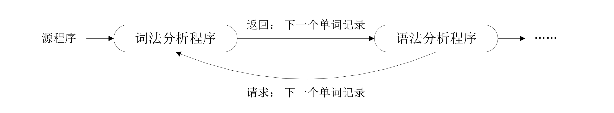

# 词法分析

## 概述

词法分析的主要任务是扫描程序的字符流，并将扫描到的每个单词识别为有意义的词素（lexeme）。

对于每一个词素，词法分析器生成如下的二元组作为 token：

$$
\langle \text{token-name}, \text{attribute-value} \rangle
$$

其中 token 的名字是一个用于语法分析的标识符，属性通常指向符号表中的一个位置。

例如，对于语句：

```
position = initial + rate * 60
```

可以通过词法分析转化为：

```
<id, 1> <=> <id, 2> <+> <id, 3> <*> <60>
```

## 词法分析在编译器中的组织

通常由语法分析程序调用词法分析程序。



## 实现方式

常用的实现方法：

- 扩展巴克斯范式（EBNF，Extended Backus–Naur form）
- 状态转换图
- 正规表达式
- 有限状态自动机