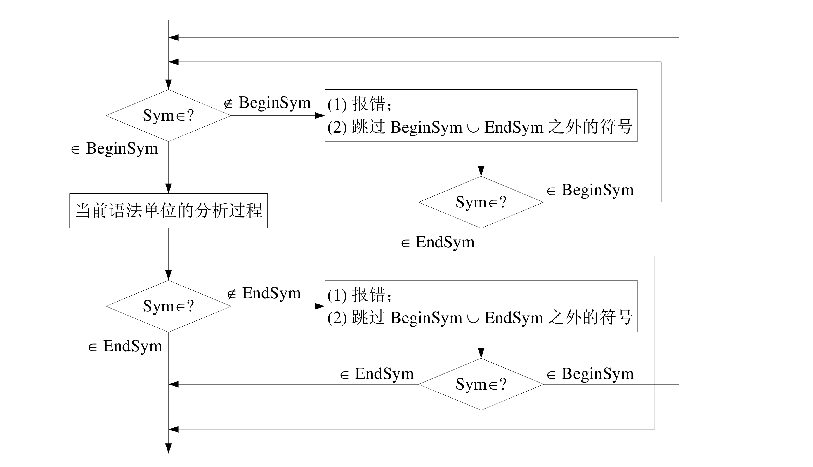
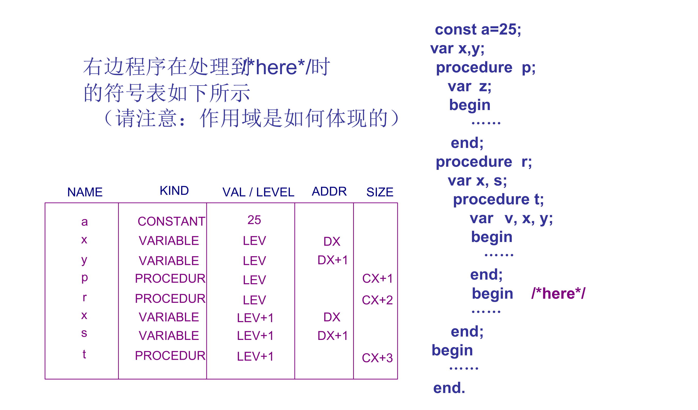
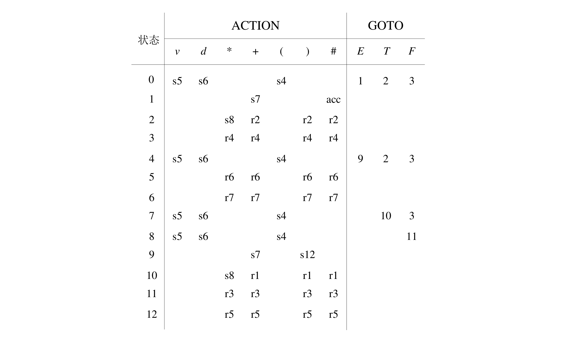
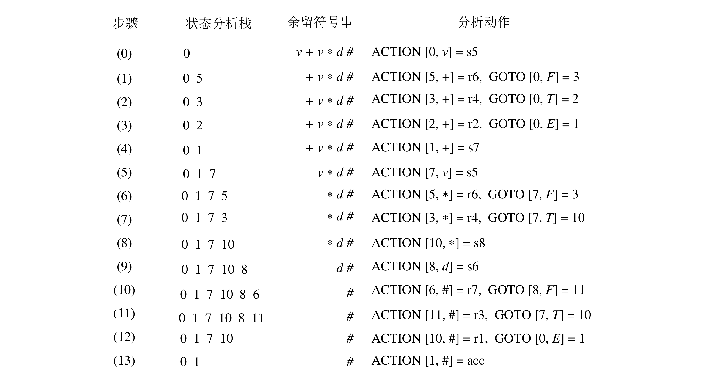

# 语法分析

语法分析的核心问题：识别与解析。

对任意上下文无关文法 $G = (V, T, P, S)$，和任意 $W \in T^*$，是否有 $w \in L(G)$？若成立，则给出分析树或（最左）推导步骤；否则报错。

## 自顶向下语法分析

思想：从文法开始符号出发进行推导；每一步推导都获得文法的一个句型，直到产生出一个句子恰好是所期望的终结符串。

### 带回溯的自顶向下分析

自顶向下分析过程的两类非确定性：

- 选择哪一个非终结符展开；
- 对于选定的非终结符选择哪一个产生式。

最朴素的想法是采用试探和回溯。

改进方法：在每一步推导中，总是对最左边的非终结符尽心替换，仅有产生式选择是非确定的，分析成功可得到一个最左推导。

### 自顶向下预测分析

通过向前扫描（lookahead）若干个字符进行确定性推导（并非所有文法都可以做到）。

### First 和 Follow 集合

#### First 集合

定义：设上下文无关文法 $G = (V_N, V_T, P, S)$，对于 $\alpha \in (V_N \cup V_T)^*$ 定义：

$$
\text{First}(\alpha) = \{a | \alpha \Rightarrow ^* a \beta, a \in V_T, \beta \in (V_N \cup V_T)^* \lor a = \varepsilon, \alpha \Rightarrow ^* \varepsilon \}
$$

直观理解：$\text{First}$ 集合是一个对于一个 **句型** 而言的，代表着该句型能够推导出的 **开头字符** 集合。

对于语法分析，我们关心所有可能句型的 $\text{First}$ 集合，即

$$
X_G = V_N \cup V_T \cup \{\varepsilon \} \cup \{v | A \rightarrow u \in P, v \text{ is suffix of } u\}
$$

可以迭代计算所有 $x \in X_G$ 的 $\text{First}$ 集合：

- 初始化：所有非终结符和 $\varepsilon$ 集合为自身（$\text{First}(x) = \{x\}$），否则为 $\Phi$。
- 重复直到所有的集合都不再变化：
    - 对于 $A \rightarrow \varepsilon \in P$，置 $\text{First}(A) = \text{First}(A) \cup \{\varepsilon\}$。
    - 对于 $y_1y_2 \dots y_k \in \{v | A \rightarrow u \in P, v \text{ is suffix of } u\}, k \ge 1$。
        如果存在 $i$，$\varepsilon$ 在 $\forall 1 \le j \le i - 1, y_j$ 的 $\text{First}$ 集合中但不在 $y_i$ 的集合中，则
$$
\text{First}(y_1 \dots y_k) = \text{First}(y_1) \cup \dots \cup \text{First}(y_i) - \varepsilon
$$
        否则不需要 $-\varepsilon$，即
$$
\text{First}(y_1 \dots y_k) = \text{First}(y_1) \cup \dots \cup \text{First}(y_k)
$$
    - 若有 $A \rightarrow y_1 y_2 \dots y_k$，则置
$$
\text{First}(A) = \text{First}(A) \cup \text{First}(y_1y_2 \dots y_k)
$$

#### Follow 集合

定义：设上下文无关文法 $G = (V_N, V_T, P, S)$，对于 $A \in V_N$ 定义：

$$
\text{Follow}(A) = \{a | S$ \Rightarrow ^* \alpha A \beta $ \land a \in \text{First}(\beta $), \alpha, \beta \in (V_N \cup V_T)^* \}
$$

其中 $ 为符号序列的结束符。

直观理解：$\text{Follow}$ 集合是一个对于一个 **非终结符** 而言的，代表着该句型能够推导出的 **紧邻字符** 集合。

可以迭代计算所有 $A \in V_N$ 的 $\text{Follow}$ 集合：

- 初始时，置 $\text{Follow}(S) = \{\$\}$；对其它 $A \in V_N$，置 $\text{Follow}(A) = \Phi$。
- 重复直到所有的集合都不再变化：若有 $A \rightarrow \alpha B \beta \in P$，则
  - 令 $\text{Follow}(B) = \text{Follow}(B) \cup (\text{First} - \{\varepsilon \})$
  - 若 $\varepsilon \in \text{First}(\beta)$，则令 $\text{Follow}(B) = \text{Follow}(B) \cup \text{Follow}(A)$

### LL(1) 文法

定义：设上下文无关文法 $G = (V_N, V_T, P, S)$，对于任何产生式 $A \rightarrow \alpha \in P$，其预测集合 $\text{PS}(A \rightarrow \alpha)$ 定义为

- 如果 $\varepsilon \notin \text{First}(\alpha)$，那么 $\text{PS}(A \rightarrow \alpha) = \text{First}(\alpha)$；
- 如果 $\varepsilon \in \text{First}(\alpha)$，那么 $\text{PS}(A \rightarrow \alpha) = (\text{First}(\alpha) - \{\varepsilon\}) \cup \text{Follow}(A)$。

文法 $G$ 是 LL(1) 的，当且仅当对于 $G$ 中任何两个有相同左部的不同产生式 $A \rightarrow \alpha$ 和 $A \rightarrow \beta$，都满足：

$$
\text{PS}(A \rightarrow \alpha) \cap \text{PS}(A \rightarrow \beta) = \Phi
$$

直观理解：$\text{PS}$ 集合是对于一个 **产生式** 而言的。YouOnlyLookOnce，只需向前扫描一个字符就可以做出确定性推断。

### 递归下降分析

- 每遇到一个终结符，则判断当前读入的单词符号是否与该终结符相匹配，若匹配，则继续读取下一个单词；若不匹配，则进行错误处理。
- 每遇到一个非终结符，则调用相应的分析子程序。

直观理解：利用 LL(1) 的性质扫描进行 switch case 并递归下降。

#### 实际应用中的扩展

实际上，也可以将产生式右端扩展为更复杂的描述表达式，即除了文法符号之间的连接运算之外，还可以有选择、重复、任选以及优先括号等运算。

即：

```
X1 | X2 | ... | Xm    多个成分之间的选择
{X}   成分 X 的重复
[X]   成分 X 的任选
(X)   成分 X 优先
```

将产生式右端扩展后，需要更改 First 集合以适应递归下降。

$$
\begin{align}
& \text{First}(X_1 | X_1 | \dots | X_m) = \text{First}(X_1) \cup \dots \cup \text{First}(X_m) \\
& \text{First}(\{X_1\}) = \text{First}(X) \cup \{\varepsilon\} \\
& \text{First}([X_1]) = \text{First}(X) \cup \{\varepsilon\} \\
& \text{First}((X_1)) = \text{First}(X)
\end{align}
$$

### 表驱动分析

#### 预测分析表

对于上下文无关文法 $G = (V_N, V_T, P, S)$ 建立预测分析表 $M$。$M$ 的每一行对应非终结符 $A \in V_N$，每一列对应终结符 $a \in V_T \cup \{\$\}$。

表中的项 $M[A, a] \subseteq P$ 是一个产生式集合，得到过程为：

对文法的每个产生式 $A \rightarrow a \in P$，若它的预测集合 $\text{PS}(A \rightarrow \alpha)$ 中包含 $a \in V_T \cup \{\$\}$，则将 $A \rightarrow a$ 加入 $M[A, a]$。

#### 表驱动分析

使用下推栈辅助完成。

1. 若栈顶为终结符，则判断当前读入的单词符号是否与该终结符相匹配，若匹配，再读取下一单词符号继续分析；若不匹配，则进行错误处理。
2. 若栈顶为非终结符，则根据该终结符和当前输入单词符号查 LL(1)分析表，若相应表项中是产生式（唯一的），则将此非终结符出栈，并把产生式右部符号从右至左入栈；若表项为空，则进行错误处理。
3. 重复，直到栈顶 $\$$ 遇到文本串结束符 $\$$，分析结束。

### 文本变换

并非所有文法都满足 LL(1)，但一些文法可以通过简单变换转化为 LL(1)。

特别地，这些步骤包括消除左递归和提取左公因子。

LL(1) 文法通常不包含左递归和左公因子，许多文法在消除左递归和左公因子后可以变换为 LL(1) 文法，但不含左递归和左公因子的文法不一定都是 LL(1) 文法。

#### 消除左递归

定义：若文法中含有形如：

$$
P \rightarrow P_1 \alpha_0, \dots, P_n \rightarrow P_1 \alpha_n, n \ge 0
$$

的一组产生式，称为该文法是左递归的。

##### 直接左递归

当 $n = 0$ 时，有直接左递归情景。

对于简化情况：

$$
P \rightarrow P \alpha | \beta
$$

可以将其改写为：

$$
\begin{align}
& P \rightarrow \beta Q \\
& Q \rightarrow \alpha Q | \varepsilon
\end{align}
$$

将简化情况进行扩展，可以得到：

对于一般形式直接左递归的一组公式：

$$
P \rightarrow P \alpha_1 | P \alpha_2 | \dots | P \alpha_m | \beta_1 | \dots | \beta_n
$$

其中 $\alpha_i \neq \varepsilon, \beta_i[0] \neq P$，可以进行变换：

$$
\begin{align}
& P \rightarrow \beta_1 Q | \dots | \beta_n Q \\
& Q \rightarrow \alpha_1 Q | \dots | \alpha_m Q | \varepsilon
\end{align}
$$

##### 一般左递归

对于无回路，无 $\varepsilon$ 产生式的文法，可以通过以下步骤消除一般左递归：

```pseudocode
for i = 1 to n do {
  for j = 1 to i - 1 do {
    A_i -> alpha_1 r | ... | alpha_k r 反复替代形如 A_i -> A_j 的产生式
    A_j -> alpha_1 | ... | alpha_k 是关于 A_j 的全部产生式
  }
  消除关于 A_i 的直接左递归
}
```

#### 提取左公因子

对于形如：

$$
P \rightarrow \alpha \beta_1 | \dots | \alpha \beta_m | \gamma_1 | \dots | \gamma_n
$$

的一组产生式，需要消除重叠的左公因子，即引入新非终结符 $Q$ 替代。

$$
\begin{align}
& P \rightarrow \alpha Q | \gamma_1 | \dots | \gamma_n \\
& Q \rightarrow \beta_1 | \dots | \beta_m
\end{align}
$$

### 出错处理

#### 递归下降分析的短语层恢复

进入时检查 BeginSym，若不属于则报错，滤去补救集合 S（BeginSym 和 EndSym 之并）以外所有符号。

离开时检查 EndSym，若不属于则报错，滤去补救集合 S（BeginSym 和 EndSym 之并）以外所有符号。



#### 表驱动的应急恢复

出错报告：栈顶的终结符和当前输入符不匹配；非终结符 $A$ 在栈顶、但面临的输入符 $a$ 在分析表中有 $M[A, a]$ 为空。

应急恢复：跳过输入串中的一些符号直至遇到同步符号为止。

同步符号：

- $\text{Follow}(A)$ 中的符号作为同步符号，可以把 $A$ 从栈中弹出，分析继续。
- $\text{First}(A)$ 中的符号作为同步符号，可以根据 $A$ 恢复分析。

## 符号表

作用：

- 用来存放有关标识符（符号）的属性信息；
- 用来体现作用域与可见性信息。

### 作用域与可见性

当前作用域、开作用域、闭作用域。

### 作用域与符号表组织

#### 单符号表

所有嵌套的作用域共用一个全局符号表；每个作用域有一个作用域号，仅记录开作用域中的符号；当某个作用域成为闭作用域时，从符号表中删除该作用域中所声明的名字。



#### 多符号表

每个作用域都有各自的符号表；维护一个符号表的作用域栈，每个开作用域对应栈中的一个入口，当前的开作用域出现在该栈的栈顶。

## 自底向上的语法分析

### 基本思想

与自顶向下不同，自底向上的思想为从语法分析树的叶子结点开始向上归约，一步步从终结符串归约到树根。

不是所有的归约操作都是正确的选择，错误的选择需要回溯。因此，寻找 **可规约串** 是重要的。

#### 短语和直接短语

定义（短语）：对于文法 $G = (V_N, V_T, P, S)$，若 $S \Rightarrow^* \alpha A \delta$，且 $A \Rightarrow^+ \beta$，
则称 $\beta$ 是句型 $\alpha \beta \delta$ 的一个 **短语**，要求 $\alpha, \beta, \delta \in (V_N \cup V_T)^*$。

直观理解：对于一个语法分析树，每一个非叶子节点都对应一个短语，对应为以其为根的果实从左向右连接形成的字符串。

例如，下图中语法分析树对应的所有短语为


$$
\epsilon, a, aa, aaa, aaab, b \\
aA, aaA, aaAb, b
$$

定义（直接短语）：对于文法 $G = (V_N, V_T, P, S)$，若 $S \Rightarrow^* \alpha A \delta$，且 $A \Rightarrow \beta$，
则称 $\beta$ 是句型 $\alpha \beta \delta$ 的一个 **直接短语**，要求 $\alpha, \beta, \delta \in (V_N \cup V_T)^*$。

例如，上图中语法分析树对应的所有短语为

$$
\epsilon, b \\
aA, b
$$

直观理解：对于一个语法分析树，找到叶子节点上一层的节点。

对于特定句型而言，每个直接短语就是该句型的一个可规约串，因此在每一步只使用一个产生式的自底向上分析中，总是选择某个直接短语进行一步归约。

注：短语和直接短语都是 **从属于句型** 的。

#### 句柄

为了增加归约的确定性，通常我们选择从最左边的直接短语开始进行归约。

定义（句柄）：对于文法 $G = (V_N, V_T, P, S)$，若 $S \Rightarrow _{\text{rm}}^* \alpha A w$，且 $A \Rightarrow \beta$，
则称 $\beta$ 是右句型 $\alpha \beta w$ 的一个相对于非终结符 $A$ **句柄**，要求 $\alpha, \beta,\in (V_N \cup V_T)^*$ 且 $w \in V_T^*$。

注：最右推导对应于句柄，按照句柄归约相当于 **逆向** 进行最右推导的过程。

直观理解：对于一个语法分析树，其 **最左边的直接短语** 就是句柄。

句柄不一定是唯一的，对于存在二义最右推导的句型，句柄可以有多个。

### 移进-归约分析

基本思想：借助一个下推栈和一个基于有限状态控制的分析引擎，分析引擎根据当前状态、分析栈当前内容、余留的符号串确定如下动作并进入新状态：

- Reduce：按确定的方式对栈顶短语进行归约；
- Shift：从输入序列移进一个单词符号；
- Error：发现语法错误，进行错误处理/恢复；
- Accept：分析成功。

与自顶向下对比：

- 功能较强大：推导时仅观察可推导出的输入串的一部分，而归约时可归约的输入串整体已全部出现。
- 利于出错处理：输入符号查看后才被移进。

移进-归约分析主要需要解决两类冲突。

#### 移进-归约冲突

无法确定下一步移进还是归约。

例如：对于产生式

```
S -> if E then S | if E then S else S
```

考虑对于句型：

```
if E then if E then S else S
```

当 `if E then if E else S` 出现在栈中时，可以同时移进 `else` 或归约 `if E then S`。

#### 归约-归约冲突

无法确定下一步按照哪个短语进行归约。

例如：对于产生式

```
S -> aA | aaA
```

考虑对于句型：

```
aaab
```

当 `aaA` 出现在分析栈中时，可以同时使用两个产生式进行归约。

### LR 分析

L：从左向右扫描。

R：最右推导。

#### LR 分析表

LR 分析表由两部分组成：

- ACTION 表：在栈顶状态为 $k$，当前输入单词为 $a$ 时应该完成的动作，可能取值为：
  - si：状态 $i$ 移进栈顶。
  - rj：按照第 $j$ 条产生式进行归约。
  - acc：成功。
  - err：出错，通常标为空白。
- GOTO 表：告诉分析引擎，在按产生式 $A \rightarrow \beta$ 归约之后，将栈顶 $|\beta|$ 个状态弹出，此时若栈顶状态为 $i$，则需要将新状态 $j$ 移进栈顶。

LR 分析表与分析算法的例子如图：





LR 分析过程中也可将状态栈扩展为状态符号栈。

#### LR(0) 分析

向前查看 0 个符号。

##### 増广文法

对于文法 $G = (V_N, V_T, P, S)$，增加产生式：

$$
S' \rightarrow S
$$

其中，$S' \notin V_N \cup V_T$，得到 $G$ 的増广文法 $G' = (V_N, V_T, P, S')$。

注：motivation 为开始符号不会出现在任何产生式的右边。

##### 活前缀

对于文法 $G = (V_N, V_T, P, S)$，设 $S'$ 是其増广文法的开始符号。若 $S \Rightarrow_{rm}^* \alpha A w$ 且 $A \Rightarrow w$，
其中 $\alpha, \beta \in (V_N \cup V_T)^*, w \in V_T^*$，即 $\beta$ 是右句型 $\alpha \beta w$ 的一个相对于非终结符 $A$ 的句柄，
$\alpha \beta$ 的任何前缀 $\gamma$ 都是文法 $G$ 的活前缀。

注：$S$ 是 $G$ 的活前缀。

活前缀与句柄的关系：活前缀是某一右句型的的前缀，不超过该右句型的某个句柄。

- 活前缀已含有该句柄的全部符号，表明该句柄对应的产生式 $A \rightarrow \alpha$ 的右部 $\alpha$ 已经出现在栈顶。
- 活前缀只含该句柄的部分符号，表明该句柄对应的产生式 $A \rightarrow \alpha_1 \alpha_2$ 中部分 $\alpha_1$ 已出现在栈顶，正在等待 $\alpha_2$。
- 活前缀不含有该句柄的任何符号，表明证期待 $A \rightarrow \alpha$ 的右部所推导出的字符串。

##### LR(0) 有限状态机

LR(0) 项目：右端某一位置有圆点的产生式，例如：$A \rightarrow xyz$ 即对应 4 个不同的项目。圆点标志已分析过的串与该产生式匹配的位置。

项目可分为：

- 移进项目：形如 $A \rightarrow \alpha . a \beta$，其中 $a \in V_T, \alpha, \beta \in (V_N \cup V_T)^*$。（**. 后为 $V_T$**）
- 待约项目：形如 $A \rightarrow \alpha . B \beta$。（**. 后为 $V_N$**）
- 归约项目：形如 $A \rightarrow \alpha .$。（**. 后为空，前为 $V_N, V_T$**）
- 接受项目：形如 $S' \rightarrow S.$。

LR(0) 有限状态机的状态为某个 LR(0) 项目集 $I$ 的闭包，闭包的计算过程为：

1. 令 J = I。
2. Repeat For J 中的每个项目 $A \rightarrow \alpha . B \beta$ 和文法产生式 $B \rightarrow \gamma$：
   1. Do 若 $B \rightarrow .\gamma$ 不在 J 中，则加 $B \rightarrow .\gamma$ 到 J 中。
   2. Until 循环不再添加新项目。
3. 令 CLOSURE(I) = J。

直观理解：如果希望看到 B，也希望看到 $\gamma$。

转移函数：$\text{GO}(I, X) = \text{CLOSURE}(J)$，其中 $I$ 为 LR(0) 有限状态机的状态，$X$ 为文法符号，$J = \{A \rightarrow \alpha X . \beta| A \rightarrow \alpha . X \beta \in I\}$。

结论：构造出的 DFA 的语言是文法 $G$ 的所有活前缀的集合。

##### LR 分析表

ACTION 表：对每个状态 $k$ 考察：

- 有移进项目：对 . 后的 $V_T$ 列设置为移进后转移的状态 $j$（sj）。
- 有归约项目：对 **所有** 的 $V_T$ 列设置为归约时使用的产生式 $m$（rm）。
- 有接受项目：对结束符列设置 acc。

GOTO 表：对 $V_N$，在转移弧上的状态 $(k, j)$，对该 $V_N$ 列设置转移到状态 $j$。

LR(0) 表中没有多重定义。

#### SLR(1) 分析

Simple LR(1)。

满足 LR(0) 的文法太少，文法中可能存在冲突，此时如果可以提前查看一个字符可以解决部分冲突：

- 如果每一状态的所有归约项中要归约的非终结符的 Follow 集互不相交，则可以解决归约-归约冲突。
- 如果每一状态的所有归约项中要归约的非终结符的 Follow 与该状态所有移进项目要移进的符号集互不相交，则可以解决移进-归约冲突。

可以修改 LR 分析表的构造方法如下：

ACTION 表：对每个状态 $k$ 考察：

- 有移进项目：对 . 后的 $V_T$ 列设置为移进后转移的状态 $j$（sj）。
- 有归约项目：对 **所有 【Follow 集合】** 的 $V_T$ 列设置为归约时使用的产生式 $m$（rm）。
- 有接受项目：对结束符列设置 acc。

GOTO 表：对 $V_N$，在转移弧上的状态 $(k, j)$，对该 $V_N$ 列设置转移到状态 $j$。

可以通过 LR(0) 有限状态机直接判断文法是否满足 SLR(1)：

- 不存在移进归约冲突：对于任何项目 $A \rightarrow \alpha . a \beta$，不存在 $B \rightarrow \beta .$，使得 $a \in \text{Follow}(B)$，即不存在移进-归约冲突。
- 不存在归约-归约冲突：对该状态的任何两个项目 $A \rightarrow \alpha .$ 和 $B \rightarrow \beta .$，满足 $\text{Follow}(A) \cap \text{Follow}(B) = \Phi$。

局限性：

- 只考虑到归约非终结符的 Follow 符号。
- 未考虑到非终结符 Follow 集中的符号是否也是句柄的 Follow 符号。

#### LR(1) 分析

向前查看 1 个符号。

剔除部分无效归约。


#### LALR(1) 分析

Look Ahead LR(1)。