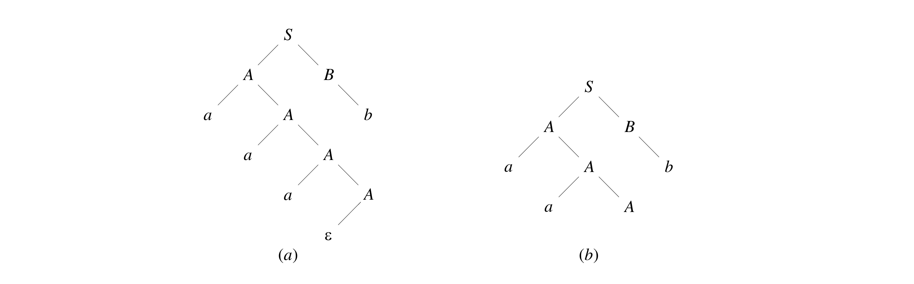

# 语法分析

## 自顶向下语法分析

### 带回溯的自顶向下分析

自顶向下分析过程的两类非确定性：

- 选择哪一个非终结符展开；
- 对于选定的非终结符选择哪一个产生式。

最朴素的想法是采用试探和回溯。

### 自顶向下预测分析

通过向前扫描若干个字符进行确定性推导（并非所有文法都可以做到）。

### First 和 Follow 集合

#### First 集合

定义：设上下文无关文法 $G = (V_N, V_T, P, S)$，对于 $\alpha \in (V_N \cup V_T)^*$ 定义：

$$
\text{First}(\alpha) = \{a | \alpha \Rightarrow ^* a \beta, a \in V_T, \beta \in (V_N \cup V_T)^* \lor a = \varepsilon, \alpha \Rightarrow ^* \varepsilon \}
$$

直观理解：$\text{First}$ 集合是一个对于一个 **句型** 而言的，代表着该句型能够推导出的 **开头字符** 集合。

对于语法分析，我们关心所有可能句型的 $\text{First}$ 集合，即

$$
X_G = V_N \cup V_T \cup \{\varepsilon \} \cup \{v | A \rightarrow u \in P, v \text{ is suffix of } u\}
$$

可以迭代计算所有 $x \in X_G$ 的 $\text{First}$ 集合：

- 初始化：所有非终结符和 $\varepsilon$ 集合为自身（$\text{First}(x) = \{x\}$），否则为 $\Phi$。
- 重复直到所有的集合都不再变化：
    - 对于 $y_1y_2 \dots y_k \in \{v | A \rightarrow u \in P, v \text{ is suffix of } u\}, k \ge 1$。
        如果存在 $i$，$\varepsilon$ 在 $\forall 1 \le j \le i - 1, y_j$ 的 $\text{First}$ 集合中但不在 $y_i$ 的集合中，则
$$
\text{First}(y_1 \dots y_k) = \text{First}(y_1) \cup \dots \cup \text{First}(y_i) - \varepsilon
$$
        否则不需要 $-\varepsilon$，即
$$
\text{First}(y_1 \dots y_k) = \text{First}(y_1) \cup \dots \cup \text{First}(y_k)
$$
    - 若有 $A \rightarrow y_1 y_2 \dots y_k$，则置
$$
\text{First}(A) = \text{First}(A) \cup \text{First}(y_1y_2 \dots y_l)
$$

#### Follow 集合

定义：设上下文无关文法 $G = (V_N, V_T, P, S)$，对于 $A \in V_N$ 定义：

$$
\text{Follow}(A) = \{a | S$ \Rightarrow ^* \alpha A \beta $ \land a \in \text{First}(\beta $), \alpha, \beta \in (V_N \cup V_T)^* \}
$$

其中 $ 为符号序列的结束符。

直观理解：$\text{Follow}$ 集合是一个对于一个 **非终结符** 而言的，代表着该句型能够推导出的 **紧邻字符** 集合。

可以迭代计算所有 $A \in V_N$ 的 $\text{Follow}$ 集合：

- 初始时，置 $\text{Follow}(A) = \{\$\}$；对其它 $A \in V_N$，置 $\text{Follow}(A) = \Phi$。
- 重复直到所有的集合都不再变化：若有 $A \rightarrow \alpha B \beta \in P$，则
  - 令 $\text{Follow}(B) = \text{Follow}(B) \cup (\text{First} - \{\varepsilon \})$
  - 若 $\varepsilon \in \text{First}(\beta)$，则令 $\text{Follow}(B) = \text{Follow}(B) \cup \text{Follow}(A)$

### LL(1) 文法

定义：设上下文无关文法 $G = (V_N, V_T, P, S)$，对于任何产生式 $A \rightarrow \alpha \in P$，其预测集合 $\text{PS}(A \rightarrow \alpha)$ 定义为

- 如果 $\varepsilon \notin \text{First}(\alpha)$，那么 $\text{PS}(A \rightarrow \alpha) = \text{First}(\alpha)$；
- 如果 $\varepsilon \in \text{First}(\alpha)$，那么 $\text{PS}(A \rightarrow \alpha) = (\text{First}(\alpha) - \{\varepsilon\}) \cup \text{Follow}(A)$。

文法 $G$ 是 LL(1) 的，当且仅当对于 $G$ 中任何两个有相同左部的不同产生式 $A \rightarrow \alpha$ 和 $A \rightarrow \beta$，都满足：

$$
\text{PS}(A \rightarrow \alpha) \cap \text{PS}(A \rightarrow \beta) = \Phi
$$

直观理解：$\text{PS}$ 集合是对于一个 **产生式** 而言的。YouOnlyLookOnce，只需向前扫描一个字符就可以做出确定性推断。

### 递归下降分析

- 每遇到一个终结符，则判断当前读入的单词符号是否与该终结符相匹配，若匹配，则继续读取下一个单词；若不匹配，则进行错误处理。
- 每遇到一个非终结符，则调用相应的分析子程序。

直观理解：利用 LL(1) 的性质扫描进行 switch case 并递归下降。

### 表驱动分析

#### 预测分析表

对于上下文无关文法 $G = (V_N, V_T, P, S)$ 建立预测分析表 $M$。$M$ 的每一行对应非终结符 $A \in V_N$，每一列对应终结符 $a \in V_T \cup \{\$\}$。

表中的项 $M[A, a] \subseteq P$ 是一个产生式集合，得到过程为：

对文法的每个产生式 $A \rightarrow a \in P$，若它的预测集合 $\text{PS}(A \rightarrow \alpha)$ 中包含 $a \in V_T \cup \{\$\}$，则将 $A \rightarrow a$ 加入 $M[A, a]$。

#### 表驱动分析

使用下推栈辅助完成。

1. 若栈顶为终结符，则判断当前读入的单词符号是否与该终结符相匹配，若匹配，再读取下一单词符号继续分析；若不匹配，则进行错误处理。
2. 若栈顶为非终结符，则根据该终结符和当前输入单词符号查 LL(1)分析表，若相应表项中是产生式（唯一的），则将此非终结符出栈，并把产生式右部符号从右至左入栈；若表项为空，则进行错误处理。
3. 重复，直到栈顶 $\$$ 遇到文本串结束符 $\$$，分析结束。

### 文本变换

并非所有文法都满足 LL(1)，但一些文法可以通过简单变换转化为 LL(1)。

特别地，这些步骤包括消除左递归和提取左公因子。

#### 消除左递归

定义：若文法中含有形如：

$$
P \rightarrow P_1 \alpha_0, \dots, P_n \rightarrow P_1 \alpha_n, n \ge 0
$$

的一组产生式，称为该文法是左递归的。

##### 直接左递归

当 $n = 0$ 时，有直接左递归情景。

对于简化情况：

$$
P \rightarrow P \alpha | \beta
$$

可以将其改写为：

$$
\begin{align}
& P \rightarrow \beta Q \\
& Q \rightarrow \alpha Q | \varepsilon
\end{align}
$$

将简化情况进行扩展，可以得到：

对于一般形式直接左递归的一组公式：

$$
P \rightarrow P \alpha_1 | P \alpha_2 | \dots | P \alpha_m | \beta_1 | \dots | \beta_n
$$

其中 $\alpha_i \neq \varepsilon, \beta_i[0] \neq P$，可以进行变换：

$$
\begin{align}
& P \rightarrow \beta_1 Q | \dots | \beta_n Q \\
& Q \rightarrow \alpha_1 Q | \dots | \alpha_m Q | \varepsilon
\end{align}
$$

##### 一般左递归

对于无回路，无 $\varepsilon$ 产生式的文法，可以通过以下步骤消除一般左递归：

```pseudocode
for i = 1 to n do {
  for j = 1 to i - 1 do {
    A -> alpha_1 r | ... | alpha_k r 反复替代形如 A_i -> A_j 的产生式
    A_j -> alpha_1 | ... | alpha_k 是关于 A_j 的全部产生式
  }
  消除关于 A_i 的直接左递归
}
```

#### 提取左公因子

对于形如：

$$
P \rightarrow \alpha \beta_1 | \dots | \alpha \beta_m | \gamma_1 | \dots | \gamma_n
$$

的一组产生式，需要消除重叠的左公因子，即引入新非终结符 $Q$ 替代。

$$
\begin{align}
& P \rightarrow \alpha Q | \gamma_1 | \dots | \gamma_n \\
& Q \rightarrow \beta_1 | \dots | \beta_m
\end{align}
$$

### 出错处理

递归下降分析的短语层恢复。

表驱动的应急恢复。

## 自底向上的语法分析

### 基本思想

与自顶向下不同，自底向上的思想为从语法分析树的叶子结点开始向上归约，一步步从终结符串归约到树根。

不是所有的归约操作都是正确的选择，错误的选择需要回溯。因此，寻找 **可规约串** 是重要的。

#### 短语和直接短语

定义（短语）：对于文法 $G = (V_N, V_T, P, S)$，若 $S \Rightarrow^* \alpha A \delta$，且 $A \Rightarrow^+ \beta$，
则称 $\beta$ 是句型 $\alpha \beta \delta$ 的一个 **短语**，要求 $\alpha, \beta, \delta \in (V_N \cup V_T)^*$。

直观理解：对于一个语法分析树，每一个非叶子节点都对应一个短语，对应为以其为根的果实从左向右连接形成的字符串。

例如，下图中语法分析树对应的所有短语为



$$
\epsilon, a, aa, aaa, aaab, b \\
aA, aaA, aaAb, b
$$

定义（直接短语）：对于文法 $G = (V_N, V_T, P, S)$，若 $S \Rightarrow^* \alpha A \delta$，且 $A \Rightarrow \beta$，
则称 $\beta$ 是句型 $\alpha \beta \delta$ 的一个 **直接短语**，要求 $\alpha, \beta, \delta \in (V_N \cup V_T)^*$。

直观理解：对于一个语法分析树，找到叶子节点上一层的节点。

#### 句柄

为了增加归约的确定性，通常我们选择从最左边的直接短语开始进行归约。

定义（句柄）：对于文法 $G = (V_N, V_T, P, S)$，若 $S \Rightarrow _{\text{rm}}^* \alpha A w$，且 $A \Rightarrow \beta$，
则称 $\beta$ 是右句型 $\alpha \beta w$ 的一个相对于非终结符 $A$ **句柄**，要求 $\alpha, \beta,\in (V_N \cup V_T)^*$ 且 $w \in V_T^*$。

注：最右推导对应于句柄，按照句柄归约相当于 **逆向** 进行最右推导的过程。

直观理解：对于一个语法分析树，其最左边的直接短语就是句柄。

句柄不一定是唯一的，对于存在二义最右推导的句型，句柄可以有多个。
