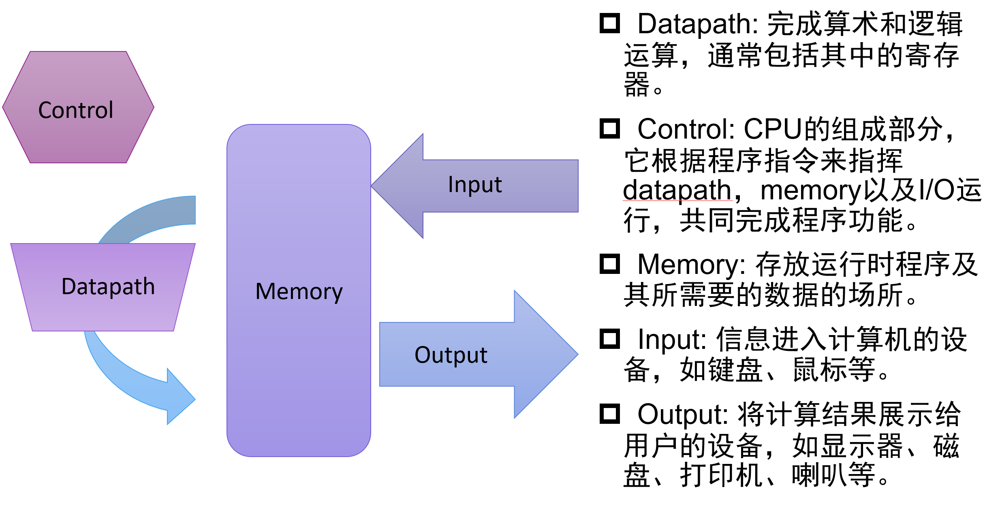
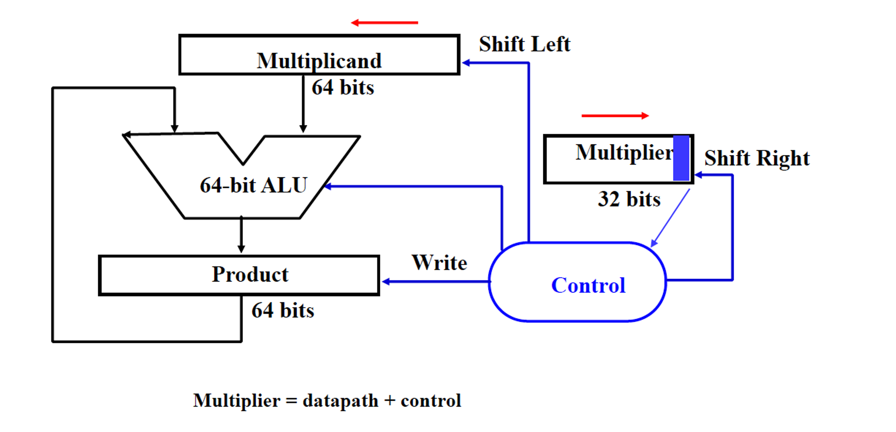
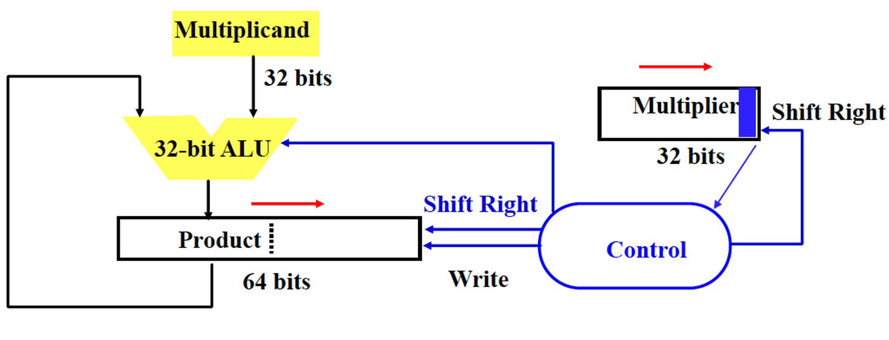
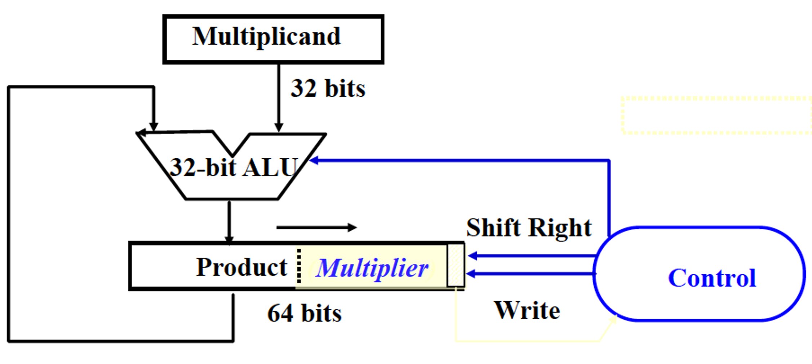
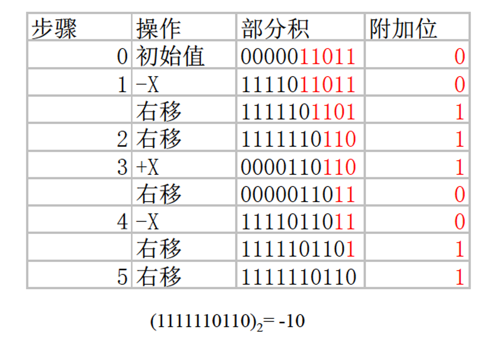
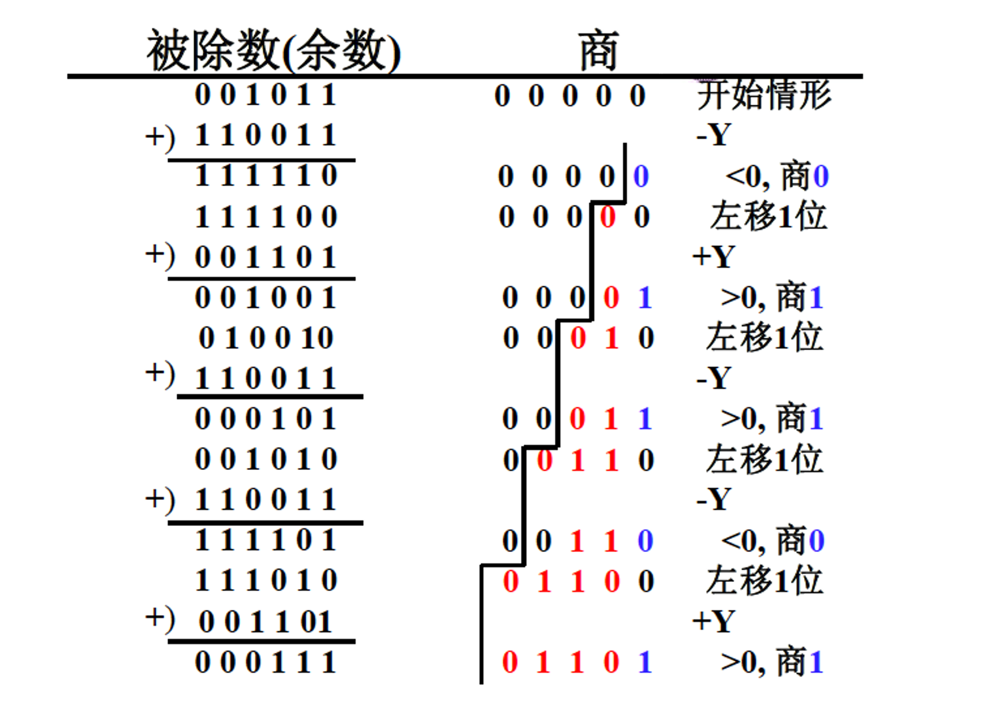
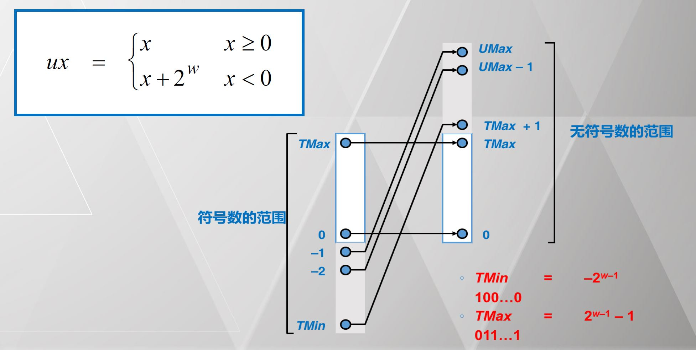
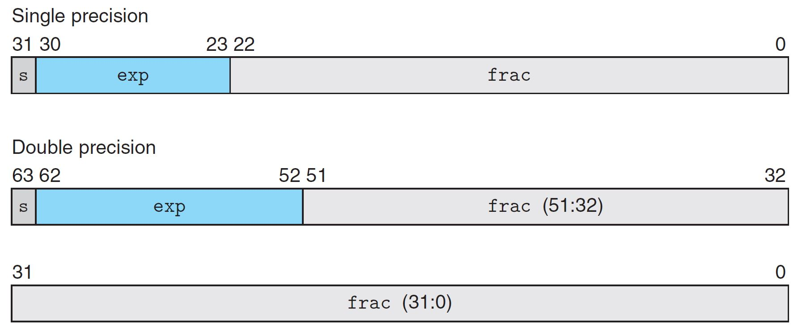
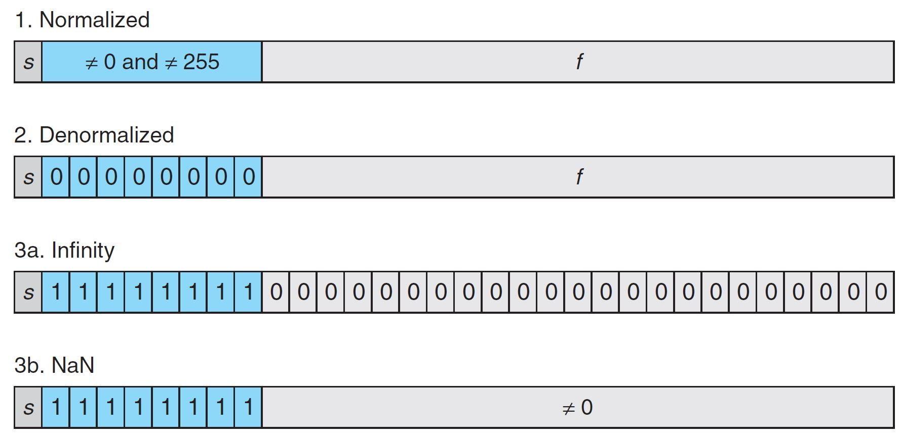
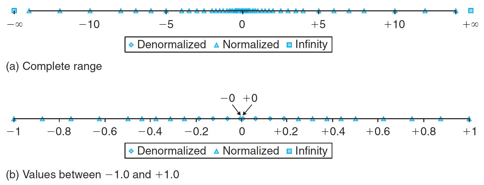

# 数据表示、数据运算和运算器设计

## 计算机系统概述

通用计算机（Universal Machine）：使用图灵机来模拟图灵机的执行，可以不局限于执行的具体指令。

Von Neumann 架构：存储程序（**内存是指令和数据统一的存储**），顺序指令处理。

计算机运行机制：



## 计算机性能

吞吐率：单位时间内完成的任务数量。

响应时间：完成单个任务的时间。

> 辨析：吞吐率与响应时间
>
> 尽管二者都可用来衡量性能，但两者并不完全等价，例如，考虑以下两种提升性能的方法：
>
> 1. 将计算机中的处理器更换为更高速的型号。
> 2. 为系统增加额外的处理器，使用多处理器来分别处理独立的任务。
>
> 一般来说，降低响应时间几乎总是可以提高吞吐率，因此 1 同时改进了两者。
>
> 而对于 2 来说，增加处理器个数并不会使得单个任务完成更快，只会提高吞吐率。

```
CPU 时间 = CPU 时钟周期数 * 时钟周期长度
```

```
CPU 时钟周期数 = 程序指令数 * 指令平均时钟周期数（CPI）
```

```
CPU 时间 = 指令数 * CPI / 时钟频率
```

## 算术运算及电路实现

### 加减法

溢出检测：检测符号位。

| 操作  | 操作数 A | 操作数 B | 溢出条件 |
| ----- | -------- | -------- | -------- |
| A + B | $\ge 0$  | $\ge 0$  | $< 0$    |
| A + B | $< 0$    | $< 0$    | $\ge 0$  |
| A - B | $\ge 0$  | $< 0$    | $< 0$    |
| A - B | $< 0$    | $\ge 0$  | $\ge 0$  |


### 乘法

#### 原码乘法

##### 乘法实现1

1. 若乘数的当前位为 1，将被乘数和部分积求和。
2. 若乘数的当前位为 0，跳过。
3. 将部分积移位。
4. 所有位都乘完后，部分积即为最终结果。

需要 64 位被乘数寄存器，64 位ALU，64 位部分积寄存器，32 位乘数寄存器。



缺陷：

- 被乘数的一半存储的只是 0，浪费存储空间。
- 每次加法实际上只有一半的位有效，浪费计算能力。


##### 乘法实现2

需要 32 位被乘数寄存器，32 位ALU，64 位部分积寄存器，32 位乘数寄存器。




##### 乘法实现3

需要 32 位被乘数寄存器，32 位ALU，64 位部分积寄存器。




#### 补码乘法

方案一：补码转化为原码绝对值，算完后再根据符号转换回补码表示。

方案二：布斯乘法直接乘。

##### 布斯乘法

乘法可以拆解为加法和减法的组合。

考虑一个补码 $x = x_{n-1}x_{n-2} \dots x_1 x_0$：

$$
x = -2^{n - 1} x_{n - 1} + \sum \limits_{i = 0}^{n - 2} x_i2^i
$$

则容易有：

$$
\begin{align}
x \times y &= x \times (-2^{n - 1}y_{n - 1} + \sum \limits_{i = 0}^{n - 2}y_i2^i) \\
&= x \times \sum \limits_{i = 0}^{n - 1} 2^i (y_{i - 1} - y_i)
\end{align}
$$

其中 $y_{-1} = 0$。

因此，可直接用补码进行乘法运算，根据乘法相邻两位的不同组合确定是 $\pm x$。

> 例：计算 $2 \times (-5)$。
>
> 
>
> 易错点：
>
> 1. 部分积部分使用乘法实现 3，红色部分为乘数 $-5$，黑色部分为部分积。
> 2. 黑色部分部分积右移为 **逻辑右移**，需要在最高位补符号。
> 3. 加减乘数的时候需要 **左对齐**。


### 除法

#### 加减交替除法

若上次减运算结果为负，可直接左移，本次用 $+Y$ 即可，如果减运算结果为正，用 $-Y$ 求余。

> 例：
>
> 


## 数据表示及检错纠错

### 数据编码

#### 字符型数据

- ASCII：7 位二进制编码，占用一个字节表示 128 个西文字符。
- UNICODE：16 位表示 65536 个字符。
- UTF-8：变长，除首字节均以 10 开始，可自同步，可扩展性强。


#### 点阵字体

本质是单色位图。


#### 矢量字体

一个字可以用多条曲线表示，每条曲线保存关键点，显示时取出关键点用平滑曲线连接并填充闭合空间，可等比例缩放。


#### 数值型数据

##### 原码反码与补码

无符号数（原码表示）：$B2U(X) = \sum \limits_{i = 1}^{w - 1} x_i \cdot 2^i$​

带符号数（补码表示）：$B2T(X) = -x_{w - 1} \cdot 2^{w - 1} + \sum \limits_{i = 0}^{w - 2} x_i \cdot 2^i$​

- 非负数：补码 = 原码；

- 负数：补码 = 反码 + 1 = $2^w$​ + 该负数（补码表示相反数按位取反再加一）。

取值范围：

- 无符号数：$[0, 2^w - 1]$；


- 带符号数：$[-2^{w - 1}, 2^{w - 1} - 1]$（0的归属不对称）。


无符号数与带符号数之间的转换：二进制串的表示是不变的，变化的是解释。



负数的原码、反码、补码表示均不同。


#### 浮点数

$(-1)^s M 2^E$

- 符号（sign）：$s$。
- 尾数（significand，`frac` 域）：$M$，是一个位于区间 $[1.0, 2.0)$ 的小数。
- 阶码（exponent，`exp` 域）：$E$。

单精度浮点数：`exp` 域8 bits，`frac` 域 23 bits。

双精度浮点数：`exp` 域11 bits，`frac` 域 52 bits。




##### 规格化浮点数（Normalized）

- 满足条件：$\text{exp} \neq 00\dots0$ 且 $\text{exp} \neq 11\dots1$
- 真实的阶码值需要减去偏置量 `bias`（保证为正）
  - $E = \text{exp} - \text{bias}$
  - $\text{bias} = 2^{e - 1} - 1$，$e$ 为 `exp` 域的位数（`float: 127, double: 1023`）
- `frac` 域的第一位隐含1，因此第一位的1可以省去
  - $00\dots0(M = 1.0) - 11\dots1(M = 2.0 - \varepsilon)$


##### 非规格化浮点数（Denormalized）

满足条件：$\text{exp} = 00\dots0$

$E = 1 - \text{Bias}$（而非用 $0$ 减）

$M = 0.xxx\dots x_2$

- 提供了0的表示方法

​		不同的符号位会出现 `+0.0` 与 `-0.0`。

- 提供了极小数值的表示法

​		Gradual underflow，逐步丧失精度，在0附近均匀分布。

> ​		除了规约浮点数，IEEE754-1985标准采用非规约浮点数，用来解决填补绝对值意义下最小规格数与零的距离。（举例说，正数下，最大的非规格数等于最小的规格数。而一个浮点数编码中，如果exponent=0，且尾数部分不为零，那么就按照非规约浮点数来解析）非规约浮点数源于70年代末IEEE浮点数标准化专业技术委员会酝酿浮点数二进制标准时，Intel公司对**渐进式下溢出**（gradual underflow）的力荐。当时十分流行的DEC VAX机的浮点数表示采用了**突然式下溢出**（abrupt underflow）。如果没有渐进式下溢出，那么0与绝对值最小的浮点数之间的距离（gap）将大于相邻的小浮点数之间的距离。例如单精度浮点数的绝对值最小的规约浮点数是 ${\displaystyle 1.0\times 2^{-126}}$，它与绝对值次小的规约浮点数之间的距离为 ${\displaystyle 2^{-126}\times 2^{-23}=2^{-149}}$。如果不采用渐进式下溢出，那么绝对值最小的规约浮点数与0的距离是相邻的小浮点数之间距离的 ${\displaystyle 2^{23}}$ 倍，可以说是非常突然的下溢出到 $0$。**这种情况的一种糟糕后果是：两个不等的小浮点数 $X$ 与 $Y$ 相减，结果将是 $0$。**训练有素的数值分析人员可能会适应这种限制情况，但对于普通的程序员就很容易陷入错误了。采用了渐进式下溢出后将不会出现这种情况。例如对于单精度浮点数，指数部分实际最小值是（-126），对应的尾数部分从${\displaystyle 1.1111\ldots 11}$， ${\displaystyle 1.1111\ldots 10}$ 一直到 ${\displaystyle 0.0000\ldots 10}$，${\displaystyle 0.0000\ldots 01}$，${\displaystyle 0.0000\ldots 00}$ 相邻两小浮点数之间的距离（gap）都是 ${\displaystyle 2^{-126}\times 2^{-23}=2^{-149}}$；而与0最近的浮点数（即最小的非规约数）也是 ${\displaystyle 2^{-126}\times 2^{-23}=2^{-149}}$。
>
> source：https://zh.wikipedia.org/wiki/IEEE_754


##### 一些特殊值

- $s = 0, \text{exp} = 11 \dots 1, \text{frac} = 0$：$+\infty$
- $s = 1, \text{exp} = 11 \dots 1, \text{frac} = 0$：$-\infty$
- $\text{exp} = 11 \dots 1, \text{frac} \neq 0$：$\text{NaN}$


##### 总结



> 例：6 bit浮点数。
>
> 


##### 浮点数加减法

1. 对阶操作，求阶差 $\Delta E = E_x - E_y$，使阶码小的数的维数右移 $|\Delta E|$ 位，去阶码较大的阶码值。
2. 尾数加减。
3. 规格化处理。
4. 舍入操作，可能带来有一次规格化。
5. 判断结果的正确性，即检查阶码上下溢出。


### 检错纠错码

码距：任意两个合法码之间至少有几个二进制位不相同。

仅有一位不同的编码是无纠错能力的。合理增大码距，能提高发现错误的能力，但会为传输和数据存储带来复杂度。

常用的检错纠错码：

- 奇偶校验码：并行传输数据。
- 海明校验码：并行传输数据。
- 循环冗余校验码：串行传输数据。


#### 奇偶校验码

用于并行码 **检错**。

实现：在 $k$ 位数据码之外增加 $1$ 位校验位，使 $k +1$ 位码字中取值为 $1$ 的位数总保持偶数（偶校验）或奇数（奇校验）。

码距为 2。


#### 海明校验码

用于多位并行数据 **检错纠错**。

实现：为 $k$ 位数据码设立 $r$ 个校验位，使 $k + r$ 位的码字同时具有以下两个特性：

- 能发现并改正 $k + r$ 位中任何一位出错。
- 能发现 $k + r$ 位中任何两位同时出错，但已无法改正。

编码方法：

- $2^r \ge k + r + 1$：用 $2^r$ 个编码分别表示 $k$ 个数据位，$r$ 个校验位哪一位出错（**发现并改成一位错**），码距为 3。
- $2^{r - 1} \ge k + r$：用 $r - 1$ 位校验码为出错位编码，再单独设一位区分 1 位还是 2 位出错（**发现并改正一位错，发现两位错**），码距为 4。


校验位在 2 的幂次方位（index 从 1 开始），数据位编号可拆分为校验位编号的组合。

最后一位为总校验位，为所有位的异或。

