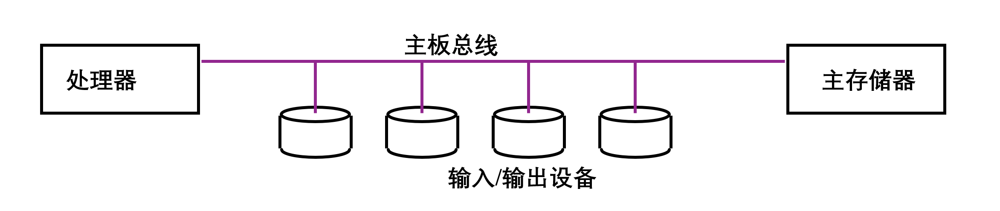
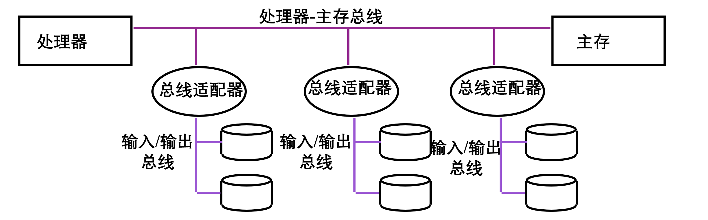
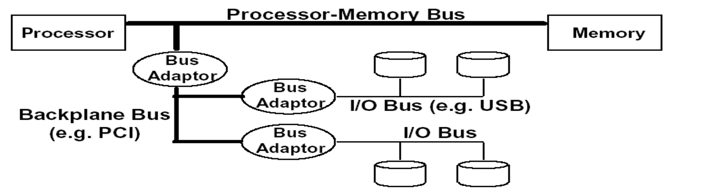

# 总线和输入输出设备

## 输入输出系统

对于繁多的输入输出来说，计算机系统主要需要解决的问题有：

- 控制方式：CPU 如何控制输入输出？（输入输出方式）
- 传输方式：传输通道、方式、速率等。（总线、接口）
- 数据识别和转换：转换为计算机可以识别的格式。（设备）

### 输入输出方式

#### 程序直接访问

成本低、效率低、严重占用 CPU 资源。

#### 程序中断

CPU 和外部设备同时工作，外部设备发起请求，CPU 暂停正在执行的程序，进行相应。

提高了 CPU 效率，并可以同时管理多个外部设备。

中断处理流程：

关中断 -> 保存端点 -> 判断中断来源转中断服务 -> 开中断 -> 执行中断服务程序 -> 关中断 -> 恢复断点 -> 开中断 -> 返回端点。

适用情况：传输速率不高、传输量不大。

对 CPU 干扰较大。

#### DMA

外设和主存储器相连，是为外设专用的硬件，用于在 **高速外设** 和 **主存** 之间 **成组** 传输数据。传送开始前和结束后都通过程序或中断的方式进行预处理和后处理，但传送时 CPU 不受影响。

DMA 使用内存总线的方式：

- 独占使用：DMA 控制器获得总线控制权后开始传送，传送后把总线控制权交还 CPU。
- 周期窃取：没有 DMA 请求时 CPU 正常访问内存，有请求时 I/O 设备挪用周期，冲突时 DMA 优先。

对 CPU 打扰适中。

#### 通道控制方式

在计算机系统中代替 CPU 管理控制外设的独立部件，本质上是一种能执行有限 I/O 指令集合的简单处理器，进一步减少 CPU 对于数据传输的参与。

在通道控制方式中，CPU 只需要发出启动指令，指出需要通道执行的操作和使用的 I/O 设备，该指令就可以启动通道，使该通道从内存中调出相应的通道执行程序即可，实现 CPU、通道和 I/O 设备的并行操作。

#### 外围处理机

一个功能较弱的计算机管理 I/O，彻底释放 CPU，通过通道方式与主机进行交互。

## 总线

总线：计算机多个子系统共享的信息通道，需要关注 **控制**、**地址**、**数据** 三类信号之间的关系。

总线的优势：统一标准、降低成本、简化设计。

缺点：总线容易成为瓶颈，限制吞吐量。

### 总线类型

总线类型：

- 处理器-主存总线：传输距离短、速度高。
- 输入/输出总线：通常距离较长，速度较慢。
- 主板总线。

总线的一般组成：控制线、数据线。

单总线计算机：主板总线。

双总线系统：处理器-主存总线 + 输入输出总线。

三总线系统：主板总线连接到处理器-主存总线，大大减少处理器-主存总线负载。

### 仲裁

总线仲裁需要考虑的因素：优先权、公平性。

- 集中仲裁：有统一仲裁器仲裁。
  - 菊链仲裁：所有设备共用一个总线请求信号，优先级高的最先拿到仲裁器发的 grant，如果无任务传递给下一个，简单但无法保证公平性，同时逐级传递总线授权信号限制了总线的速度。
  - 集中平行仲裁：所有设备单独与仲裁器相连。
- 分布仲裁：流量需确认无冲突后传输。

### 同步与异步总线

同步总线：统一时钟，高速，为了防止时钟信号扭曲需要足够短。

异步总线：可适应不同设备的不同速度，不用担心时钟信号扭曲。

### 增加总线带宽

1. 增加总线的宽度。
2. 分别设置数据总线和地址总线。
3. 采用成组传送方式。

多主设备总线提高事务数量：

- 仲裁重叠。
- 总线占用（节省仲裁时间）。
- 地址、数据传送重叠。

## 接口电路和外部设备

接口：总线和外部设备的连接

- 使主机能根据设备编号找到外设；
- 使主机能控制设备并与之通信；
- 提供主机和设备之间的数据缓冲机制。