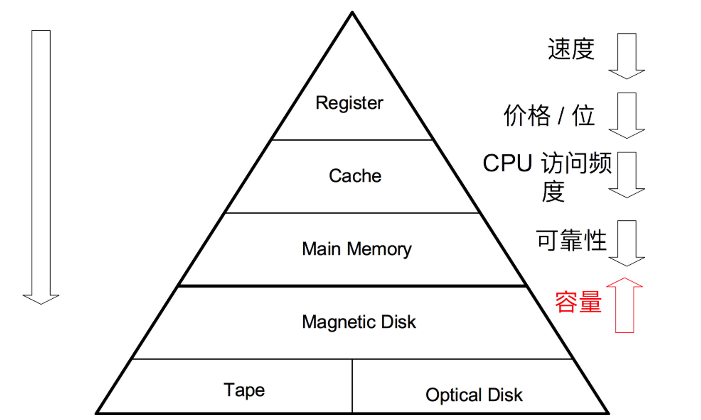
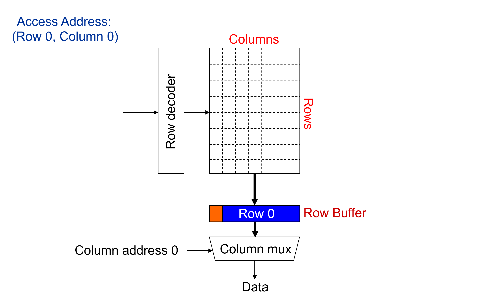
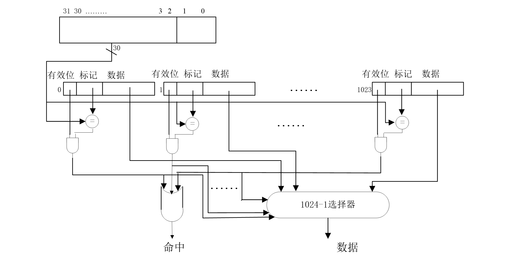
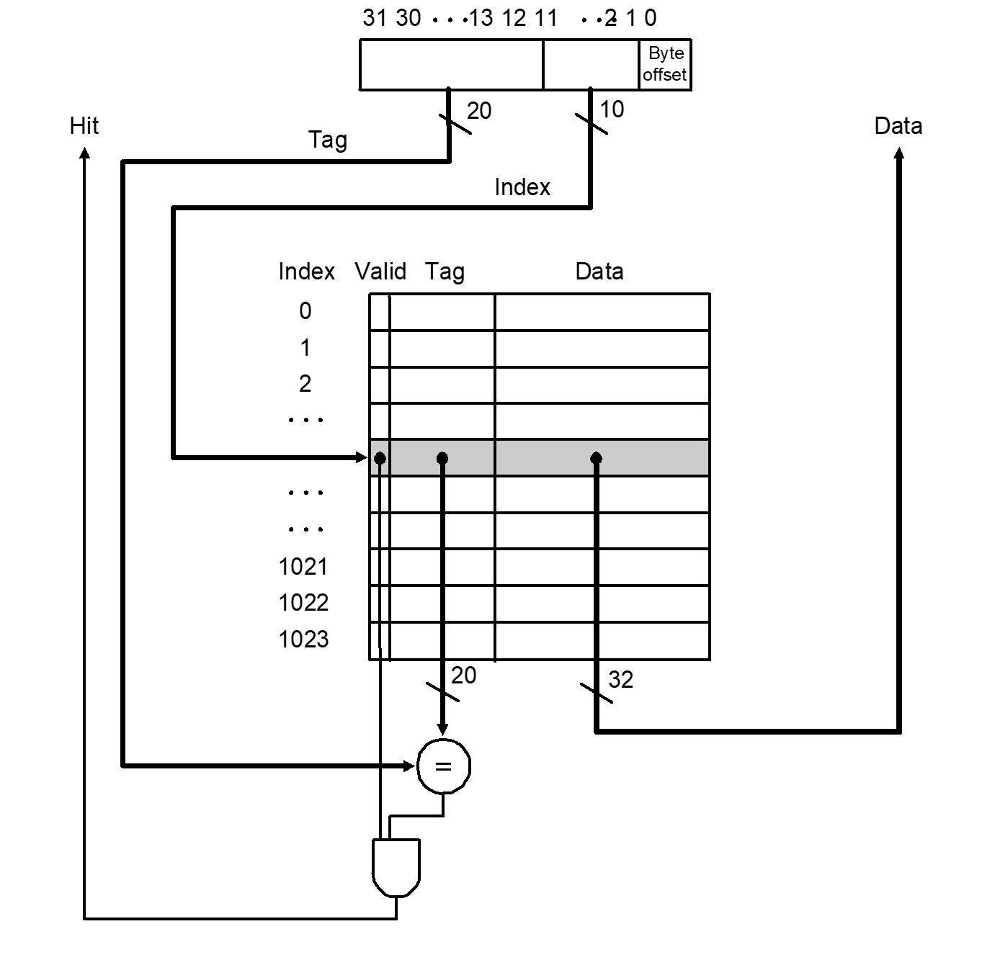
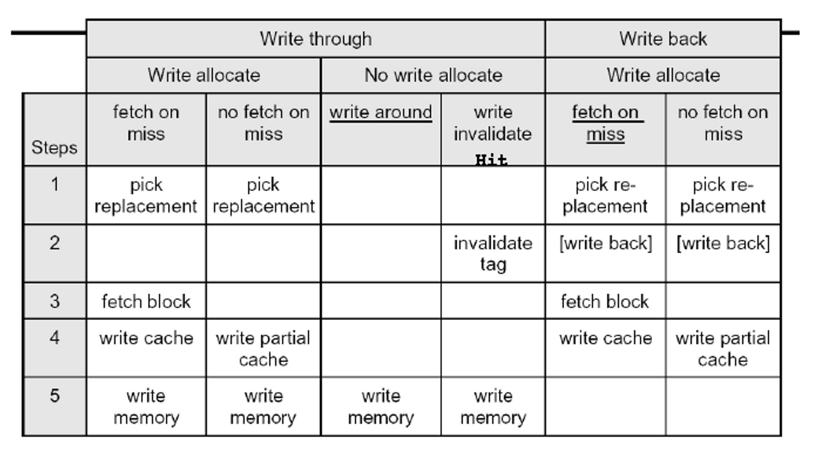
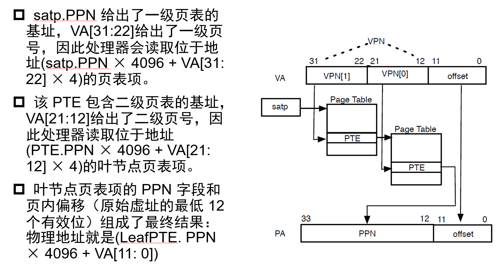
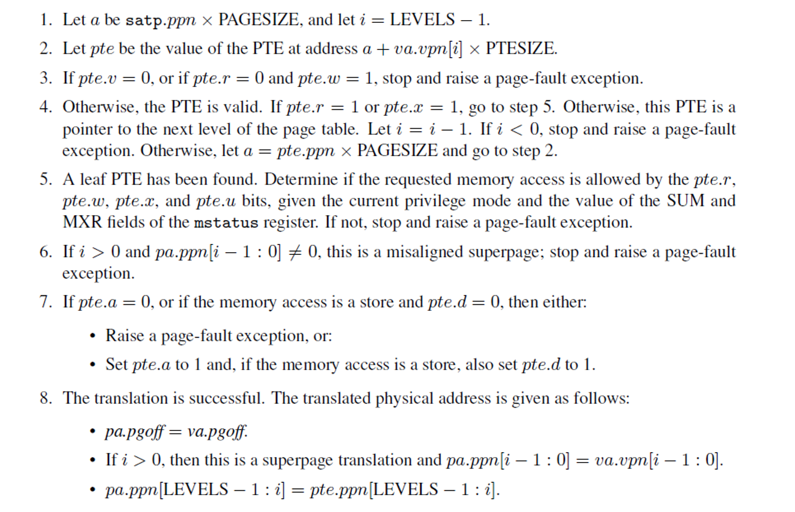

# 层次存储系统

## 层次存储系统概述

### 存储系统

- 随机访问存储器（RAM）：**随机**，即访问时间与存放位置无关；半导体存储器。
- 顺序访问存储器（SAM）：按照存储位置依次访问；磁带存储器。
- 直接访问存储器（DAM）：随机 + 顺序；磁盘存储器。
- 关联访问存储器（CAM）：根据内容访问；cache 和 TLB。

### 层次存储系统

基本原则

- 一致性原则：处在不同层次存储器中的同一个信息应保持相同的值。
- 包含性原则：处在内层的信息一定包含在外层中。



## DRAM

动态存储器，存储原理为 **晶体管 + 电容**。

工作特点：

- 破坏性读出：电容放电导致，刚读出内容必须立即写回，称为预充电延迟。
- 要定期刷新：电容漏电导致，因此需要：
  - 集中刷新：停止读写，所有行逐行刷新。
  - 分散刷新：每次完成读写之后刷新这一行。

DRAM 系统的结构：

DIMM（Dual Inline Memory Modules） -> rank -> chip -> bank -> row & col

读取 DRAM 次序如下，因此行列地址需要分两次送（如果缓存命中则不需要送列地址）。



## SRAM

**触发器存储**，不需要刷新；非破坏性读出；行列地址同时送。

## Cache

### 基本原理

#### 程序局部性原理

- 时间局部性：最近访问的信息很可能很快还要被访问，因此装载进 cache。
- 空间局部性：最近被访问的信息邻近的信息很可能要被访问，因此装载进 cache。

#### 基本实现

主存和 CPU 之间的存储器，SRAM 实现，高速、透明。

cache 通常需要由数据块（data）、标签字段（tag）和有效位（valid）组成，但 **命名规范中一般只考虑数据的大小**。

#### 主要问题

- 地址和 cache 行之间的映射关系：如何根据主存地址得到 cache 中的数据？
- 数据之间的一致性：cache 中的内容是否已经是主存对应地址中的内容？
- 数据交换的粒度：cache 中的内容与主存内容以多大的粒度交换？
- cache 内容装入和替换策略：如何提高 cache 命中率？

#### 参数

- 块（line）：数据交换的最小单位。
- 命中（hit）：命中率；命中时间。
- 缺失（miss）：缺失率；缺失损失。

平均访问时间：$\text{HR} \times {命中时间} + (1 - \text{HR}) \times {缺失损失}$

### 缓存地址映射

#### 全相联

所有地址都可以映射到所有位置。

组数为 1，每组中有多路。

PC 被划分为标记位和块内地址：

```
PC = tag | block offset
```

例：主存 4GB，cache 4KB 全相联，块大小 4B。

分析过程：

- 主存 4GB => PC 位数 32。
- 块 4B => offset 位数 2。
- tag 位数：30。



特点：

- 主存字块可以和 cache 任意字块对应，利用率高，方式灵活。
- tag 位长，比较电路成本高。

#### 直接映射

每个地址只可能映射到一个位置。

若干组，组内只有一路。

PC 被划分为标记位、组索引和块内地址：

```
PC = tag | set index | block offset
```

例：主存 4GB，cache 4KB 直接映射，块大小 4B。

分析过程：

- 主存 4GB => PC 位数 32。
- 块 4B => offset 位数 2。
- cache 4KB，块大小 4B => 1024 组，set index 位数 10。
- tag 位数：20。



特点：

- 主存字块只可以和固定的 cache 字块对应，方式直接，利用率低、命中率低、效率较低。
- 标志位较短，比较电路成本低。

#### 多路组相联

PC 被划分为标记位、组索引和块内地址：

```
PC = tag | set index | block offset
```

特点：

- 前两种方式的折中方案，组内全相联，组间直接映射。
- 集中两种方案的优点，成本合适，效率适中。

### 写缓存

- 写直达（write through）：保证强一致性
    - 写分配（write allocate）：写完加载进 cache。
    - 写不分配（no write allocate）：写完不需要加载进 cache，动机为如果操作系统要写整个数据块，则写完第一个字段就加载是不必要的。
- 拖后些（write back）：弱一致性。



### cache 缺失

#### 必然缺失

开机或者进程切换首次访问数据块，【必然发生】。

难以避免，只要程序访问存储器次数够多即可忽略，可通过预取策略应对。

#### 容量缺失

活动数据集超过了 cache 的大小，【全相联经常发生】。

增加 cache 容量应对。

#### 冲突缺失

多个内存块映射到同一个 cache 块，【直接映射经常发生】。

增加 cache 容量，增加相连路数。

#### 无效缺失

其他进程修改了主存数据。

### cache 接入系统的体系结构

1. 侧接法：与其他部分一样接到总线上，结构简单成本低，但不利于降低总线占用率。
2. 隔断法：使 cache 处于两段之间，有利于提高总线利用率，但结构复杂成本较高。

### 一致性保证策略

- 修改态（M）：被修改，只能从 cache 读到正确数据。
- 独占态（E）：与主存对应数据块相同，且在其他 cache 中没有副本。
- 共享态（S）：与主存对应数据块相同，可能在其他 cache 中有副本。
- 无效态（I）：尚未装入数据。

## 虚拟内存

Motivation:

- 将物理内存作为磁盘数据的缓存。
- 简化程序的内存管理。
- 存储保护功能。

### 页式存储管理

将主存和虚存划分为固定大小的页，以页为单位进行管理和数据交换，地址被划分为 页号 + 页内地址。

#### TLB

转换旁路缓冲，缓存虚实地址转换。

TLB 缺失将造成：流水线停止、通知操作系统、读页表、将表项写入 TLB、返回到用户程序并重新访问。

#### 地址转换





### 段式存储管理

使用段分界，段长动态可变，标记不同权限。

## 外存储器

非易失性存储。

特点：慢、**串行访问**、访问粒度大、掉电后信息不丢失。

### 磁盘

磁盘结构：$n$ 个盘片（platter）、$2n$ 个盘面（surface）、盘面上的同心圆-磁道（track）、扇区（sector）。

#### 访问过程

1. 寻道：找到正确的磁道。
2. 寻找扇区：等待磁道旋转到要读的扇区，期望时间是旋转半周的时间。
3. 数据传输：读写数据。
4. 磁盘控制器延迟：这一延迟串行访问时每次都叠加，可通过并行读多个层面或并行读多个磁盘改进。

> 例：平均寻道时间 $12 \text{ms}$，旋转速度 $5400 \text{rpm}$，磁盘控制器延迟 $2 \text{ms}$，传输速度 $5 \text{MB}$，求读取一页（$8 \text{KB}$） 需要多少时间？
>
> 寻道：$12 \text{ms}$
>
> 旋转延迟：$\frac 1 2 \times \frac{1}{5400} = 5.6 \text{ms}$
>
> 传输时间：$\frac{8 \text{KB}}{5 \text{MB/S}} = 1.6 \text{ms}$
>
> 磁盘控制器延迟：$2 \text{ms}$
>
> 故总时间为 $21.2 \text{ms}$

#### 可靠性与可用性

- 可靠性：使用设备出现故障的几率衡量。
    - 改善使用环境；
    - 提高各部件可靠性；
    - 减少组成部件。
- 可用性：使用系统能正常运行的几率衡量。
    - 增加硬件冗余，如检错纠错码等。

### RAID

廉价磁盘的冗余阵列（Redundant Array of Inexpensive Disks）。

用若干个链接磁盘组成统一管理阵列。

#### RAID0

Block-level striping with no redundancy。

Motivation: Data striping。

将磁盘划分为带，每个带内 $k$ 个扇区，交叉循环写在不同的扇区中。这样从带边界出发对于连续带的读指令就可以拆为读多个带指令。

适合数据请求量较大的情况，没有冗余，**对随机读写较为友好**。

#### RAID1

Disk mirroring with no striping。

备份在不同磁盘中。

写操作需要进行两次，而读操作可以进行负载均衡，**性能高两倍**。

冗余备份，可靠性高。

#### RAID2

Bit-level striping with ECC codes。

以字节为工作单位，对每个字节分解成一对 4 位的半字节，每个半字节加上 3 位校验码变成 7 位，分别写在 7 个磁盘上。

控制器复杂，成本高，需要驱动器同步。

例：3 + 4。

#### RAID3

Striping with a dedicated parity disk。

RAID2 简化版，每个字计算一个校验位，存储在校验驱动器上，需要驱动器同步，对随机读写不友好。

例：3 + 1。

#### RAID4

Striping with a dedicated parity disk。

每个带计算一个校验带。

RAID0 + 校验，不对字进行校验，不需要驱动器同步，对部分字节纠错能力差，校验盘负载沉重，对随机读写不友好。

例：3 + 1。

#### RAID5

Block-level striping with distributed parity information。

减少校验盘负载，将校验位循环均匀分布在所有驱动器上。

例：3 + 1。

#### RAID6

Block-level striping with double distributed parity information。

二维校验，可以纠正两个盘上的错误。

例：3 + 2。

### 固态硬盘

固态硬盘（SSD）：由控制单元、存储单元组成。

- 控制单元：FTL 完成上层逻辑地址到底层物理地址的转换、磨损均衡，垃圾回收。
- 存储单元：按 block 有限次擦除，按页进行读写，组织结构为 package -> die -> plane -> block -> page。

以页的方式写入（最小读写单元），块的方式擦除（最小擦除单元）。