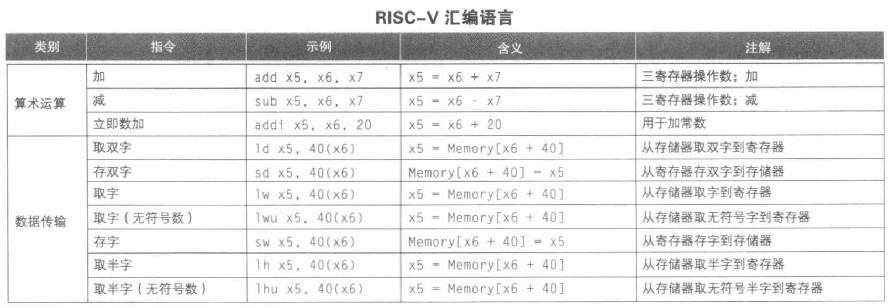
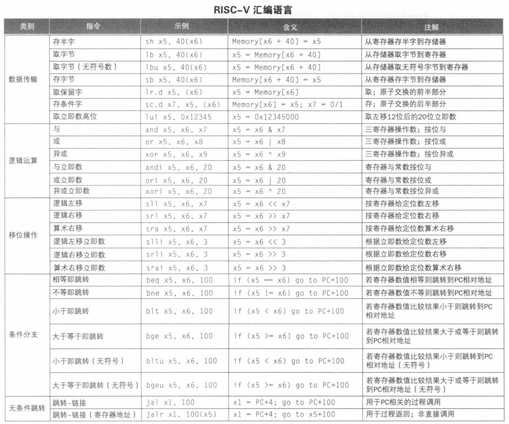
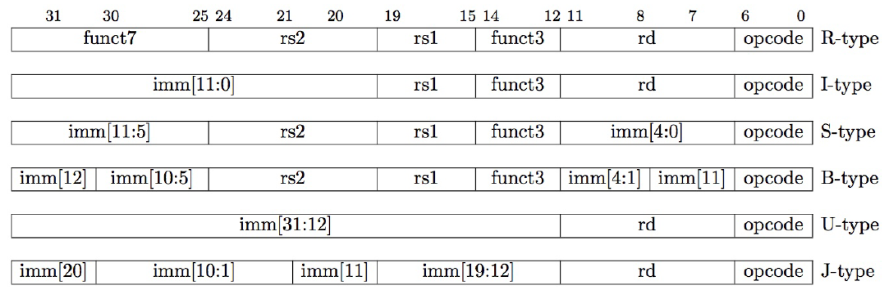
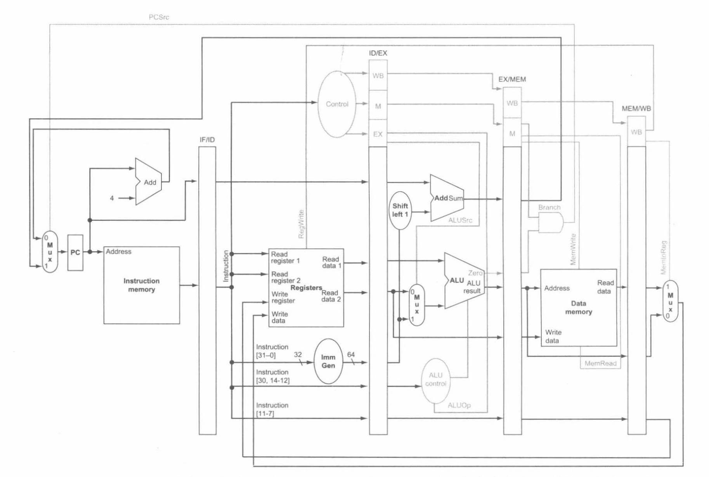
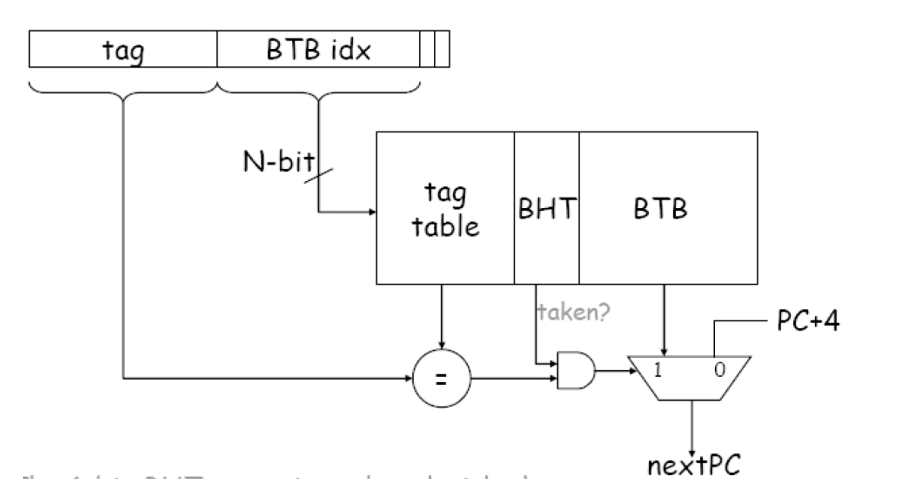

# 处理器

## RISC-V 指令系统

六种基本指令格式：

- 用于寄存器-寄存器操作的 R 类型指令；
- 用于短立即数和访存 load 操作的 I 型指令；
- 用于访存 store 操作的 S 型指令；
- 用于条件跳转操作的 B 类型指令；
- 用于长立即数的 U 型指令；
- 用于无条件跳转的 J 型指令。

### 寻址模式

- 立即数寻址
- 寄存器寻址
- 基址寻址
- PC 相对寻址

### 函数调用

调用的过程：

1. 将参数放到过程可以访问到的地方；
2. 将控制转交给过程；
3. 获取过程所需的存储资源；
4. 执行所需的任务；
5. 将结果值放在调用程序可以访问到的地方；
6. 将控制返回到初始点。

寄存器使用：

- `x10-x17`：传递参数和返回值；
- `x1`：`ra` 返回地址寄存器；
- `x2`：`sp` 栈指针。

控制流：

在 B 型指令中，由于指令暗含了对齐，因此 12 比特 imm 表示了 $[-4096, +4094]$ 共 13 比特的偏移信息。

`jal` 2 比特对齐。

`jalr` 为 I 型指令，不是 J 型指令，不需要对齐（$\times 2$）。

auipc 指令将立即数左移 12 位加到 PC 上，并将结果写入到目标寄存器。这样，可以将 auipc 中的 20 位立即数与 jalr 中的 12 位立即数组合，将执行流程转移到任何相对于 PC 寄存器的 32 位偏移地址。

## 处理器

CPI：一条指令所需的 CPU 时钟周期数。

### 流水线

### 冲突

流水线中的冲突：

- 结构冲突：硬件资源无法满足指令重叠执行（如 IF 和 MEM 同时访问内存）。
- 数据冲突：一条指令依赖于前面指令执行结果数据，但又在指定位置无法得到正确数据。
- 控制冲突：分支指令或其它需要改写 PC 的指令。

#### 结构冲突

暂停流水线，插入气泡；资源充分利用（如同时读写寄存器堆）。

#### 数据冲突

##### 前递

EX 冒险：EX/MEM 段要写的寄存器和 ID/EX 段要操作的寄存器相同。

MEM 冒险：MEM/WB 段要写的寄存器和 ID/EX 段要操作的寄存器相同。

##### 停顿

一条指令在加载内存之后读取该寄存器（EX/MEM 段要读，且 ID/EX 段要操作的寄存器相同），产生冲突且无法通过前递解决，需要停顿直到 `load` 完成后，再利用前递完成。

#### 控制冲突

在冲突中对流水线性能影响最大。

简单处理：

1. 出现分支指令即暂停流水线，直到 MEM 阶段获得新 PC 之后。
2. 缩短分支延迟。
3. 假设分支不发生/发生。

##### 动态分支预测

1 位动态分支预测

1 位 BHT 位决定是否进行跳转。该处理在性能上存在一定缺点：即使一个条件分支总是发生跳转，但一旦其不发生跳转时就会造成两次预测错误。

针对这一问题，可以增加到 2 位 BHT，两次预测错误才改变给出的预测。

## 中断和异常

### 特权级

U（用户模式）、S（监管者模式）、M（机器模式）。

### 中断与异常

- 同步异常：
    - 访问错误异常；
    - 断点异常；
    - 环境调用异常；
    - 非法指令异常；
    - 非对齐地址异常。
- 异步异常（中断）：
    - 软件中断：用户一个 hart 中断另一个 hart；
    - 时钟中断：计数器 `mtime` 大于比较寄存器 `mtimecmp`；
    - 外部中断：外设中断控制器触发。

#### M 态异常处理

CSR 寄存器：

- `mtvec`：处理器需跳转的地址。
- `mepc`：异常 PC。
- `mcause`：异常种类。
- `mie`：中断使能。
- `mip`：正准备处理的中断，pending。
- `mtval`：trap 附加信息。
- `mscratch`：暂时存放一个字大小的数据。
- `mstatus`：机器状态。

异常处理流程：

1. 保存异常 PC 到 `mepc`，PC 被置为 `mtvec`。
2. 设置异常种类 `mcause`，设置 `mtval`。
3. 禁用 `mie`，将旧 `mie` 保存到 `mpie`。
4. 就权限模式保存到 `mstatus` MPP 域中，权限模式更改为 M。

可抢占式异常处理：在处理异常过程中转到处理更高优先级的中断。

#### 物理内存保护

PMP，M 模式可指定 U 模式可访问的内存地址。

如果地址大于等于 PMP 地址 i，小于 PMP 地址 i + 1，则访问权限由 PMP i + 1 的配置寄存器决定。

#### S 态异常处理

异常委托机制：通过该机制可选择性将中断和异常完全绕过 M 模式给 S 模式处理。

异常委托寄存器：

- `mideleg`：控制委托给 S 态的中断。
- `medeleg`：控制委托给 S 态的异常。