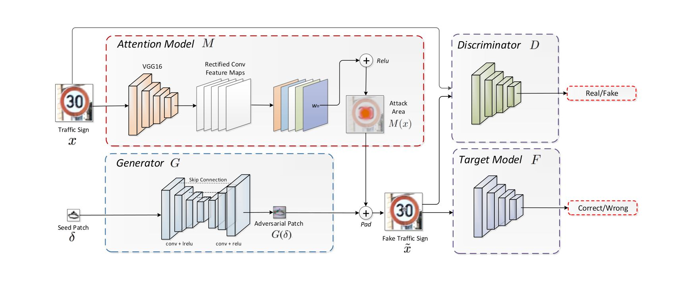

# PS-GAN

## 概述

[AAAI2019][PS-GAN] Perceptual-Sensitive GAN for Generating Adversarial Patches

利用 GAN 对于目标检测进行 patch 攻击。

## 问题描述

patch 攻击可以通过如下的方式形式化描述：

给定原图 $\boldsymbol x$ 和标签 $y_{\text{real}}$，希望生成一个新图：

$$
\tilde{\boldsymbol x} = (1 - \boldsymbol m) \odot \boldsymbol x + \boldsymbol m \odot \boldsymbol \delta
$$

其中 $\odot$ 代表按位乘，$\boldsymbol m \in \{0, 1\}^n$ 是一张与原图大小相同的 mask，$\boldsymbol \delta \in \mathbb{R}^z$ 是生成的对抗 patch。上式也可以简写为：

$$
\tilde{\boldsymbol x} = \boldsymbol x +_{\boldsymbol m} \boldsymbol \delta
$$

使得对于检测器 $F$，$y_{\text{pre}} = F(\tilde{\boldsymbol x}) \neq y_{\text{real}}$。

## 模型目标

模型的期望目标主要有三点：

- 在视觉上自然（能够融入环境不突兀）；
- 使得检测器产生错误；
- 生成的 patch 在模型注意力集中的区域。

## 模型结构

### 数据流 pipeline

PS-GAN（Perceptual-Sensitive GAN）的数据流向如下：

生成模型 $G$ 采用一个 patch-to-patch 翻译的过程，接收一个种子 patch $\boldsymbol \delta$，输出生成的对抗 patch $G(\boldsymbol \delta)$。

判别模型 $D$ 用于判别生成的对抗图片 $\tilde{\boldsymbol x}$ 在视觉上和谐。

攻击的目标为检测器 $F$。

注意力模型通过对预训练模型计算注意力热度图，决定攻击的重要区域 $M(\boldsymbol x)$。

### 组成

对照对于模型的三点期望，我们的 pipeline 中设计了对应的部分进行处理，并且直接反映到了模型的优化目标中：

#### 视觉真实性

视觉的真实性由判别模型 $D$ 保证。

生成的对抗样本的损失为：

$$
\begin{align}
L_{\text{GAN}}(G, D) = 
&\mathbb E_{\boldsymbol x}[\log D(\boldsymbol \delta, \boldsymbol x)] + \\
& E_{\boldsymbol x, \boldsymbol z}[\log (1 - D(\boldsymbol \delta, \boldsymbol x+_{M(\boldsymbol x)} G(\boldsymbol z, \boldsymbol \delta)))]
\end{align}
$$

为了约束对原图的变化，增加针对 patch 的损失：

$$
L_{\text{patch}}(\boldsymbol \delta) = \mathbb E_{\boldsymbol \delta} \lVert G(\boldsymbol \delta) - \boldsymbol \delta \rVert_2
$$

#### 检测器错误

针对检测器输出设计损失：

$$
L_{\text{adv}}(G, F) = \mathbb E_{\boldsymbol x, \boldsymbol \delta} [\log P_F(\tilde{\boldsymbol x})]
$$

#### 注意力集中

利用注意力模型计算热度图和图像中敏感的区域 $M(\boldsymbol x)$。

在这里使用了经典的后向传播计算热度图的方法 Grad-CAM，将输出对每一层的偏导后向传播到图上。

#### 优化目标

因此，可以得到 patch 攻击 GAN 的优化目标：

$$
\min \limits_G \max \limits_D L_{\text{GAN}} + \lambda L_{\text{patch}} + \gamma L_{\text{adv}}
$$