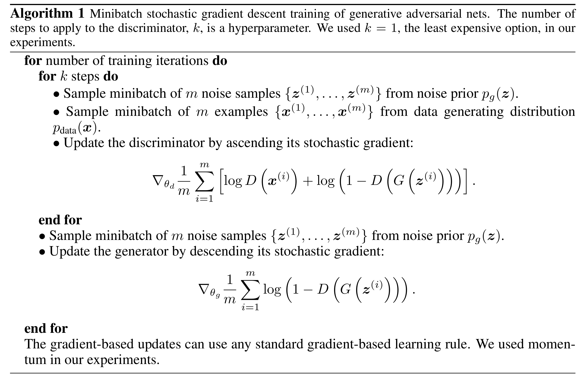
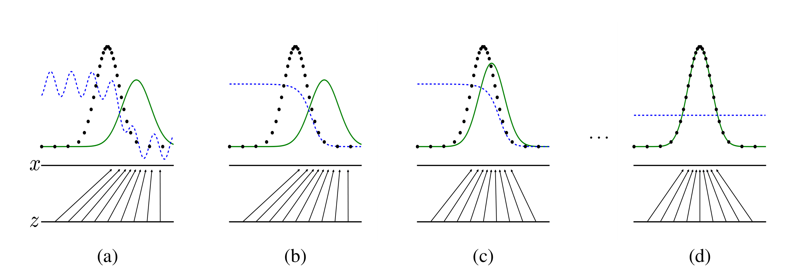

# GAN

## 概述

[NIPS2014][GAN] Generative Adversarial Nets

## Motivation

对于深度学习模型的研究主要集中在判别模型领域中，对于生成模型的研究不足。

现有的对于数据分布的估计方法涉及到复杂的统计学手段，应用不便。

## 模型结构

### 模型描述

同时训练一个生成模型 $G$ 和一个判别模型 $D$，使得生成模型生成的数据分布 $p_g$ 能够真实地估计数据分布。
定义一个先验的输入噪声分布 $p_{\boldsymbol{z}}(\boldsymbol{z})$，此时生成模型为映射 $G(\boldsymbol{z}, \theta_g)$。
定义判别模型 $D(\boldsymbol{x}, \theta_d)$ 接受输入 $\boldsymbol{x}$ 并输出一个单个标量代表真实性的置信度。

此时，训练过程等价于一个 minimax 游戏：

$$
\min \limits_G \max \limits_D V(G, D) =
\mathbb{E}_{\boldsymbol x \sim p_{\text{data}}(\boldsymbol{x})}[\log D(\boldsymbol{x})] +
\mathbb{E}_{\boldsymbol{z} \sim p_{\boldsymbol{z}}(\boldsymbol{z})}[\log (1 - D(G(\boldsymbol{z})))]
$$

### 工程细节

在实践过程中，我们需要采用一个数值计算的方法对目标进行优化。

对于内层的优化目标，直接求出完备的优化结果在计算上是不可行的，因此我们通过交替 $k$ 步优化 $D$ 和 $1$ 步优化 $G$ 来进行求解。超参数 $k$ 需要取适中的值，如果过小则对于 $G$ 的判别不够准确，如果过强容易过拟合。

对于外层的优化目标，里层的函数在实际应用中可能无法提供足够显著的梯度。尤其在早期时当 $G$ 的效果较差时，$D$ 能够以较高的置信度拒绝生成的结果，导致 $\log(1 - D(G(\boldsymbol{z})))$ 饱和。因此，我们在训练 $G$ 的时候寻求最大化 $\log D(G(\boldsymbol{z}))$。

训练过程的算法流程如下：

## 理论说明

### 近似过程

### 全局最优性

Prop 1：对于固定的 $G$，最优的判别模型 $D$ 为：

$$
D_G^*(\boldsymbol{x}) = \frac{p_{\text{data}}(\boldsymbol{x})}{p_{\text{data}}(\boldsymbol{x}) + p_g(\boldsymbol{x})}
$$

> Proof：
>
> 对于给定的生成模型 $G$，判别模型 $D$ 的训练过程是期望最大化 $V(G, D)$：
> 
> $$
> \begin{align}
> V(G, D) &= \int_{\boldsymbol x} p_{\text{data}}(\boldsymbol{x}) \log(D(\boldsymbol x)) \text dx + \int_{\boldsymbol z} p_{\boldsymbol z}(\boldsymbol z) \log(1 - D(g(\boldsymbol z))) \text dz \\
> &= \int_{\boldsymbol x} p_{\text{data}}(\boldsymbol{x}) \log(D(\boldsymbol x))  + p_g(\boldsymbol x) \log(1 - D(\boldsymbol x)) \text dx
> \end{align}
> $$
> 
> 由于对于任意 $(a, b) \in \mathbb{R}^2 \backslash \{0, 0\}$，函数 $y \rightarrow a \log (y) + b \log(1 - y)$ 在 $[0, 1]$ 见 $\frac {a}{a + b}$ 处取得最大值，因此得证。

将上述结果代入 $V(G, D)$ 中，得到外层生成模型的优化目标 $C(G)$：

$$
\begin{align}
C(G) &= \max \limits_D V(G, D) \\
&= \mathbb{E}_{\boldsymbol x \sim p_{\text{data}}}[\log D_G^*(\boldsymbol{x})] + 
\mathbb{E}_{\boldsymbol{z} \sim p_{\boldsymbol{z}}}[\log(1 - D_G^*(G(\boldsymbol{z})))] \\
&= \mathbb{E}_{\boldsymbol x \sim p_{\text{data}}}[\log D_G^*(\boldsymbol{x})] + 
\mathbb{E}_{\boldsymbol{z} \sim p_{g}}[\log(1 - D_G^*(\boldsymbol{x}))] \\
&= \mathbb{E}_{\boldsymbol x \sim p_{\text{data}}}[\log \frac{p_{\text{data}}(\boldsymbol{x})}{p_{\text{data}}(\boldsymbol{x}) + p_g(\boldsymbol{x})}] + 
\mathbb{E}_{\boldsymbol{z} \sim p_{g}}[\log \frac{p_g(\boldsymbol{x})}{p_{\text{data}}(\boldsymbol{x}) + p_g(\boldsymbol{x})}]
\end{align}
$$

Thm 1：$C(G)$ 取到全局最优解 $-\log 4$ 当且仅当 $p_g = p_{\text{data}}$。

> Proof：
>
> $C(G)$ 的形式与 KL 散度相近，将其变形得到：
> 
> $$
> \begin{align}
> C(G) &= \mathbb{E}_{\boldsymbol x \sim p_{\text{data}}}[\log \frac{p_{\text{data}}(\boldsymbol{x})}{\frac 1 2 (p_{\text{data}}(\boldsymbol{x}) + p_g(\boldsymbol{x}))}] + 
\mathbb{E}_{\boldsymbol{z} \sim p_{g}}[\log \frac{p_g(\boldsymbol{x})}{\frac 1 2(p_{\text{data}}(\boldsymbol{x}) + p_g(\boldsymbol{x}))}] - \log 4\\
&= - \log 4 + \text{KL}(p_{\text{data}} \Vert \frac{p_{\text{data}}(\boldsymbol{x}) + p_g(\boldsymbol{x})}{2}) + \text{KL}(p_g \Vert \frac{p_{\text{data}}(\boldsymbol{x}) + p_g(\boldsymbol{x})}{2})
> \end{align}
> $$
> 
> 由 KL 散度的性质可知其最小值为 $0$ 当且仅当 $p_{\text{data}} = p_g$，因此得证。

### 算法收敛性

Prop 2：如果 $G$ 和 $D$ 有足够的容量，并且算法的每一步判别模型 $D$ 都能够优化得到对于给定 $G$ 的最优，则 $p_g$ 收敛到 $p_{\text{data}}$。

> Proof:
> 
> 转换视角，考虑 $V(G, D) = U(p_g, D)$ 是关于 $p_g$ 的函数，则 $U(p_g, D)$ 是凸函数。
> 
> 而由于每次 $D$ 都训练到最优，则凸函数的上确界 $\text{sup}_D U(p_g, D)$ 同样是凸函数。
> 
> 对于凸函数进行优化一定可以找到最优解。