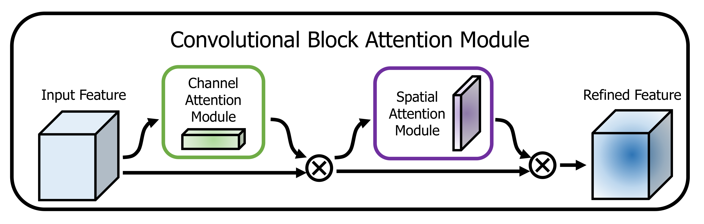
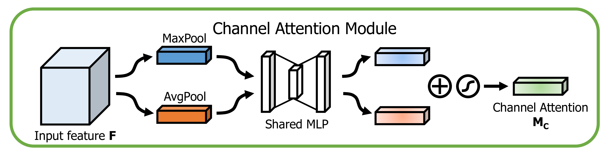
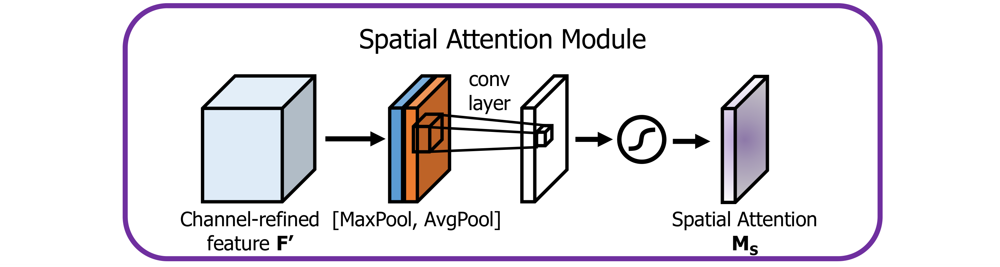

# CBAM

## 概述

[ECCV2018][CBAM] Convolutional Block Attention Module

## Motivation

### 网络结构设计

网络结构方面的创新大体可以分为三个方面：深度、宽度和容量（depth, width and cardinality），从这一角度可以总结过去关于网络结构的多数研究。

- 深度:
  - LeNet；
  - VGGNet：堆积同种模块可以获得较好效果；
  - ResNet 及应用残差模块的变种；
- 宽度：
  - GoogLeNet：增加宽度；
- 容量：
  - Xception、ResNeXt。

作者跳出这三个方面，从另一个维度（attention）去考虑网络结构的创新，希望在卷积操作中利用跨通道和空间的注意力机制提升效果。

## CBAM

### CBAM

对于给定的中间层特征图 $\mathbf{F} \in \mathbb{R}^{C \times H \times W}$ 输入，CBAM 依次计算 1D 的通道注意力图 $\mathbf{M}_c \in \mathbb{R}^{C \times 1 \times 1}$ 和 2D 的空间注意力图 $\mathbf{M}_s \in \mathbb{R}^{1 \times H \times W}$。最终得到：

$$
\mathbf{F}' = \mathbf{M}_c(\mathbf{F}) \otimes \mathbf{F} \\
\mathbf{F}'' = \mathbf{M}_s(\mathbf{F}') \otimes \mathbf{F}' \\
$$

### Channel attention module

**WHAT** is meaningful.

$$
\mathbf{M}_c(\mathbf{F}) = \sigma(\text{MLP}(\text{AvgPool}(\mathbf{F})) + \text{MLP}(\text{MaxPool}(\mathbf{F})))
$$

### Spatial attention module

**WHERE** is meaningful.

