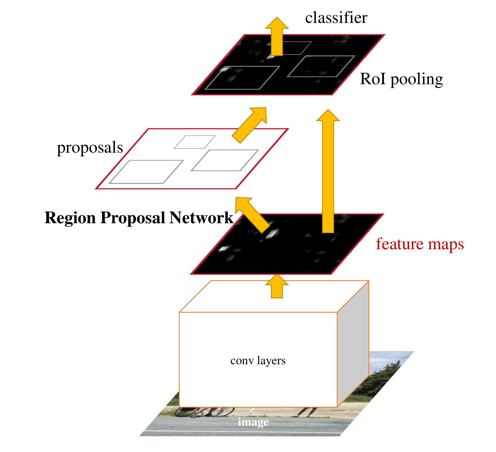
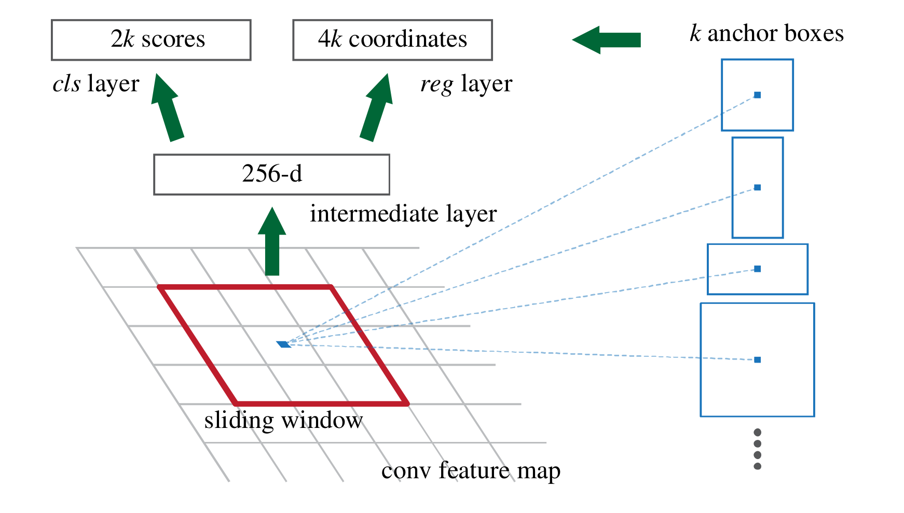

# Faster R-CNN

## 概述

[NIPS2015][Faster R-CNN] Faster R-CNN: Towards Real-Time Object Detection with Region Proposal Networks

## Motivation

基于 region proposal 的方法使用的 selective search 等生成方法效率不佳。

Contribution：

- 提出 RPN 利用神经网络加速并提升生成 region proposal 的效率和表现；
- 引入 anchor 的概念，从另一个角度考虑不同尺度和比例的物体（scale & ratio）；
- 提出新的训练方式，可以精调 RPN 和目标检测网络。

## 推理

### Pipeline

### 特征提取网络

用于提取特征图。这部分网络由 RPN 和检测网络进行参数共享

### RPN

对于每个位置预先定义一系列 $k$ 个不同尺度、不同比例的锚框，作为预测区域的基准。

`cls layer` 分支预测 proposal 是物体和不是物体的分数共 $2k$ 个输出；`reg layer` 利用锚框为基准预测偏置量共 $4k$ 个输出。

### RoI pooling

全连接层每次输入的大小必须是相同的，因此不同大小的 region proposal 必须转换为相同长度的 feature vector。

将每个 proposal 对应的 feature map 区域划分为 $w \times h$ 的网格，每一部分做 max pooling，可完成上述转换。

### Classification

进行分类和位置回归精调。

## 训练

### 四步交替训练

1. 使用 ImageNet 预训练权重初始化 RPN 网络的 conv 层，训练 RPN 网络（同时更新 conv 层和 RPN 特有层）；
2. 根据训练好的 RPN 网络 proposal，使用 ImageNet 预训练权重初始化 Faster R-CNN 网络的 conv 层，然后训练 Faster R-CNN 网络（同时更新 conv 层和 Faster R-CNN 特有层）；
3. 固定上一步训练好的 conv 层，训练 RPN 网络（只更新 RPN 特有层）；
4. 固定 conv 层和 RPN，训练 Faster R-CNN 网络（只更新 Faster R-CNN 特有层）。

### 正负样本分配

对于每个 anchor 分配一个二值的正负，正例为：

1. 与 gt IoU 最高；
2. 与 gt IoU > 0.7。