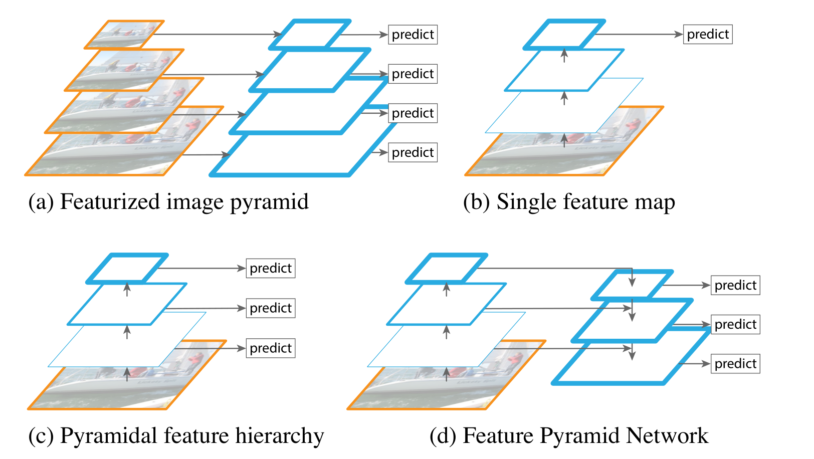
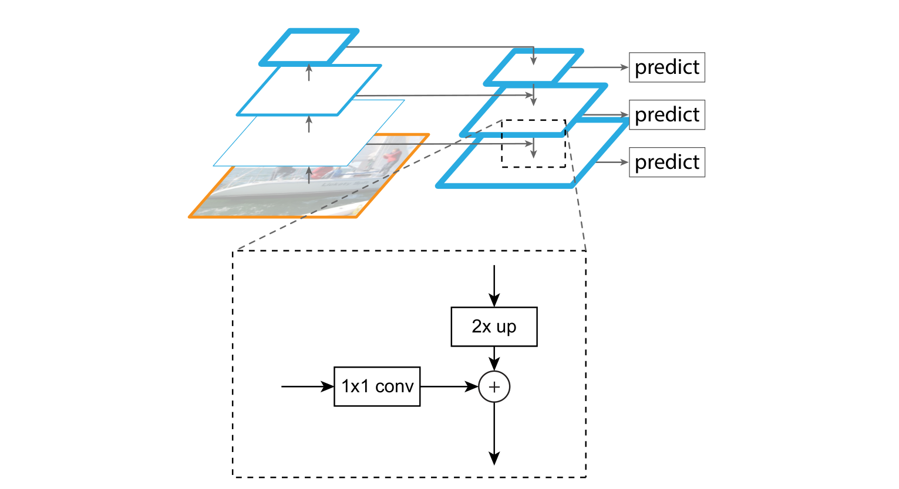
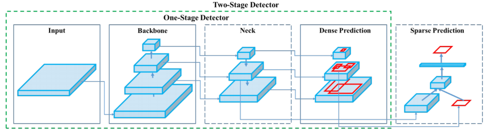

# FPN

## 概述

[CVPR2017][FPN] Feature Pyramid Networks for Object Detection

FPN 是一个非常重要的 idea，这种设计思想被广泛应用于后续的目标检测方法中。

## Motivation

对于不同 scale 的图像/特征识别物体是计算机视觉中常见的任务，许多的目标检测模型在识别的过程中应用了不同的 scale。在提取特征的过程中形成了这种“特征金字塔”（feature pyramid）的结构。在特征金字塔中：

- 顶层的特征图有强语意（semantically strong），但位置信息粗略，用来预测小物体的 bbox 不准确。
- 底层的特征图有弱语意，但位置信息精确。

因此，作者考虑能够通过一种方法提取兼有二者优点的特征。将上层的强语意与下层的高分辨率结合。

## 模型结构

### Bottom-up pathway

自底向上的过程生成强语意的金字塔顶。

这一过程相当于下采样的过程，使用常用的卷积层就可以实现。在作者使用的 ResNet backbone 中，作者采样的步长为 $2$，最后留下的特征图为 $\{C_2, C_3, C_4, C_5\}$，相对原图像采样步长分别为 $\{4, 8, 16, 32\}$。

### Top-down pathway and lateral connections

自顶向上的过程，并利用横向连接进行特征融合。

#### 自顶向下

对语意更强的高层特征图进行上采样，得到与下层相同的尺寸。

#### 横向连接

对下层特征图用 $1 \times 1$ 卷积降维，并且与按位加与上层融合。

#### 卷积

为降低混叠效应（aliasing effect），对得到的融合后的特征图再进行 $3 \times$ 卷积，得到最终结果 $\{P_2, P_3, P_4, P_5\}$。

## 应用

以 YOLOv4 为例，FPN 被应用在 neck 的部分对于 backbone 提取出的多尺度特征进行融合。

