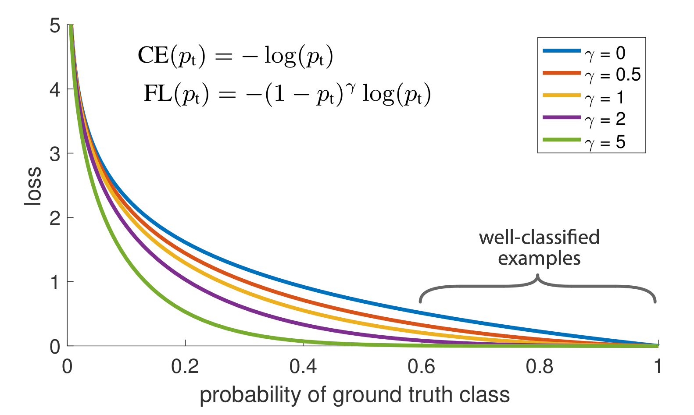
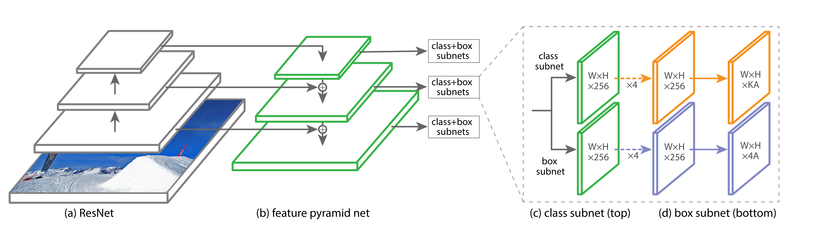

# RetinaNet

## 概述

[ICCV2017][RetinaNet] Focal Loss for Dense Object Detection

## Motivation

### 一阶段与二阶段检测模型

一阶段检测模型更为简单、计算速度更快，但往往准确性不如二阶段模型。

作者指出 class imbalance 是造成这种差异的主要原因。

### Class Imbalance

在一阶段检测模型中，检测器往往需要处理数量巨大的可能目标，其中负样本的数量要占绝对多数，这造成了两个问题：

- 训练过程中效率低，占绝大多数的负样本无法提供足够有用的信息学习；
- 大量的负样本累积得到的大量 loss 对模型造成误导。

## Focal Loss

针对上述的问题，作者提出了新的 focal loss，希望能够聚焦学习比较困难的样本（down-weighting inliers）。

## 符号约定

对于一个交叉熵函数：

$$
\text{CE}(p, y) = 
\begin{cases}
- \log (p) & \text{if} \  y = 1 \\
- \log(1 - p) & \text{otherwise}
\end{cases}
$$

简写令

$$
p_t = 
\begin{cases}
p & \text{if}\  y = 1 \\
1 - p & \text{otherwise}
\end{cases}
$$

## Balanced Cross Entropy

对于交叉熵，一个常见的处理 class imbalance 的方法是引入权重因子 $\alpha \in [0, 1]$ 来区分正例和负例。

$$
\text{CE}(p_t) = -\alpha_t \log(p_t)
$$

## Focal Loss

尽管 balanced cross entropy 区分了正负样本，但并没有区分难易样本。因此在 Balanced Cross Entropy 的基础上，定义 focal loss：

$$
\text{FL}(p_t) = -(1 - p_t)^{\gamma} \log(p_t)
$$

$\gamma \in [0, 5]$ 的图示如下：

Focal Loss 的两个重要性质如下：

- 当分类错误且 $p_t$ 较小时（与 ground truth 差距较大），调制因子接近 $1$，不影响交叉熵；当 $p_t \rightarrow 1$ 时，因此趋近 $0$，即 down-weight 的过程。
- 参数 $\gamma$ 可平滑调节 down-weight 的力度。

在实际应用过程中，加入平衡因子：

$$
\text{FL}(p_t) = -\alpha_t (1 - p_t)^{\gamma} \log(p_t)
$$

## class imbalance 与模型初始化

对于二元分类模型，初始化时默认同等概率输出正负。在这一设置下，class imbalance 会导致训练初期非常不稳定。

因此，可以通过设置先验将出现次数偏小的样本初始化 $p$ 变小以提升训练稳定性。

## class imbalance 与二阶段检测模型

对于二阶段检测模型，class imbalance 的问题影响较小，因为第一阶段的选定区域极大地平衡了背景类与物体的数量关系。

## RetinaNet

RetinaNet 由一个 backbone 网络和两个针对任务的子网络构成。

### Backbone

Backbone 为 FPN，提取多尺度信息。

### Classification Subnet

对于 $K$ 个物体类别和 $A$ 个 anchor，classification subnet 采用全卷积的形式，并在各个尺寸之间共享参数。通过多个卷积层最终得到 $KA$ 个通道给出每个位置的类别预测。

### Box Regression Subnet

与分类网络类似，通过全卷积最终得到 $4A$ 个通道（bounding box 位置信息）。