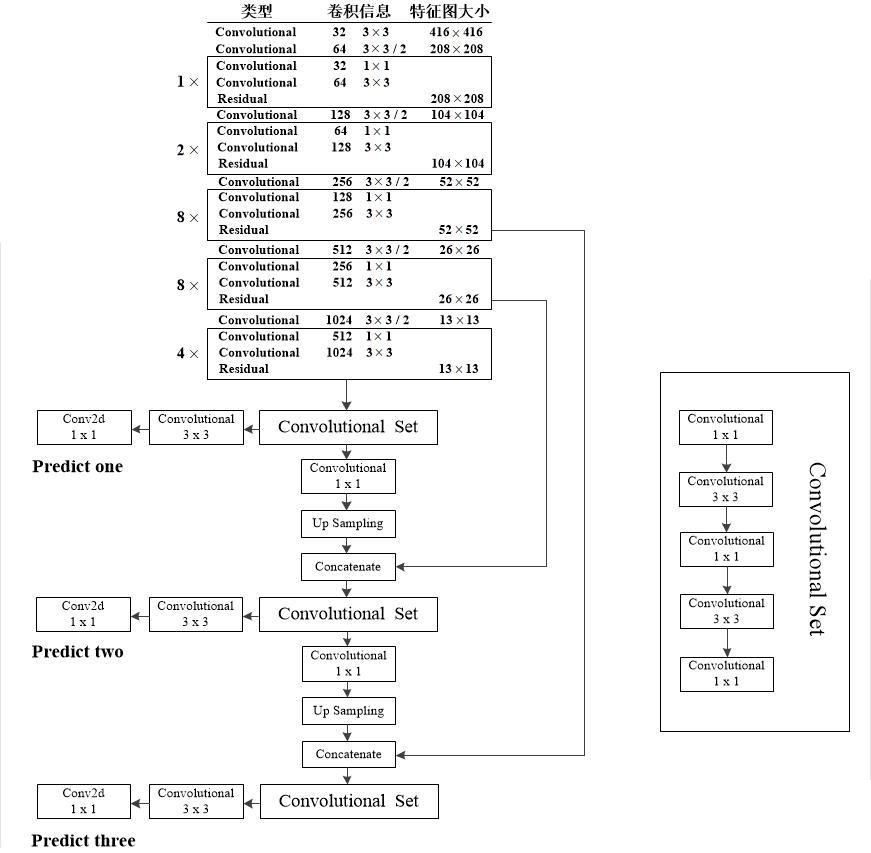

# YOLO v3

## 概述

[YOLOv3] YOLOv3: An Incremental Improvement

对于 YOLOv2 的一些进一步的改动和提升。

YOLOv3 使用多尺度的预测，在特征提取时提取得到不同尺寸的特征图（如上图）。

在每个特征图中，YOLOv3 分别通过大小为 $k \times (4 + 1 + c)$ 个 $1 \times 1$ 个卷积核，得到输出大小为 $S \times S \times [k \times (4 + 1 + c)]$ 的张量。其中 $c$ 为类别数量；$k = 3$ 为 anchor box 的数量；$4$ 为 $x, y, w, h$；$1$ 为置信度。