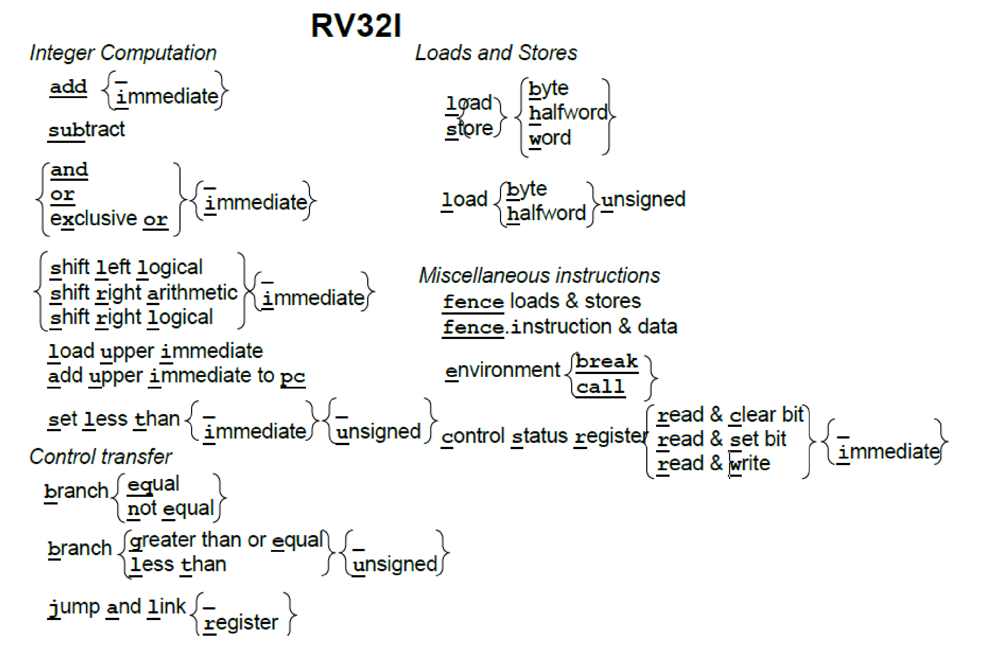

# RV32I

## 简介

RISC-V 的指令集体系结构是模块化的。最基础的指令是 RV32I，即 32 位的整数指令集，包含了所有的 RISC-V 处理器都必须要实现的指令。

## 指令格式



六种基本指令格式：

- 用于寄存器-寄存器操作的 R 类型指令；
- 用于短立即数和访存 load 操作的 I 型指令；
- 用于访存 store 操作的 S 型指令；
- 用于条件跳转操作的 B 类型指令；
- 用于长立即数的 U 型指令；
- 用于无条件跳转的 J 型指令。
  

特别的，所有位都是 0 的指令码和所有位是 1 的指令码都是非法指令，可以被异常捕获方便调试。

## 寄存器

```
x0 / zero
x1 / ra (return address)
x2 / sp (stack pointer)
x3 / gp (global pointer)
x4 / tp (thread pointer)
x5 / t0 (temporary)
x6 / t1
x7 / t2
x8 / s0 / fp (saved register, frame pointer)
x9 / s1
x10 / a0 (function argument, return value)
x11 / a1 (function argument, return value)
x12 / a2
x13 / a3
x14 / a4
x15 / a5
x16 / a6
x17 / a7
x18 / s2 (saved register)
x19 / s3
x20 / s4
x21 / s5
x22 / s6
x23 / s7
x24 / s8
x25 / s9
x26 / s10
x27 / s11
x28 / t3
x29 / t4
x30 / t5
x31 / t6
```

## 整数计算

### 1

算术指令：`add, sub`

逻辑指令：`add, or, xor`

移位指令：`sll, srl, sra`

上述指令还有立即数的版本，立即数总是进行符号扩展。

### 2

根据比较结果生成布尔值：RV32I 提供一个当小于时置位的指令。如果第一个操作数小于第二个操作数，它将目标寄存器设置为 1，否则为
0。有符号版本（slt）和无符号版本（sltu）。

### 3

剩下的两条整数计算指令主要用于构造大的常量数值和链接。

加载立即数到高位 lui 将 20 位常量加载到寄存器的高 20 位，接着可以使用标准的立即数指令来创建 32 位常量。** 由于 32 位常量本来就需要占用全部的 32 位，而指令长度也是 32 位，因此不得不使用拼接的方式来构造出 32 位的常量来放置到 32 位的寄存器中 **，使用 lui 指令来达到这个目的。

auipc 指令将立即数左移 12 位加到 PC 上，并将结果写入到目标寄存器。这样，可以将 auipc 中的 20 位立即数与 jalr 中的 12 位立即数组合，将执行流程转移到任何相对于 PC 寄存器的 32 位偏移地址。

### 应用

#### 大位宽数据加法

64 位整数求和：

```assembly
// {a3, a2} 即把低位保存在 a2，高位保存在 a3 的 64 位整数
// {a3, a2} + {a5, a4} = {a1, a0}
add a0, a2, a4
sltu a2, a0, a2
add a1, a3, a5
add a1, a2, a1
```

## load store

- 32bits: `lw, sw`
- 16bits: `lh, lhu, sh`
- 8bits: `lb, lbu, sb`

RISC-V 是精简指令集体系结构，使用明确的内存访问指令来访问内存而省略了 x86 复杂的寻址模式，其它的指令都不会涉及到内存。

## 条件分支

```assembly
beq
bne
bge
bgeu
blt
bltu
```

### 应用

#### 检测加法溢出

RISC-V 依赖于软件进行溢出检查。

检查无符号加法的溢出：

```assembly
add t0, t1, t2
bltu t0, t1, overflow
```

检查有符号加法的益处

```assembly
add t0, t1, t2
slti t3, t2, 0 # t3 = (t2 < 0) ? 1 : 0
slt t4, t0, t1 # t4 = (t1 + t2 < t1) ? 1 : 0
bne t3, t4, overflow
```

## 无条件跳转

- jal 将下一条指令 PC+4 的地址保存到目标寄存器中，通常是返回地址寄存器 ra。如果使用 x0 来替换 ra，则可以实现无条件跳转，因为 x0 不能被更改。
- jalr 可以调用地址是动态计算出来的函数，或者也可以实现调用返回（ra 作为源寄存器，x0 作为目标寄存器）。
